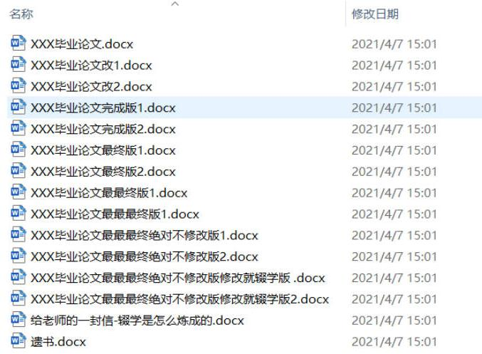
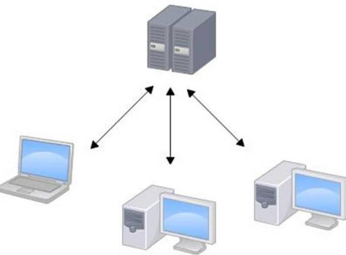
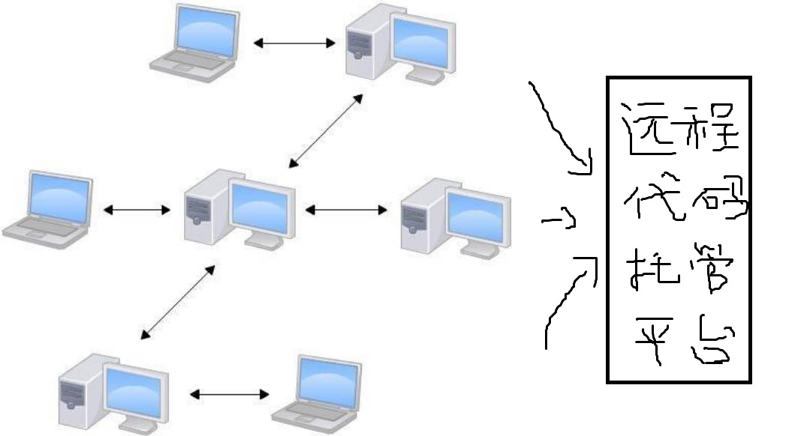
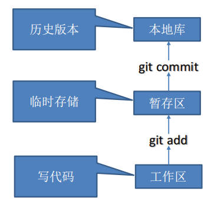

# Git 概述

Git 是一个免费的、开源的分布式版本控制系统，可以快速高效地处理从小型到大型的各种项目。

## 何为版本控制

版本控制是一种记录文件内容变化，以便将来查阅特定版本修订情况的系统。

版本控制其实最重要的是可以记录文件修改历史记录，从而让用户能够查看历史版本，方便版本切换。

为什么需要版本控制？由个人开发过渡到团队协作。

一个版本控制的例子：

## 版本控制工具

### 集中式版本控制工具

CVS 、SVN（Subversion）、VSS ……

集中化的版本控制系统都有一个单一的集中管理的服务器，保存所有文件的修订版本。而协同工作的人们都通过客户端连到这台服务器，取出最新的文件或者提交更新。多年以来，这已成为版本控制系统的标准做法。

这种做法带来了许多好处，每个人都可以在一定程度上看到项目中的其他人正在做些什么，而管理员也可以轻松掌控每个开发者的权限。并且管理一个集中化的版本控制系统，要远比在各个客户端上维护本地数据库来得轻松容易。

这么做显而易见的缺点是中央服务器的单点故障。如果服务器宕机一小时，那么在这一小时内，谁都无法提交更新，也就无法协同工作。

### 分布式版本控制工具

Git 、Mercurial 、Bazaar 、Darcs ……

像 Git 这种分布式版本控制工具，客户端提取的不是最新版本的文件快照，而是把代码仓库完整地镜像下来（本地库）。这样任何一处协同工作用的文件发生故障，事后都可以用其他客户端的本地仓库进行恢复。因为每个客户端的每一次文件提取操作，实际上都是一次对整个文件仓库的完整备份。

分布式的版本控制系统出现之后，解决了集中式版本控制系统的缺陷：

- 服务器断网的情况下也可以进行开发（因为版本控制是在本地进行的）
- 每个客户端保存的也都是整个完整的项目（包含历史记录，更加安全）

### 区别

**------AI 的回答------**

集中式版本控制（Centralized Version Control, CVCS）和分布式版本控制（Distributed Version Control, DVCS）是两种常见的版本控制系统，它们在结构和工作方式上存在以下主要区别：

**1. 系统架构**

- **集中式版本控制**
  - 所有的版本控制数据（包括代码、历史记录等）存储在中央服务器中。
  - 开发者从中央服务器获取工作副本，修改后提交回中央服务器。
- **分布式版本控制**
  - 每个开发者都有一个完整的代码库副本，包括所有版本历史记录。
  - 提交可以本地完成，不依赖中央服务器。

**2. 工作方式**

- **集中式版本控制**
  - 开发者需要始终保持与中央服务器连接才能操作（例如提交或更新）。
  - 离线情况下无法提交代码。
- **分布式版本控制**
  - 开发者可以在本地仓库提交、查看历史、回滚等操作。
  - 提交到远程仓库只是同步操作，可以离线完成本地任务。

**3. 故障容忍**

- **集中式版本控制**
  - 中央服务器是单点故障，如果服务器不可用，整个团队无法提交或获取最新代码。
  - 数据丢失风险较高，备份非常关键。
- **分布式版本控制**
  - 每个开发者的本地仓库都有完整的历史记录，即使远程服务器宕机，开发者仍可以继续工作。
  - 数据安全性高，因为多个副本相当于多个备份。

**4. 协作模式**

- **集中式版本控制**
  - 更强调线性工作流程，适合小型团队和简单项目。
  - 通常需要锁定文件以避免多人冲突（但灵活性较低）。
- **分布式版本控制**
  - 支持更复杂的分支与合并操作，适合大型项目和分布式团队。
  - 多人协作时可以同时开发不同功能，最终合并。

**5. 性能与速度**

- **集中式版本控制**
  - 操作速度依赖网络质量，与服务器交互频繁。
  - 历史记录查询可能较慢，因为每次都需要从服务器获取。
- **分布式版本控制**
  - 本地操作非常快，因不需要频繁访问远程服务器。
  - 提交和历史查询等操作直接在本地完成。

分布式版本控制具有更高的灵活性和可靠性，因此在现代开发中更为流行。

**------廖雪峰官网的回答------**

先说集中式版本控制系统，版本库是集中存放在中央服务器的，而干活的时候，用的都是自己的电脑，所以要先从中央服务器取得最新的版本，然后开始干活，干完活了，再把自己的活推送给中央服务器。中央服务器就好比是一个图书馆，你要改一本书，必须先从图书馆借出来，然后回到家自己改，改完了，再放回图书馆。

集中式版本控制系统最大的毛病就是必须联网才能工作，如果在局域网内还好，带宽够大，速度够快，可如果在互联网上，遇到网速慢的话，可能提交一个 10M 的文件就需要 5 分钟，这还不得把人给憋死啊。

那分布式版本控制系统与集中式版本控制系统有何不同呢？首先，分布式版本控制系统根本没有“中央服务器”，每个人的电脑上都是一个完整的版本库，这样，你工作的时候，就不需要联网了，因为版本库就在你自己的电脑上。既然每个人电脑上都有一个完整的版本库，那多个人如何协作呢？比方说你在自己电脑上改了文件 A ，你的同事也在他的电脑上改了文件 A ，这时，你们俩之间只需把各自的修改推送给对方，就可以互相看到对方的修改了。

和集中式版本控制系统相比，分布式版本控制系统的安全性要高很多，因为每个人电脑里都有完整的版本库，某一个人的电脑坏掉了不要紧，随便从其他人那里复制一个就可以了。而集中式版本控制系统的中央服务器要是出了问题，所有人都没法干活了。

在实际使用分布式版本控制系统的时候，其实很少在两人之间的电脑上推送版本库的修改，因为可能你们俩不在一个局域网内，两台电脑互相访问不了，也可能今天你的同事病了，他的电脑压根没有开机。因此，分布式版本控制系统通常也有一台充当“中央服务器”的电脑，但这个服务器的作用仅仅是用来方便“交换”大家的修改，没有它大家也一样干活，只是交换修改不方便而已。

当然，Git 的优势不单是不必联网这么简单，后面我们还会看到 Git 极其强大的分支管理，把 SVN 等远远抛在了后面。

CVS 作为最早的开源而且免费的集中式版本控制系统，直到现在还有不少人在用。由于 CVS 自身设计的问题，会造成提交文件不完整，版本库莫名其妙损坏的情况。同样是开源而且免费的 SVN 修正了 CVS 的一些稳定性问题，是目前用得最多的集中式版本库控制系统。

微软自己也有一个集中式版本控制系统叫 VSS ，集成在 Visual Studio 中。由于其反人类的设计，连微软自己都不好意思用了。

分布式版本控制系统除了 Git 以及促使 Git 诞生的 BitKeeper 外，还有类似 Git 的 Mercurial 和 Bazaar 等。这些分布式版本控制系统各有特点，但最快、最简单也最流行的依然是 Git ！

**------其它回答------**

只需要记住最核心的一点就可以了，那就是：

**分布式版本控制系统，每一台计算机都有完整的版本库。**

**集中式版本控制系统，版本库存放在中央服务器。**

\---

集中式和分布式的区别是：你的本地是否有完整的版本库历史!

假设 SVN 服务器没了，那你丢掉了所有历史信息，因为你的本地只有当前版本以及部分历史信息。

假设 GitHub 服务器没了，你不会丢掉任何 Git 历史信息，因为你的本地有完整的版本库信息。你可以把本地的 Git 库重新上传到另外的 Git 服务商。

## Git 的诞生

很多人都知道，Linus 在 1991 年创建了开源的 Linux ，从此，Linux 系统不断发展，已经成为最大的服务器系统软件了。

Linus 虽然创建了 Linux ，但 Linux 的壮大是靠全世界热心的志愿者参与的，这么多人在世界各地为 Linux 编写代码，那 Linux 的代码是如何管理的呢？

事实是，在 2002 年以前，世界各地的志愿者把源代码文件发给 Linus ，然后由 Linus 本人通过手工方式合并代码！

你也许会想，为什么 Linus 不把 Linux 代码放到版本控制系统里呢？不是有 CVS 、SVN 这些免费的版本控制系统吗？因为 Linus 坚定地反对 CVS 和 SVN ，这些集中式的版本控制系统不但速度慢，而且必须联网才能使用。有一些商用的版本控制系统，虽然比 CVS 、SVN 好用，但那是付费的，和 Linux 的开源精神不符。

不过，到了 2002 年，Linux 系统已经发展了十年了，代码库之大让 Linus 很难继续通过手工方式管理了，社区的弟兄们也对这种方式表达了强烈不满，于是 Linus 选择了一个商业的版本控制系统 BitKeeper ，BitKeeper 的东家 BitMover 公司出于人道主义精神，授权 Linux 社区免费使用这个版本控制系统。

安定团结的大好局面在 2005 年就被打破了，原因是 Linux 社区牛人聚集，不免沾染了一些梁山好汉的江湖习气。开发 Samba 的 Andrew 试图破解 BitKeeper 的协议（这么干的其实也不只他一个），被 BitMover 公司发现了，于是 BitMover 公司怒了，要收回 Linux 社区的免费使用权。

Linus 可以向 BitMover 公司道个歉，保证以后严格管教弟兄们，嗯，这是不可能的。实际情况是这样的：

Linus 花了两周时间自己用 C 写了一个分布式版本控制系统，这就是 Git ！一个月之内，Linux 系统的源码已经由 Git 管理了！

Git 迅速成为最流行的分布式版本控制系统，尤其是 2008 年，GitHub 网站上线了，它为开源项目免费提供 Git 存储，无数开源项目开始迁移至 GitHub ，包括 jQuery ，PHP ，Ruby 等等。

## Git 工作机制

工作区：你 coding 的时候，本地存储代码的磁盘块。

暂存区：用于临时存储代码仓库的磁盘块。

本地库：本地代码仓库，将保留所有的代码版本。

远程库：远程代码仓库，托管在远程平台上，比如 GitHub ，这样全世界的开发者都可以看到你的代码。

如果说你在代码中写了不该写的话，比如骂老板的话。如果这段话在工作区中，按下 Backspace 删掉就行了，没人知道。如果不小心 add 到暂存区了，删掉也一样的，没人知道。但如果不小心 commit 到本地库了，那将永远保存下来，无法删除。即使你后来删除了这段话，然后又 commit 到本地库，企图覆盖掉之前的版本不让别人知道，但如果退回到上一个版本，依旧能看到，并且你无法删除，因为新的版本是依赖旧的版本的。再或者你推送到远程库了，那全世界的人都会看到。所以，如果推送到本地库或者远程库了，唯一的解决办法就是删库跑路，所以提交之前一定要谨慎谨慎。

如何查看历史版本：

- 本地仓库用 Git 相关命令
- GitHub 进入仓库页，点击 

## 代码托管中心

代码托管中心是基于网络服务器的远程代码仓库，一般我们简单称为远程库。

基于局域网：

- GitLab（局域网下搭建的远程库，比如企业内部闭源的代码）

基于互联网：

- GitHub（外网）

- Gitee（码云，国内网站）