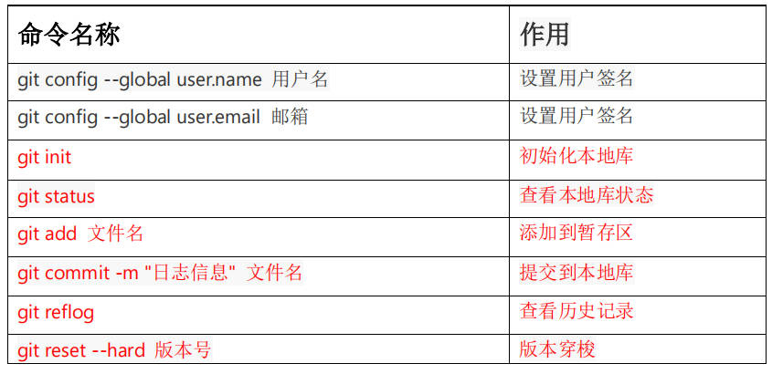
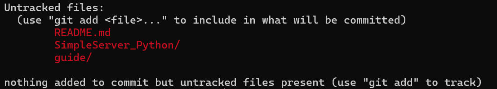
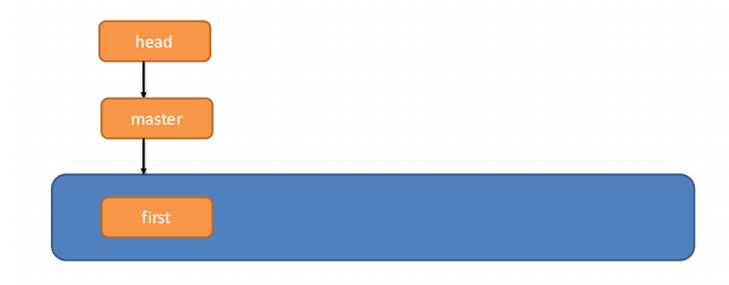

# Git 常用命令

补充：

- `git add .` ：将所有文件添加。
- `git diff 文件名` ：查看文件具体被修改了什么地方。
- `git reset --hard HEAD^` ：回退到上一个版本，上上次为 `HEAD^^` ，上 n 次为 `HEAD~n` 。

## 设置用户签名

签名的作用是区分不同操作者身份。

用户的签名信息在每一个版本的提交信息中能够看到，以此确认本次提交是谁做的。Git 首次安装必须设置一下用户签名，否则无法提交代码。

这里设置用户签名和将来登录 GitHub（或其他代码托管中心）的账号没有任何关系。

## 初始化本地库

不要求该目录是否为空。

如果初始化成功，可在隐藏文件中看到 .git 目录。

## 查看本地库状态

当出现 `No commits yet` ，表示该本地库从未有过提交，即没有任何版本。

当出现类似上面的内容，"Untracked files" 表示这些文件还只存在于工作区中。

只要有红色的内容，就说明还有对本地库的更改没有提交到本地库中。

## 添加到暂存区

使用 add 命令添加后，Git 在括号中提示的 `git rm --cached <file>...` 命令，是将文件从暂存区删除。如果使用了该命令，再次 `git status` 查看状态，文件将回到 "Untracked files" 。

## 提交到本地库

当commit 后，本地库中将产生一个版本，例如 `[master (root-commit) ffc7716]` 中的 `ffc7716` 就是本次版本号（精简版）。

## 历史版本

 `git log` ，查看详细的历史版本信息，`git reflog` 显示的是精简版。

Git 维护版本的方式不是保存每一个历史版本的副本，而是只维护一个文件，即当前版本，然后保存版本变更的历史信息。

## 版本穿梭

使用命令 `git reset --hard 版本号` 命令，版本号用精简版或者详细版都可以。

版本穿梭后，本地库中的文件都将自动修改回历史版本的状态。

Git 切换版本，底层其实是移动的 HEAD 指针，具体原理如下图所示：

