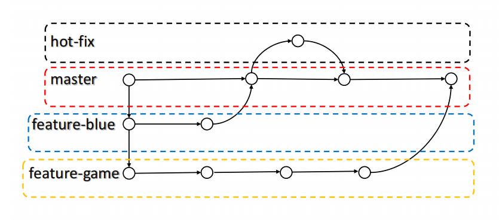

# Git 分支操作

## 什么是分支

下图是一个例子。比如一个公司的内部代码体系可以分为线上和生产两个分支，线上分支专门用来给用户使用，生产分支专门用于开发和测试。两个分支内容是一样的，只不过一个面向用户，一个面向企业内部，生产分支在生产或变更功能后将其合并到线上分支。


在版本控制过程中，同时推进多个任务，为每个任务，我们就可以创建每个任务的单独分支。使用分支意味着程序员可以把自己的工作从开发主线上分离开来，开发自己分支的时候，不会影响主线分支的运行。**分支可以简单理解为副本，一个分支就是一个单独的副本**。（分支底层其实也是指针的引用）



在上图中，master 是主线分支，一直在运行。feature-blue 分支基于 master 开发，迭代一个版本后并入主分支。feature-game 分支基于 feature-blue 分支，可能是开发一个比较大的功能，开发难度大，因此一直在单独迭代，迭代 3 个版本后并入主分支。hot-fix 是“热修”分支，可能是 master 分支出现了紧急 bug ，修复后重新并入主分支。

## 分支的好处

同时并行推进多个功能开发，提高开发效率。

各个分支在开发过程中，如果某一个分支开发失败，不会对其他分支有任何影响。失败的分支删除重新开始即可。

## 分支操作


补充：

- `git checkout -b 分支名` ：新建分支并切换到该分支。
- `git branch -d 分支名` ：删除分支。

### 合并分支

没有合并的之前，master 分支和 hot-fix 分支的内容是各自独立的。将 hot-fix 分支合并到 master 分支后，master 分支的内容将与 hot-fix 的内容一样。注意将 hot-fix 的内容覆盖掉 master 的内容，而不是二者取并集。

### 合并冲突

合并冲突产生的表现为分支后面状态为 MERGING：

```bash
(master|MERGING)
```

场景：

```bash
# 初始时，master | hot-fix
Hello World!
Hello Git!
This is hox-fix!
# master 做了修改，并 add、commit
Hello World!
Hello Git!
This is hox-fix!
master test
# hot-fix 也做了修改，并 add、commit
Hello World!
Hello Git!
This is hox-fix!
hot-fix test
```

此时 master 欲合并 hot-fix，则会产生冲突。

master 分支和 hot-fix 分支各自都分别有新的提交，变成了这样：（网上的图，feature1 即本例中的 hot-fix）


这种情况下，Git 无法执行“快速合并”，只能试图把各自的修改合并起来，但这种合并就会有冲突：

```bash
Auto-merging hello.txt
CONFLICT (content): Merge conflict in hello.txt
Automatic merge failed; fix conflicts and then commit the result.
```

Git 无法替我们决定使用哪一个，必须人为决定新代码内容。

可以这样理解，如果不产生冲突，那只能是一个分支是“静态”的，一个分支是“动态”的。比如 master 分支永远是“静态”地运行，只提供给用户使用，hot-fix 分支在 master “静态”的版本上“动态”修改。如果冲突，那则是两个分支都是“动态”的，master 产生了一个版本，hot-fix 也产生了一个版本，merge 时 Git 将会“混乱”，即不知道到底 merge 后是基于哪个版本。

此时 `git status` 查看一下，Git 会提示 "both modified" ，所以无法自动合并：

```bash
On branch master
You have unmerged paths.
  (fix conflicts and run "git commit")
  (use "git merge --abort" to abort the merge)

Unmerged paths:
  (use "git add <file>..." to mark resolution)
        both modified:   hello.txt

no changes added to commit (use "git add" and/or "git commit -a")
```

打开 hello.txt ：


Git用 `<<<<<<<` 、`=======` 、`>>>>>>>` 标记出不同分支的内容，`=======` 上面是当前分支的有冲突内容，下面是另一个分支的有冲突内容。

要解决冲突，我们需要手动删除记号内容（解决冲突的所有操作都在 master 分支，即要合并到的分支下）：


然后 add 、commit 。注意 commit 命令不能带文件名：

```bash
$ git commit -m "merge test" hello.txt
fatal: cannot do a partial commit during a merge.
```

使用 `git commit -m "merge test"` 即可。

如此便解决了冲突。

冲突解决后，master 分支的代码为手动修改后的样子，hot-fix 分支的代码不受影响，还是冲突时的模样，即：

```bash
Hello World!
Hello Git!
This is hox-fix!
hot-fix test
```

所有的分支、版本、版本切换、冲突的底层原理还是指针。

master 、hot-fix 其实都是指向具体版本记录的指针。当前所在的分支，其实是由 HEAD 指针决定的，所以创建分支的本质就是多创建一个指针。

HEAD 如果指向 master，那么我们现在就在 master 分支上。

HEAD 如果指向 hotfix，那么我们现在就在 hotfix 分支上。

切换分支的本质就是移动 HEAD 指针。