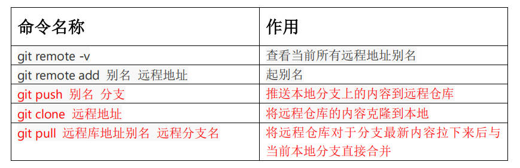

# GitHub 操作

Git 联动 GitHub 。

## 操作命令

首先需要你在 GitHub 为你的代码创建一个新的仓库。



补充：

- `git push -u 别名 分支名` ：将代码提交到该分支。

## 远程仓库别名

`git remote -v` 用于查看本地库对应的远程仓库地址的别名（可以有多个），因为远程仓库地址是一个 HTTPS 或 SSH 链接，不好记。一般把远程仓库的别名命名为本地库的名字，把远程仓库地址的别名命名为 origin 。

起别名后再次 `git remote -v` 会看到有 `(fetch)` 和 `(push)` ，表示该仓库既可推送（push）又可拉取（fetch）。

## 推送本地分支到远程仓库

在 `git push` 命令中，`别名` 换成远程仓库的 HTTPS 或 SSH 链接也行。

`push` 操作需要验证身份，你可能会遇到如下报错：

```bash
remote: Invalid username or password.
```

[解决方法](https://blog.csdn.net/Fzyabc/article/details/138653476)

## 拉取远程库

`git pull` 命令。比如团队成员更新了他的代码到远程库，此时你为了保持本地库与远程库的代码同步，即本地库的代码也是最新的，则使用 `git pull` 命令。注意要指定拉取哪个分支。

`git pull` 之后，可用 `git status` 查看一下，没有报红，说明 Git 会自动将更新 commit 到本地库中。 

`pull` 与 `clone` 的区别是，`clone` 是用于本地没有任何代码，则 `clone` 远程仓库下来。`pull` 是本地已有本地库，为了保持与远程库的更新同步。

## 克隆远程库

克隆操作不仅将代码拉下来了，还会自动初始化本地库，即你将拥有一个与远程库作者相同的本地库。

`clone` 后，Git 会自动将远程仓库地址起别名为 `origin` ，可以使用 `git remote -v` 查看。

`clone` 会做如下操作：

1. 拉取代码
2. 初始化本地仓库
3. 创建别名

你可能会遇到这样的报错：

```bash
Cloning into 'git-demo'...
The authenticity of host 'github.com (20.205.243.166)' can't be established.
ED25519 key fingerprint is SHA256:+DiY3wvvV6TuJJhbpZisF/zLDA0zPMSvHdkr4UvCOqU.
This key is not known by any other names.
Are you sure you want to continue connecting (yes/no/[fingerprint])? yes
Could not create directory '/c/Users/\300\356\307\253/.ssh' (No such file or directory).
Failed to add the host to the list of known hosts (/c/Users/\300\356\307\253/.ssh/known_hosts).
git@github.com: Permission denied (publickey).
fatal: Could not read from remote repository.

Please make sure you have the correct access rights
and the repository exists.
```

这个报错与网上类似的不一样，其本质是因为：

```bash
Could not create directory '/c/Users/\300\356\307\253/.ssh' (No such file or directory).
Failed to add the host to the list of known hosts (/c/Users/\300\356\307\253/.ssh/known_hosts).
```

即 C 盘用户文件名用了中文（**很低级的错误**）。解决办法：每次 `git clone` 时，在桌面打开 Git Bash 输入：

```bash
ssh-keyscan github.com >> ~/.ssh/known_hosts
```

该问题无法从根源上解决，除非重装系统或更改中文目录名。

## 团队内协作

`clone` 后，你就可以修改代码，然后 add 、commit 、push（记得做好分支管理），这样远程库中对应分支就会更新你的修改。

当然，在实际的企业开发中，push 需要进行身份认证，如果该项目的 GitHub 仓库还没有将你邀请进去，你是没有权限 push 的。即读（clone）是公共的，写（push）是私有的。[[邀请方法]](https://blog.csdn.net/qq_38502736/article/details/107216862)

## 跨团队协作

[[讲解]](https://www.bilibili.com/video/BV1vy4y1s7k6?spm_id_from=333.788.videopod.episodes&vd_source=d5967fefd7ddfdac9a53237e1cda5a61&p=25)

团队外的人在 GitHub 中 fork "叉"该项目，则他的 GitHub 中将会出现该项目的副本仓库，然后既可以在 GitHub 中在线开发，也可以 clone 下来在本地开发，再 add 、commit 、push 。之后，该外人**在他的 fork 项目中**点击 "Pull request" 提交一个 Pr ，若该项目的负责人审核通过后，在 GitHub 中在线 Merge 该 Pr ，则一次跨团队开发就成功了。

如果不提交 Pr ，fork 者的任何开发行为都不会影响到原始团队，即你怎么开发都不关我的事，像 "github.io" 项目一样。

#### 提交 Pr

1. fork
2. clone
3. 新建并切换分支
4. 修改代码
5. add
6. commit
7. push
8. 提交 Pr

#### 合并 Pr

1. 审核
2. merge
3. pull 更新本地库
4. 删除 pr 的分支

## SSH 免密登录

在 `C:\User\用户名` 文件夹中打开 Git Bash ，输入：

```bash
ssh-keygen -t rsa -C "<your-email-address>"
```

随后会生成 .ssh 文件夹。进入 .ssh ，打开 id_rsa.pub 文件，复制 id_rsa.pub 文件内容。登录 GitHub ，进入 Settings → SSH and GPG keys ，New 一个 SSH Key ，将复制内容粘贴进去即可。

验证是否操作成功，输入：

```bash
ssh -T git@github.com
```

无报错即成功。