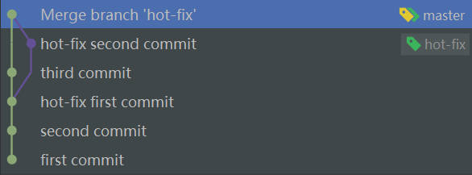

# IDEA 集成 Git

本章介绍如何在 IDEA 里使用 Git ，而不需要再使用 Bash 和命令。

## 特定文件

一些特定文件与项目的实际功能无关，不参与服务器上部署运行，把它们忽略掉能够屏蔽 IDE 工具之间的差异。

在推送代码时如何屏蔽掉这些文件，则依靠 .gitignore 文件。

新版的 IDEA 会自动扫描并配置 Git ，并且每当 New 一个 Project 时会自动生成 .gitignore 文件，里面自动配置好了一些需要忽略的特定文件。

特定文件举例：

- IDEA 的特定文件：.idea 目录下的一些 .iml 文件。
- Maven 工程的特定文件：target 目录。

## 初始化本地库

顶部菜单栏找到 "VCS" ，点击进入找到 "Create Git Repository" ，点击后便成功初始化了本地库，相当于执行了 `git init` ，可发现项目目录中出现了 .git 目录。

此时项目中除 .gitignore 里的文件外的所有文件将变红，表示这些变红的文件为 "Untracked files" 。

## 添加到暂存区

选择要添加的文件或目录，右键找到 "Git" ，点击进入找到 "Add" ，点击后便成功添加到了暂存区，此时会发现该文件或目录变成了绿色，.gitignore 中的文件或目录为黄色。

## 提交到本地库

与 "Add" 同一位置找到 "Commit" ，随后操作即可，此时绿色的文件或目录回到最初的白色。

## 切换版本

新版本的代码，文件或目录为蓝色，表示该文件或目录"已被追踪但被修改"，修改完后再次 Add 、Commit 即变回正常的白色。

底部菜单栏找到 "Git" ，在 "Log" 里即可看到版本日志。点击对应的版本，可查看详细的版本信息、代码变更等。右键对应的版本，点击 "Checkout" 即可实现版本切换。

黄色指针表示 HEAD 指针，绿色指针表示分支指针。

## 创建和切换分支

IDEA 的最右下角会显示当前所在分支，点击该选项，便可进行创建分支、切换分支等操作。

## 合并分支

### 正常合并

同样在 IDEA 的最右下角操作。

注意，一定要先切换回**要合并到**的分支（查看最右下角的变化），然后再点击待合并的分支，找到 "Merge...into..." 进行操作。

合并成功后：

三个指针合一。

### 冲突合并

同样在 IDEA 的最右下角操作。

IDEA 十分人性化且简单，按照它的提示操作即可。

合并成功后：

[[讲解]](https://www.bilibili.com/video/BV1vy4y1s7k6?spm_id_from=333.788.videopod.episodes&vd_source=d5967fefd7ddfdac9a53237e1cda5a61&p=32)