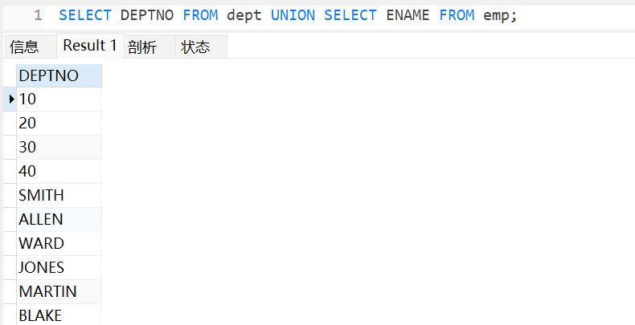
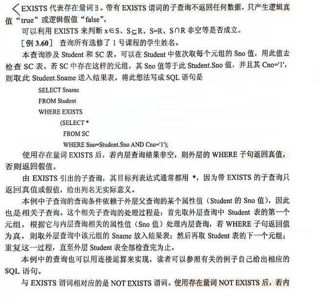
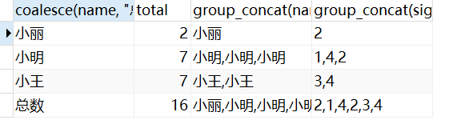

> 如果某字段的单词会引起语法错误，你可以使用反引号 `` 包裹它。

# 数据类型

## 数值类型

| 类型         | 大小    | 范围（有符号）                                               | 范围（无符号）                                               | 用途            |
| :----------- | :------ | :----------------------------------------------------------- | :----------------------------------------------------------- | :-------------- |
| TINYINT      | 1 Bytes | (-128，127)                                                  | (0，255)                                                     | 小整数值        |
| SMALLINT     | 2 Bytes | (-32 768，32 767)                                            | (0，65 535)                                                  | 大整数值        |
| MEDIUMINT    | 3 Bytes | (-8 388 608，8 388 607)                                      | (0，16 777 215)                                              | 大整数值        |
| INT或INTEGER | 4 Bytes | (-2 147 483 648，2 147 483 647)                              | (0，4 294 967 295)                                           | 大整数值        |
| BIGINT       | 8 Bytes | (-9,223,372,036,854,775,808，9 223 372 036 854 775 807)      | (0，18 446 744 073 709 551 615)                              | 极大整数值      |
| FLOAT        | 4 Bytes | (-3.402 823 466 E+38，-1.175 494 351 E-38)，0，(1.175 494 351 E-38，3.402 823 466 351 E+38) | 0，(1.175 494 351 E-38，3.402 823 466 E+38)                  | 单精度 浮点数值 |
| DOUBLE       | 8 Bytes | (-1.797 693 134 862 315 7 E+308，-2.225 073 858 507 201 4 E-308)，0，(2.225 073 858 507 201 4 E-308，1.797 693 134 862 315 7 E+308) | 0，(2.225 073 858 507 201 4 E-308，1.797 693 134 862 315 7 E+308) | 双精度 浮点数值 |

## 日期和时间类型

| 类型     | 大小 ( bytes) | 范围                                           | 格式                | 用途             |
| :------- | :------------ | :--------------------------------------------- | :------------------ | :--------------- |
| DATE     | 3             | 1000-01-01/9999-12-31                          | YYYY-MM-DD          | 日期值           |
| TIME     | 3             | '-838:59:59'/'838:59:59'                       | HH:MM:SS            | 时间值或持续时间 |
| YEAR     | 1             | 1901/2155                                      | YYYY                | 年份值           |
| DATETIME | 8             | '1000-01-01 00:00:00' 到 '9999-12-31 23:59:59' | YYYY-MM-DD hh:mm:ss | 混合日期和时间值 |

## 字符串类型

| 类型       | 大小                  | 用途                            |
| :--------- | :-------------------- | :------------------------------ |
| CHAR       | 0-255 bytes           | 定长字符串                      |
| VARCHAR    | 0-65535 bytes         | 变长字符串                      |
| TINYBLOB   | 0-255 bytes           | 不超过 255 个字符的二进制字符串 |
| TINYTEXT   | 0-255 bytes           | 短文本字符串                    |
| BLOB       | 0-65 535 bytes        | 二进制形式的长文本数据          |
| TEXT       | 0-65 535 bytes        | 长文本数据                      |
| MEDIUMBLOB | 0-16 777 215 bytes    | 二进制形式的中等长度文本数据    |
| MEDIUMTEXT | 0-16 777 215 bytes    | 中等长度文本数据                |
| LONGBLOB   | 0-4 294 967 295 bytes | 二进制形式的极大文本数据        |
| LONGTEXT   | 0-4 294 967 295 bytes | 极大文本数据                    |

CHAR(n) 和 VARCHAR(n) 中括号中 n 代表字符的个数，并不代表字节个数，比如 CHAR(30) 就可以存储 30 个字符。

CHAR 和 VARCHAR 类型类似，但它们保存和检索的方式不同。它们的最大长度和是否尾部空格被保留等方面也不同。

BINARY 和 VARBINARY 类似于 CHAR 和 VARCHAR，不同的是它们包含二进制字符串而不要非二进制字符串。也就是说，它们包含字节字符串而不是字符字符串。这说明它们没有字符集，并且排序和比较基于列值字节的数值值。

## 枚举与集合类型

- **ENUM**: 枚举类型，用于存储单一值，可以选择一个预定义的集合。
- **SET**: 集合类型，用于存储多个值，可以选择多个预定义的集合。

# 数据库操作

## 创建数据库

```mysql
create database 库名;
```

## 删除数据库

```mysql
drop database 库名;
```

## 选择数据库

```mysql
use 库名;
```

## 查询库名

```mysql
select databases(); #显示当前库名
show databases; #显示所有库名
```

# 数据表操作

## 创建数据表

```mysql
create table [if not exists] [库名.]xxx (
    列名1 数据类型 [完整性约束],
    列名2 数据类型 [完整性约束]
)engine=InnoDB default charset=utf8;
```

在 MySQL 中，`engine=InnoDB` 指定了表使用的存储引擎。存储引擎决定了表在数据库中的实际存储方式以及所支持的功能。以下是 `engine=InnoDB` 的作用和替换或省略它的影响：

__1. `InnoDB` 存储引擎的特点__

`InnoDB` 是 MySQL 默认的事务型存储引擎，具有以下特点：

- **事务支持**：`InnoDB` 支持事务，并提供了 ACID（原子性、一致性、隔离性、持久性）特性。
- **外键支持**：支持外键约束，可以保证数据的完整性。
- **行级锁**：`InnoDB` 使用行级锁，可以提高多用户并发访问的效率，适用于需要频繁写操作的应用。
- **崩溃恢复**：在发生崩溃时，`InnoDB` 可以利用其日志文件进行数据恢复。

__2. 替换成其他存储引擎的影响__

MySQL 支持其他存储引擎，比如 `MyISAM`、`MEMORY`、`CSV` 等。更换存储引擎会影响表的行为和性能：

- **MyISAM**：相比 `InnoDB` 更适合读操作较多的情况，不支持事务和外键约束，使用表级锁（写锁效率较低），数据恢复能力弱。
- **MEMORY**：将表的数据存储在内存中，速度极快，但重启或宕机后数据会丢失，适合需要临时数据存储的场景。
- **CSV**：以 CSV 格式存储数据，适合数据导出或交换，但不支持索引、事务等特性。

__3. 不指定存储引擎的影响__

如果省略 `engine=InnoDB`，MySQL 会使用默认的存储引擎（通常是 `InnoDB`），但在一些旧版本的 MySQL 中，默认引擎可能是 `MyISAM`。

__4. 总结__

- 使用 `InnoDB` 是推荐的选择，特别是当需要事务、外键支持和数据恢复功能时。
- 可以换成其他存储引擎，但会影响数据完整性、性能和事务支持。
- 不指定引擎时，会根据数据库默认配置决定，建议明确指定以避免版本兼容性问题。

## 删除数据表

```mysql
drop table 表名;
```

## 查询表名

```mysql
show tables; #显示当前库下所有表名
```

## 插入

基本写法：

```mysql
insert into 表名 (列名1, 列名2...) values (value1, value2...)[, (value1, value2...)...];
```

无列名写法（注意一一对应）：

```mysql
insert into 表名 values (value1, value2...);
```

子查询写法（子查询值要与插入列匹配，也可无列名写法）：

```mysql
insert into 表名 (列名1, 列名2...) [(] select子查询 [)];
```

如果创建表时在 INT 后增加 `AUTO_INCREMENT(自动增加)` ，则该字段会自动递增而不需要我们去设置，所以在插入数据时就不需要管这一列，列名和 value 都不用管。

## 查询

### 格式

```mysql
SELECT xxx FROM xxx WHERE xxx GROUP BY xxx WITH ROLLUP HAVING XXX ORDER BY xxx LIMIT N OFFSET N;
```

\* 是唯一可使用的通配符。

可一次查询多个表，表之间要使用逗号分割。

### limit N

指定返回的记录数，默认为全部。比如符合查询的记录有 10 条，而 N=3 ，则只会显示前 3 条。

### offset N

指定显示查询结果的偏移量，默认为 0 。比如符合查询的记录有 10 条，而 N=3 ，则将从第 4 条开始显示。

### limit、offset合写

```mysql
select * from table_name limit 10; #检索前10行记录
select * from table_name limit 5, 10; #从第6行开始，检索10行记录，即：检索记录行6~15
```

### order by

```mysql
order by 列名1 asc/desc[, 列名2 asc/desc...];
order by N asc/desc[, N asc/desc...]; #N指示select出来的列名的第N个
```

asc、desc：可选，指定字典序，默认为 asc 升序。

### union

```mysql
select xxx union all/distinct select xxx;
```

并查询。可 union 多个查询，但查询结果只有一列，以第一个查询的列名为结果的列名。不规定 union 的多个查询的内容要一致，union 的作用单纯只是将众多查询结果“并”起来。



all、distinct：可选，默认为 distinct ，即重复的内容不输出。<mark>【普适】</mark>

### where

可使用 and 或 or 指定一个或多个条件，and 优先级更高。

exists、not exists：




> 例 3.55：查询与“刘晨”在同一个系学习的学生。
>
> IN 答案：select Sno, Sname, Sdept from Student where Sdept in (select Sdept from Student where Sname='刘晨');

可使用的操作符：

- 单值：>、>=、<、<=、=、!=、<>(不等于)。

- 多值（一般配合子查询）：以上操作符后跟 any(或some) 、all。

like：限定条件原本是不能使用通配符的，但使用 like 子句后就可以，示例：`where name like "%com";` 。

- like 相当于 = 。

- 通配符：
  
  - %：相当于 * 。
  
  - _：替代单个字符。数据库字符集为 ASCII 时一个汉字需要2个 _，为 GBK 时只要一个。

regexp：`where 列名 regexp xxx;` ，正则匹配。

### if

```mysql
if(条件, 条件满足时的值/操作, 条件不满足时的值/操作)
```

 放在 SELECT 子句、WHERE 子句或 HAVING 子句中。

### group by

仅仅 group by xxx 是默认只显示一条（从上到下检索到的第一条）内容的，注意只是显示出来是一条，其实后台包括了所有结果。

### 聚类函数

- group_concat()：打破 group by 的默认，显示所有内容。注意不能将 group_concat() 用 as 为别名。
- count()：统计记录总数，或返回 0。
- sum()：求和，或返回 NULL。不能使用通配符 *，针对内容是数字的列，且不能多列一起求。
- max()、min()、avg()：要求同 sum()。
- 注意：
  - 聚集函数不可用于 where 的限制条件中。
  - 除 count(*) 外，其余均跳过 NULL 值。

### having

位置在 group by 后，对 group by 的结果进行二次筛选。

可使用聚类函数。

### with rollup

`WITH ROLLUP` 是 SQL 中用于生成**分组汇总数据**的关键字，通常与 `GROUP BY` 子句一起使用。它可以计算各个分组的汇总结果，并在结果集中添加更高层次的合计行。这在生成报告和数据分析中非常有用，能够简化对分组数据的合计操作。

#### 作用

`WITH ROLLUP` 会在查询结果中添加以下两种汇总信息：

1. **小计**：为每个分组计算出小计。
2. **总计**：为所有分组计算出一个总计行。

#### 使用方式

`WITH ROLLUP` 放在 `GROUP BY` 的末尾，用法为：

```sql
SELECT 列1, 列2, 聚合函数(...)
FROM 表名
GROUP BY 列1, 列2 WITH ROLLUP;
```

#### 示例

假设有一个 `sales` 表，包含字段 `region`（地区）、`product`（产品）和 `amount`（销售金额）。如果想要按 `region` 和 `product` 进行分组，并计算销售总额，同时获得每个地区的销售小计和所有地区的总计，可以使用 `WITH ROLLUP`。

```sql
SELECT region, product, SUM(amount) AS total_sales
FROM sales
GROUP BY region, product WITH ROLLUP;
```

假设表中有如下数据：

| region | product | amount |
| ------ | ------- | ------ |
| East   | A       | 100    |
| East   | B       | 150    |
| West   | A       | 200    |
| West   | B       | 250    |

使用 `WITH ROLLUP` 后，查询结果如下：

| region | product | total_sales |
| ------ | ------- | ----------- |
| East   | A       | 100         |
| East   | B       | 150         |
| East   | NULL    | 250         |
| West   | A       | 200         |
| West   | B       | 250         |
| West   | NULL    | 450         |
| NULL   | NULL    | 700         |

#### 注意事项

- **`NULL` 表示汇总级别**：在 `WITH ROLLUP` 结果中，`NULL` 值表示汇总行。比如 `region` 列为 `NULL` 时表示总计行。
- **限制**：`WITH ROLLUP` 不支持多个 `GROUP BY` 列的任意组合。汇总顺序会从右到左进行逐级汇总。
- **性能**：`WITH ROLLUP` 可能增加查询计算量，尤其在数据量较大时应考虑性能影响。
- **适用场景**：`WITH ROLLUP` 非常适合用于报表、数据分析等需要层级汇总数据的场景。

#### coalesce

可以使用 coalesce 来设置一个可以取代 NUll 的名称，coalesce 语法：

```mysql
coalesce(a, b, c)
#如果a==null，则选择b；如果b==null，则选择c；如果a!=null，则选择a；如果a、b、c 都为null ，则返回为null
```

```mysql
select coalesce(name, "总数"), sum(signin) as total, group_concat(name), group_concat(signin) from employee_tbl group by name with rollup;
```



### 连接

JOIN 按照功能大致分为如下三类：

- **INNER JOIN（内连接，或等值连接）**：获取两个表中字段匹配关系的记录。
- **LEFT JOIN（左连接）：**获取左表所有记录，即使右表没有对应匹配的记录。
- **RIGHT JOIN（右连接）：** 与 LEFT JOIN 相反，用于获取右表所有记录，即使左表没有对应匹配的记录。

from 多表连接查询等价于 INNER JOIN。

#### INNER JOIN

INNER JOIN 返回两个表中满足连接条件的匹配行，以下是 INNER JOIN 语句的基本语法：

```mysql
SELECT column1, column2, ...
FROM table1
INNER JOIN table2 ON table1.column_name = table2.column_name;
```

**参数说明：**

- `column1`, `column2`, ... 是你要选择的列的名称，如果使用 `*` 表示选择所有列。
- `table1`, `table2` 是要连接的两个表的名称。
- `table1.column_name = table2.column_name` 是连接条件，指定了两个表中用于匹配的列。

1、简单的 INNER JOIN：

```mysql
SELECT orders.order_id, customers.customer_name
FROM orders
INNER JOIN customers ON orders.customer_id = customers.customer_id;
```

以上 SQL 语句将选择 orders 表和 customers 表中满足连接条件的订单 ID 和客户名称。

2、使用表别名：

```mysql
SELECT o.order_id, c.customer_name
FROM orders AS o
INNER JOIN customers AS c ON o.customer_id = c.customer_id;
```

以上 SQL 语句使用表别名 o 和 c 作为 orders 和 customers 表的别名。

3、多表 INNER JOIN：

```mysql
SELECT orders.order_id, customers.customer_name, products.product_name
FROM orders
INNER JOIN customers ON orders.customer_id = customers.customer_id
INNER JOIN order_items ON orders.order_id = order_items.order_id
INNER JOIN products ON order_items.product_id = products.product_id;
```

以上 SQL 语句涉及了 orders、customers、order_items 和 products 四个表的连接。它选择了订单 ID、客户名称和产品名称，连接了这些表的关联列。

4、使用 WHERE 子句进行过滤：

```mysql
SELECT orders.order_id, customers.customer_name
FROM orders
INNER JOIN customers ON orders.customer_id = customers.customer_id
WHERE orders.order_date >= '2023-01-01';
```

以上 SQL 语句在 INNER JOIN 后使用 WHERE 子句，过滤了订单日期在 '2023-01-01' 及以后的订单。

#### LEFT JOIN

LEFT JOIN 返回左表的所有行，并包括右表中匹配的行，如果右表中没有匹配的行，将返回 NULL 值，以下是 LEFT JOIN 语句的基本语法：

```mysql
SELECT column1, column2, ...
FROM table1
LEFT JOIN table2 ON table1.column_name = table2.column_name;
```

1、简单的 LEFT JOIN：

```mysql
SELECT customers.customer_id, customers.customer_name, orders.order_id
FROM customers
LEFT JOIN orders ON customers.customer_id = orders.customer_id;
```

以上 SQL 语句将选择客户表中的客户 ID 和客户名称，并包括左表 customers 中的所有行，以及匹配的订单 ID（如果有的话）。

2、使用表别名：

```mysql
SELECT c.customer_id, c.customer_name, o.order_id
FROM customers AS c
LEFT JOIN orders AS o ON c.customer_id = o.customer_id;
```

以上 SQL 语句使用表别名 c 和 o 分别代替 customers 和 orders 表的名称。

3、多表 LEFT JOIN：

```mysql
SELECT customers.customer_id, customers.customer_name, orders.order_id, products.product_name
FROM customers
LEFT JOIN orders ON customers.customer_id = orders.customer_id
LEFT JOIN order_items ON orders.order_id = order_items.order_id
LEFT JOIN products ON order_items.product_id = products.product_id;
```

以上 SQL 语句连接了 customers、orders、order_items 和 products 四个表，并选择了客户 ID、客户名称、订单 ID 和产品名称。左连接保证了即使在 order_items 或 products 中没有匹配的行，仍然会返回客户和订单的信息。

4、使用 WHERE 子句进行过滤：

```mysql
SELECT customers.customer_id, customers.customer_name, orders.order_id
FROM customers
LEFT JOIN orders ON customers.customer_id = orders.customer_id
WHERE orders.order_date >= '2023-01-01' OR orders.order_id IS NULL;
```

以上 SQL 语句在 LEFT JOIN 后使用 WHERE 子句，过滤了订单日期在 '2023-01-01' 及以后的订单，以及没有匹配订单的客户。

LEFT JOIN 是一种常用的连接类型，尤其在需要返回左表中所有行的情况下。当右表中没有匹配的行时，相关列将显示为 NULL。

#### RIGHT JOIN

LEFT JOIN 与 RIGHT JOIN 是对称的。在开发过程中中，RIGHT JOIN 并不经常使用，因为它可以用 LEFT JOIN 和表的顺序交换来实现相同的效果。

## 更新

```mysql
update 表名 set 列名1=新值1[, 列名2=新值2...][ where 限定条件];
```

只能针对一个表。

## 删除

```mysql
delete from 表名[ where 限定条件];
```

where 省了就是删除一整个表。

只能针对一个表。

## case

做为字段使用，如 `select case` 、`update xxx set xxx=case` ，END 可省。

```mysql
CASE
WHEN cond1 THEN value1
WHEN cond2 THEN value2
WHEN condN THEN valueN
ELSE value
END
```

或：

```mysql
CASE 列名
WHEN 原值1 THEN 新值1
WHEN 原值2 THEN 新值2
WHEN 原值N THEN 新值N
ELSE 新值
END
```

或：

```mysql
CASE
WHEN cond1 THEN 操作1
WHEN cond2 THEN 操作2
WHEN condN THEN 操作N
ELSE value/操作
END
```

## NULL的处理

select、where 来读取表中数据时，若查询列内容为 NULL 时，该命令可能无法正常工作。为了处理这种情况，MySQL 提供了三大运算符:
- is null： 当列的值是 NULL，返回 true 。
- is not null：当列的值不为 NULL，返回 true 。
- <=>：比较操作符，当比较的两个值相等或都为 NULL 时返回 true 。

不能使用 =NULL 或 !=NULL 在列中查找 NULL 值 。

NULL 值与任何其它值的比较（即使是 NULL）永远返回 NULL 。

# 事务

MySQL 事务主要用于处理操作量大，复杂度高的数据。比如说，在人员管理系统中，你删除一个人员，你既需要删除人员的基本资料，也要删除和该人员相关的信息，如信箱、文章等等，这样，这些数据库操作语句就构成一个事务。

在 MySQL 中，事务是一组 SQL 语句的执行，它们被视为一个单独的工作单元。

- 在 MySQL 中只有使用了 Innodb 数据库引擎的数据库或表才支持事务。
- 事务处理可以用来维护数据库的完整性，保证成批的 SQL 语句要么全部执行，要么全部不执行。
- 事务用来管理 **insert、update、delete** 语句。

## 事务的四个特性

一般来说，事务是必须满足4个条件（ACID）：原子性（**A**tomicity，或称不可分割性）、一致性（**C**onsistency）、隔离性（**I**solation，又称独立性）、持久性（**D**urability）。

- **原子性：**一个事务（transaction）中的所有操作，要么全部完成，要么全部不完成，不会结束在中间某个环节。事务在执行过程中发生错误，会被回滚（Rollback）到事务开始前的状态，就像这个事务从来没有执行过一样。
- **一致性：**在事务开始之前和事务结束以后，数据库的完整性没有被破坏。这表示写入的资料必须完全符合所有的预设规则，这包含资料的精确度、串联性以及后续数据库可以自发性地完成预定的工作。
- **隔离性：**数据库允许多个并发事务同时对其数据进行读写和修改的能力，隔离性可以防止多个事务并发执行时由于交叉执行而导致数据的不一致。事务隔离分为不同级别，包括读未提交（Read uncommitted）、读提交（Read committed）、可重复读（Repeatable read）和串行化（Serializable）。
- **持久性：**事务处理结束后，对数据的修改就是永久的，即便系统故障也不会丢失。

> 在 MySQL 命令行的默认设置下，事务都是自动提交的，即执行 SQL 语句后就会马上执行 COMMIT 操作。因此要显式地开启一个事务务须使用命令 BEGIN 或 START TRANSACTION，或者执行命令 SET AUTOCOMMIT=0，用来禁止使用当前会话的自动提交。

## 事务的分类

事务分为隐式事务和显式事务两种。

**隐式事务**：该事务没有明显的开启和结束标记，它们都具有自动提交事务的功能。DML语句（insert、update、delete）就是隐式事务。

**显示事务**：该事务具有明显的开启和结束标记。使用显式事务的前提是你得先把自动提交事务的功能给禁用。禁用自动提交功能就是设置 autocommit 变量值为0（0:禁用 1:开启）。

## 事务并发时出现的问题

某一刻不可能总只有一个事务在运行，可能出现 A 在操作 t_account 表中的数据，B 也同样在操作 t_account 表，那么就会出现并发问题。对于同时运行的多个事务，当这些事务访问数据库中相同的数据时，如果没有采用必要的隔离机制，就会发生以下各种并发问题。

- **脏读**：对于两个事务 T1、T2，T1 读取了已经被 T2 更新但还没有被提交的字段之后，若 T2 回滚，T1 读取的内容就是临时且无效的
- **不可重复读**：对于两个事务 T1、T2，T1 读取了一个字段，然后 T2 更新了该字段之后，T1 再读取同一个字段，值就不同了。
- **幻读**：对于两个事务 T1、T2，T1 在 A 表中读取了一个字段，然后 T2 又在 A 表中插入了一些新的数据时，T1 再读取该表时，就会发现神不知鬼不觉的多出几行了。

为了避免以上出现的各种并发问题，我们就必然要采取一些手段。MySQL 数据库系统提供了四种事务的隔离级别，用来隔离并发运行各个事务，使得它们相互不受影响，这就是数据库事务的隔离性。

## 事务的隔离级别

MySQL 中的四种事务隔离级别如下：

1. **read uncommitted（读未提交数据）**：允许事务读取未被其他事务提交的变更。（脏读、不可重复读和幻读的问题都会出现）
2. **read committed（读已提交数据）**：只允许事务读取已经被其他事务提交的变更。（可以避免脏读，但不可重复读和幻读的问题仍然可能出现）
3. **repeatable read（可重复读）**：确保事务可以多次从一个字段中读取相同的值，在这个事务持续期间，禁止其他事务对这个字段进行更新。（可以避免脏读和不可重复读，但幻读仍然存在）
4. **serializable（串行化）**：确保事务可以从一个表中读取相同的行，在这个事务持续期间，禁止其他事务对该表执行插入、更新和删除操作，所有并发问题都可避免，但性能十分低下。

一个事务与其他事务隔离的程度称为隔离级别。数据库规定了多种事务隔离级别，不同隔离级别对应不同的干扰程度，隔离级别越高，数据一致性就越好，但并发性就越差。

如何查看和设置事务的隔离级别：

- 查看当前的事务隔离级别通过 tx_isolation 变量或者 transaction_isolation（版本 8.0 以上使用）。

  ```mysql
  select @@tx_isolation;
  select @@transaction_isolation;
  ```

  注意：在 mysql8.0 之后，就已经抛弃了 tx_isolation 变量了，而是用 transaction_isolation 变量代替。

- 设置当前 mysql 连接的隔离级别：
  ```mysql
  set session transaction isolation level read uncommitted;
  ```

  设置数据库系统的全局的隔离级别：
  ```mysql
  set global transaction isolation level read uncommitted;
  ```

  > 当前 mysql 连接的隔离级别和 mysql 全局的隔离级别的区别是什么？
  >
  > 如果只设置当前的隔离级别，也就是 session，那么另外一个并发的 mysql 程序的隔离级别不会受到当前连接的影响，而是保持默认的 repeatable read。
  >
  > 但是如果是设置全局的事务隔离级别，则整个 mysql 数据库（包括所有打开的 mysql 程序连接）的隔离级别都会随之改变，除非服务器重启，不然就不会恢复默认了。

## 事务控制语句

- BEGIN 或 START TRANSACTION 显式地开启一个事务；
- COMMIT 也可以使用 COMMIT WORK，二者是等价的。COMMIT 会提交事务，并使已对数据库进行的所有修改成为永久性的；
- ROLLBACK 也可以使用 ROLLBACK WORK，二者是等价的。回滚会结束用户的事务，并撤销正在进行的所有未提交的修改；
- SAVEPOINT identifier，SAVEPOINT 允许在事务中创建一个保存点，一个事务中可以有多个 SAVEPOINT；
- RELEASE SAVEPOINT identifier 删除一个事务的保存点，当没有指定的保存点时，执行该语句会抛出一个异常；
- ROLLBACK TO identifier 把事务回滚到标记点；
- SET TRANSACTION 用来设置事务的隔离级别。InnoDB 存储引擎提供事务的隔离级别有READ UNCOMMITTED、READ COMMITTED、REPEATABLE READ 和 SERIALIZABLE。

## 事务处理

MYSQL 事务处理主要有两种方法：

1、用 BEGIN、ROLLBACK、COMMIT 来实现

- **BEGIN 或 START TRANSACTION**：开用于开始一个事务。
- **ROLLBACK**： 事务回滚，撤销自上次提交以来所做的所有更改。
- **COMMIT**：事务确认，提交事务，使更改永久生效。

2、直接用 SET 来改变 MySQL 的自动提交模式:

- **SET AUTOCOMMIT=0** 禁止自动提交
- **SET AUTOCOMMIT=1** 开启自动提交

# ALTER

当我们需要修改数据表名或者修改数据表字段时，就需要使用到 MySQL **ALTER** 命令。

MySQL 的 **ALTER** 命令用于修改数据库、表和索引等对象的结构。

**ALTER** 命令允许你添加、修改或删除数据库对象，并且可以用于更改表的列定义、添加约束、创建和删除索引等操作。

**ALTER** 命令非常强大，可以在数据库结构发生变化时进行灵活的修改和调整。

## 修改表名

```mysql
alter table 原表名 rename to 新表名;
#替代语句
rename table old_table_name to new_table_name;
```

## 增加列

```mysql
alter table 表名 add column 列名 数据类型[ 完整性约束];
```

## 删除列

```mysql
alter table 表名 drop column 列名;
```

## 修改列的数据类型

```mysql
alter table 表名 modify column 列名 新数据类型;
```

## 修改列名

```mysql
alter table 表名 change column 原列名 新列名 新数据类型;
```

## 添加主键

```mysql
alter table 表名 add primary key (列名);
```

## 添加外键

```mysql
alter table child_table add constraint fk_name foreign key (column_name) references parent_table (column_name);
```

## 删除外键

```mysql
alter table 表名 drop foreign key 外键别名;
```

## 修改存储引擎

```mysql
alter table tableName engine=新引擎;
```

# 临时表

MySQL 临时表在我们需要保存一些临时数据时是非常有用的。

临时表只在当前连接可见，当关闭连接时，MySQL 会自动删除表并释放所有空间。

在 MySQL 中，临时表是一种在当前会话中存在的表，它在会话结束时会自动被销毁，当然也可以手动销毁。

## 创建

```mysql
CREATE TEMPORARY TABLE temp_table_name (
  column1 datatype,
  column2 datatype
  ...
);
```

或者简写为：

```mysql
CREATE TEMPORARY TABLE temp_table_name AS
SELECT column1, column2, ...
FROM source_table
WHERE condition;
```

## 增删改查

增改查和普通表是一样的。

临时表在会话结束时会自动被销毁，但你也可以使用 DROP TABLE 明确删除它。

```mysql
DROP TEMPORARY TABLE[ IF EXISTS ]temp_table_name;
```

支持使用 ALTER 命令。

# 复制表

如何完整地复制 MySQL 数据表。

## 一般方法

1. 获取数据表的完整结构。

   ```mysql
   SHOW CREATE TABLE runoob_tbl;
   ```

2. 第一步将得到一些 CREATE 语句，修改语句中的数据表名如改为 clone_tbl，并执行。

3. 执行完第二步后，你将在数据库中创建新表 clone_tbl。 如果你想拷贝数据表的数据你可以使用 INSERT INTO... SELECT 语句来实现。

   ```mysql
   INSERT INTO clone_tbl (runoob_id, runoob_title, runoob_author, submission_date)
   SELECT * FROM runoob_tbl;
   ```

## 使用mysqldump命令

mysqldump 命令可以用于备份和还原 MySQL 数据库。

如果你只想复制一张表，你可以使用 mysqldump 导出该表的结构和数据，然后再导入到新的数据库或新的表中。

以下是一个简单的实例。

备份表数据：

```bash
mysqldump -u username -p dbname old_table > old_table_dump.sql
```

这将导出名为 old_table 的表的结构和数据到一个名为 old_table_dump.sql 的 SQL 文件。

你需要提供 MySQL 用户名和密码，并替换 username、dbname 和 old_table 为实际的值。

还原到新的数据库：

```bash
mysql -u username -p new_dbname < old_table_dump.sql
```

这将在新的数据库 new_dbname 中创建一个名为 old_table 的表，并将之前导出的结构和数据导入到新表中。

## 其它方法

另一种完整复制表的方法：

```mysql
CREATE TABLE targetTable LIKE sourceTable;
INSERT INTO targetTable SELECT * FROM sourceTable;
```

拷贝一个表中其中的一些字段：

```mysql
CREATE TABLE newadmin AS
(
    SELECT username, password FROM admin
);
```

将新建的表的字段改名：

```mysql
CREATE TABLE newadmin AS
(  
    SELECT id, username AS uname, password AS pass FROM admin
);
```

拷贝一部分数据：

```mysql
CREATE TABLE newadmin AS
(
    SELECT * FROM admin WHERE LEFT(username,1) = 's'
);
```

在创建表的同时定义表中的字段信息：

```mysql
CREATE TABLE newadmin
(
    id INTEGER NOT NULL AUTO_INCREMENT PRIMARY KEY
)
AS
(
    SELECT * FROM admin
);
```

# 元数据

查看 MySQL 版本：`select version();`

查看当前用户名：`select user();`

查看 MySQL 状态：`show status;`

查看 MySQL 配置变量：`show variables;`

# 序列

使用 AUTO_INCREMENT 定义序列。

获取最后插入表中自增列的 ID ：`select LAST_INSERT_ID();` 。

重置序列：如果你删除了表中的多条记录，并希望对剩下数据的 AUTO_INCREMENT 列进行重排，那么你可以通过删除自增列字段，然后重新添加来实现。 

```mysql
mysql> ALTER TABLE insect DROP id;
mysql> ALTER TABLE insect
    -> ADD id INT UNSIGNED NOT NULL AUTO_INCREMENT FIRST,
    -> ADD PRIMARY KEY (id);
```

设置序列开始值（一般情况下从1开始）：

```mysql
mysql> CREATE TABLE insect
    -> (
    -> id INT UNSIGNED NOT NULL AUTO_INCREMENT,
    -> PRIMARY KEY (id),
    -> name VARCHAR(30) NOT NULL, 
    -> date DATE NOT NULL,
    -> origin VARCHAR(30) NOT NULL
)engine=innodb auto_increment=100 charset=utf8;
```

或者也可以在表创建成功后，通过以下语句来实现：

```mysql
mysql> ALTER TABLE t AUTO_INCREMENT = 100;
```

# 导入.sql

`source 文件路径;` ，只能在 DOS 窗口执行。

# 运算符优先级

[MySQL 运算符 | 菜鸟教程](https://www.runoob.com/mysql/mysql-operator.html)

# 函数

## concat(字符串1, 字符串2)

将字符串连接在一起。

## datediff(日期1, 日期2)

返回 `|日期1-日期2|` 的结果。

## exp(N)

返回 e 的 N 次方。

## if(expr1,expr2,expr3)

如果 expr1 是 true ，则返回 expr2 ；否则返回则 expr3 。

## ifnull(xxx1, xxx2)

如果 xxx1 不为 NULL ，则返回 xxx1 ，否则返回 xxx2 。

## left("字符串", N)

返回字符串从左开始第 N 个字符（包括）前的部分，N 起始数是 1。

right() 同理。

## length("字符串")

获取字符串长度。

## mod(a, b)

获取 a/b 的余数。 

a%b 一样的。

## name_const("字符串", "字符串")

```mysql
SELECT NAME_CONST('My Name', 7);
<=>
SELECT 7 AS 'My Name';
```

## now()

返回 yyyy-mm-dd 格式的日期。

## ord("字符串")

返回字符串中最左边字符的 ASCII 值。

## substr("字符串", start, length)

从字符串 start 位置开始截获 length 长度的字串，start 为负数表示从右边开始数。 

mid 函数与此完全相同。

## substring("字符串", begin, end)

截获字符串中从 begin 位置到 end 位置的子串，end 不写则默认到字符串末尾。

## upper("字符串")

将字符串转大写。 

lower() 同理。

## year(yyyy-mm-dd)

返回该日期的年份部分。

# 应用

## 力扣196.删除重复的电子邮箱

报错语句：

```mysql
DELETE FROM Person 
WHERE id NOT IN 
(SELECT min(id) as id FROM Person GROUP BY email);

#You can't specify target table 'Person' for update in FROM clause
```

MySQL 不允许同时查询和删除一张表，即对一张表的 select 和 delete 不能在同一层，需要“跳板”。
