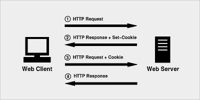

# 简介

Django 本身基于 MVC 的设计模式。

安装：`pip install Django` ，测试是否安装成功：`python -m django --version` 。

# 第一个Django项目

## 准备阶段

使用 django-admin 来创建 HelloWorld 项目：

```bash
django-admin startproject HelloWorld
```

目录说明：

- **HelloWorld:** 项目的容器。

- **manage.py:** 一个实用的命令行工具，可让你以各种方式与该 Django 项目进行交互。

- **HelloWorld/__init__.py:** 一个空文件，告诉 Python 该目录是一个 Python 包。

- **HelloWorld/asgi.py:** 一个 ASGI 兼容的 Web 服务器的入口，以便运行你的项目。

  > **一、什么是 ASGI？**
  >
  > ASGI（Asynchronous Server Gateway Interface，异步服务器网关接口）是为 Python 网络框架设计的一种标准接口，用于支持异步并发编程。它是 WSGI（Web Server Gateway Interface，Web 服务器网关接口）的异步版本，旨在支持 WebSockets 等长连接协议和高并发应用场景。
  >
  > ASGI 的主要特点：
  >
  > 1. 异步支持：ASGI 能处理异步 I/O 操作，这意味着它能高效处理并发请求，尤其是在处理长连接（如 WebSockets）或需要异步数据库查询时。
  > 2. 双向通信：ASGI 支持 WebSockets，允许客户端和服务器之间的双向通信。
  > 3. 灵活性：ASGI 不仅支持 HTTP 协议，还能处理其他协议（如 WebSockets）。这是 WSGI 所不具备的。
  > 4. 可扩展性：与 WSGI 相比，ASGI 能更好地应对现代 Web 应用的需求，尤其是在涉及实时通信和大量并发时。
  >
  > ASGI 主要用于像 FastAPI、Django Channels 等支持异步的 Python 框架。
  >
  > Django Channels 是一个扩展 Django 框架的项目，旨在为 Django 提供对 WebSockets、长连接、异步任务和其他协议的支持。Django 本身是基于 WSGI 的同步框架（但是 Django 从 3.0 版本开始就原生支持 ASGI），而 Channels 通过引入 ASGI 来增加对异步编程和双向通信的支持。
  >
  > Flask 本身并不原生支持 ASGI ，因为 Flask 是基于 WSGI 的同步 Web 框架，它的设计初衷就是为了处理同步的 HTTP 请求和响应循环。然而可以通过一些第三方工具和库将 Flask 与 ASGI 集成起来。
  >
  > **二、什么是 WSGI？**
  >
  > WSGI（Web Server Gateway Interface，Web 服务器网关接口）是 Python 中的一个标准接口，用于 Web 应用和 Web 服务器之间的通信。它是 Python Web 开发的标准协议，旨在使应用和服务器的连接更加通用、简洁。
  >
  > WSGI 的主要特点：
  >
  > 1. 同步编程：WSGI 是为同步编程模型设计的。它每次只能处理一个请求，完成后才处理下一个，因此适合处理简单的 HTTP 请求-响应模型。
  > 2. 请求-响应循环：WSGI 主要用于 HTTP 协议的请求-响应通信，无法原生处理 WebSockets 等需要双向通信的协议。
  > 3. 服务器与框架分离：WSGI 将 Web 服务器和 Web 应用解耦，这意味着 Web 应用只需遵循 WSGI 规范，就可以部署在任何兼容的 WSGI 服务器上。
  >
  > WSGI 在 Python Web 开发中的地位十分重要，Django、Flask 等经典 Web 框架都依赖于 WSGI。

- **HelloWorld/settings.py:** 该 Django 项目的设置/配置。

- **HelloWorld/urls.py:** 该 Django 项目的 URL 声明；一份由 Django 驱动的网站"目录"。

- **HelloWorld/wsgi.py:** 一个 WSGI 兼容的 Web 服务器的入口，以便运行你的项目。

接下来输入以下命令，启动服务器：

```bash
python manage.py runserver 0.0.0.0:8000
```

浏览器输入 `127.0.0.1:8000` 即可。

## 视图和URL配置

在先前创建的 HelloWorld/HelloWorld 目录新建一个 views.py 文件，并输入代码：

```python
from django.http import HttpResponse

def hello(request):
    return HttpResponse('Hello World!')
```

接着，绑定 URL 与视图函数。打开 urls.py 文件，删除原来代码，将以下代码复制粘贴到 urls.py 文件中：

```python
from django.urls import path
from . import views

urlpatterns = [
    path('hello/', views.hello),
]
```

访问 `127.0.0.1:8000/hello/` 。

## path()函数

Django path() 可以接收四个参数，分别是两个必选参数：route、view 和两个可选参数：kwargs、name。

语法格式：

```python
path(route, view, kwargs=None, name=None)
```

- **route：** 字符串，定义 URL 的路径部分。
- **view：** 视图函数，处理与给定路由匹配的请求。
- **kwargs（可选）：** 一个字典，包含传递给视图函数的额外关键字参数。
- **name（可选）：** 为 URL 路由指定一个唯一的名称，以便在代码的其他地方引用它。

# 模板

在上文中我们使用 django.http.HttpResponse() 来输出 "Hello World"。该方式将数据与视图混合在一起，不符合 Django 的 MVC 思想。

我们改为使用 Django 模板，模板是一个文本，用于分离文档的表现形式和内容。

## 应用示例

建立与 HelloWorld 同级的目录 templates ，在该目录下建立 test.html 文件，写入：

```html
<h1>{{ hello }}</h1>
```

接下来我们需要向 Django 说明模板文件的路径，修改 HelloWorld/settings.py ，修改 TEMPLATES 中的 DIRS 为 **[os.path.join(BASE_DIR, 'templates')]**，如下所示：

```python
import os	# 别忘了

TEMPLATES = [
    {
        'BACKEND': 'django.template.backends.django.DjangoTemplates',
        'DIRS': [os.path.join(BASE_DIR, 'templates')],       # 修改位置
        'APP_DIRS': True,
        'OPTIONS': {
            'context_processors': [
                'django.template.context_processors.debug',
                'django.template.context_processors.request',
                'django.contrib.auth.context_processors.auth',
                'django.contrib.messages.context_processors.messages',
            ],
        },
    },
]
```

我们现在修改 views.py，用于向模板提交数据：

```python
from django.shortcuts import render
 
def hello(request):
    context = {}
    context['hello'] = 'Hello World!'
    return render(request, 'runoob.html', context)
```

这样我们就完成了使用模板来输出数据，从而实现数据与视图分离。

## 模板标签

### 变量

语法：

```html
view：｛"HTML变量名" : views变量名｝
HTML：｛｛变量名｝｝
```

如：

```python
from django.shortcuts import render

def runoob(request):
  views_name = "菜鸟教程"
  return  render(request,"runoob.html", {"name":views_name})
```

templates 中的 runoob.html：

```html
<p>{{ name }}</p>
```

### 列表

templates 中的 runoob.html 中，可以用 **.** 索引下标取出对应的元素。

```python
from django.shortcuts import render

def runoob(request):
    views_list = ["菜鸟教程1","菜鸟教程2","菜鸟教程3"]
    return render(request, "runoob.html", {"views_list": views_list})
```

```html
<p>{{ views_list }}</p>   # 取出整个列表
<p>{{ views_list.0 }}</p> # 取出列表的第一个元素
```

### 字典

templates 中的 runoob.html 中，可以用 **.键** 取出对应的值。

```python
from django.shortcuts import render

def runoob(request):
    views_dict = {"name":"菜鸟教程"}
    return render(request, "runoob.html", {"views_dict": views_dict})
```

```html
<p>{{ views_dict }}</p>
<p>{{ views_dict.name }}</p>
```

### 过滤器

#### 语法

```html
{{ 变量名 | 过滤器:可选参数 }}
```

模板过滤器可以在变量被显示前修改它，过滤器使用管道字符，如下所示：

```
{{ name|lower }}
```

{{ name }} 变量被过滤器 lower 处理后，文档大写转换文本为小写。

过滤管道可以被套接，既是说，一个过滤器管道的输出又可以作为下一个管道的输入：

```
{{ my_list|first|upper }}
```

以上实例将第一个元素并将其转化为大写。

有些过滤器有参数。过滤器的参数跟随冒号之后并且总是以双引号包含。 例如：

```
{{ bio|truncatewords:"30" }}
```

这个将显示变量 bio 的前 30 个词。

其他过滤器：

- addslashes : 添加反斜杠到任何反斜杠、单引号或者双引号前面。
- length : 返回变量的长度。

#### default

default 为变量指定一个默认值。

```
{{ name|default:"XXX" }}
```

当然有默认的默认值，如布尔型变量的默认值是 False 。以下是默认的默认值：

```
0  0.0  False  ""  []  ()  set()  {}  None
```

#### filesizeformat

```
{{ num|filesizeformat}}
```

以更易读的方式显示文件的大小（即'13 KB', '4.1 MB', '102 bytes'等）。

#### date

根据给定格式对一个日期变量进行格式化。

```
{{ time|date:"Y-m-d" }}
```

格式 **Y-m-d H:i:s** 返回 **年-月-日 小时:分钟:秒** 的格式时间。

#### safe

将字符串标记为安全，不需要转义。

```
{{ views_str|safe }}
```

要保证 views.py 传过来的数据绝对安全，才能用 safe。

和后端 views.py 的 mark_safe 效果相同。

Django 会自动对 views.py 传到HTML文件中的标签语法进行转义，令其语义失效。加 safe 过滤器是告诉 Django 该数据是安全的，不必对其进行转义，可以让该数据语义生效。

```python
from django.shortcuts import render

def runoob(request):
    views_str = "<a href='https://www.runoob.com/'>点击跳转</a>"
    return render(request, "runoob.html", {"views_str": views_str})
```

#### if语句

```

   ... display 1

   ... display 2

   ... display 3

```

#### for循环

正向迭代：

```

	...

```

反向迭代：

```

	...

```

#### 遍历字典

可以直接用字典 **.items** 方法，用变量的解包分别获取键和值。

```python
from django.shortcuts import render

def runoob(request):
    views_dict = {"name":"菜鸟教程","age":18}
    return render(request, "runoob.html", {"views_dict": views_dict})
```

```

	{{ i }}---{{ j }}

```

#### 注释

```
{# 这是一个注释 #}
```

#### include

在模板中包含其它的模板的内容。

```

```

### 自定义标签和过滤器

1、创建 templatetags 目录（与 templates 目录同级，目录名只能是 templatetags）。

2、在 templatetags 目录下创建任意 py 文件，如：my_tags.py。

3、my_tags.py 文件代码如下：

```python
from django import template

register = template.Library()   #register的名字是固定的,不可改变
```

修改 settings.py 文件的 TEMPLATES 选项配置，添加 libraries 配置：

```python
TEMPLATES = [
    {
        'BACKEND': 'django.template.backends.django.DjangoTemplates',
        'DIRS': [BASE_DIR, "/templates",],
        'APP_DIRS': True,
        'OPTIONS': {
            'context_processors': [
                'django.template.context_processors.debug',
                'django.template.context_processors.request',
                'django.contrib.auth.context_processors.auth',
                'django.contrib.messages.context_processors.messages',
            ],
            "libraries":{                          # 添加这边三行配置
                'my_tags':'templatetags.my_tags'   # 添加这边三行配置        
            }                                      # 添加这边三行配置
        },
    },
]
```

4、利用装饰器 @register.filter 自定义过滤器。

**注意：**装饰器的参数最多只能有 2 个。

```python
@register.filter
def my_filter(v1, v2):
    return v1 * v2
```

5、利用装饰器 @register.simple_tag 自定义标签。

```python
@register.simple_tag
def my_tag1(v1, v2, v3):
    return v1 * v2 * v3
```

6、在使用自定义标签和过滤器前，要在 html 文件 body 的最上方中导入该 py 文件。

```

```

7、在 HTML 中使用自定义过滤器。

```
{{ 11|my_filter:22 }}
```

注意 11 和 22 分别对应 v1 和 v2 的参数值，view 部分只需：

```python
def hello(request):
    return render(request, 'test.html')
```

8、在 HTML 中使用自定义标签。

```

```

与 my_filter 同理。

9、语义化标签

在该 py 文件中导入 mark_safe。

```python
from django.utils.safestring import mark_safe
```

定义标签时，用上 mark_safe 方法，令标签语义化。和前端 HTML 文件中的过滤器 safe 效果一样。

```python
@register.simple_tag
def my_html(v1, v2):
    temp_html = "<input type='text' id='%s' class='%s' />" %(v1, v2)
    return mark_safe(temp_html)
```

在HTML中使用该自定义标签，在页面中动态创建标签。

```

```

### 配置静态文件

1、在项目根目录下创建 statics 目录。

2、在 settings 文件的最下方配置添加以下配置：

```python
STATIC_URL = '/static/' # 别名 
STATICFILES_DIRS = [ 
    os.path.join(BASE_DIR, "statics"), 
]
```

3、在 statics 目录下创建 css 目录，js 目录，images 目录，plugins 目录，分别放 css 文件，js 文件，图片，插件。

**注意：**此时引用路径中的要用配置文件中的别名 static，而不是目录 statics。如：

```html
<link rel="stylesheet" href="/static/plugins/bootstrap-3.3.7/dist/css/bootstrap.css">
```

在模板中使用需要加入 **``** 代码，以下实例我们从静态目录中引入图片。

```python
from django.shortcuts import render

def runoob(request):
    name ="菜鸟教程"
    return render(request, "runoob.html", {"name": name})
```

```html

{{name}}
```

### 模板继承

模板可以用继承的方式来实现复用，减少冗余内容。

网页的头部和尾部内容一般都是一致的，我们就可以通过模板继承来实现复用。

父模板用于放置可重复利用的内容，子模板继承父模板的内容，并放置自己的内容。

#### 父模板

标签 block...endblock：父模板中的预留区域，该区域留给子模板填充差异性的内容，不同预留区域名字不能相同。

```
 
预留给子模板的区域，可以设置默认内容

```

#### 子模板

子模板使用标签 extends 继承父模板：

```
 
```

子模板如果没有设置父模板预留区域的内容，则使用在父模板设置的默认内容，当然也可以都不设置，就为空。

子模板设置父模板预留区域的内容：

```
 
{ % block 名称 % }
子模板内容 

```

### 宏

宏是可重用的模板片段。

创建宏：

```html
<!--templates/macros.html-->

    <div>
        <h3>{{ item.title }}</h3>
        <p>{{ item.description }}</p>
    </div>

```

使用宏：

```html
<!--templates/index.html-->


<h1>Items</h1>

    {{ render_item(item) }}

```

# 模型

## ORM

Django 模型使用自带的 ORM。

对象关系映射（Object Relational Mapping，简称 ORM ）用于实现面向对象编程语言里不同类型系统的数据之间的转换。

ORM 在业务逻辑层和数据库层之间充当了桥梁的作用。

使用 ORM 的好处：

- 提高开发效率。
- 不同数据库可以平滑切换。

使用 ORM 的缺点：

- ORM 代码转换为 SQL 语句时，需要花费一定的时间，执行效率会有所降低。

ORM 解析过程:

- 1、ORM 会将 Python 代码转成为 SQL 语句。
- 2、SQL 语句通过 pymysql 传送到数据库服务端。
- 3、在数据库中执行 SQL 语句并将结果返回。

## 数据库配置

在项目的 settings.py 文件中找到 DATABASES 配置项，将其信息修改为：

```python
DATABASES = { 
    'default': 
    { 
        'ENGINE': 'django.db.backends.mysql',    # 数据库引擎
        'NAME': 'runoob', # 数据库名称
        'HOST': '127.0.0.1', # 数据库地址，本机 ip 地址 127.0.0.1 
        'PORT': 3306, # 端口 
        'USER': 'root',  # 数据库用户名
        'PASSWORD': '123456', # 数据库密码
    }  
}
```

接下来，告诉 Django 使用 pymysql 模块连接 mysql 数据库：

```python
# 在与 settings.py 同级目录下的 __init__.py 中引入模块和进行配置 
import pymysql

pymysql.install_as_MySQLdb()
```

## 定义模型

Django 规定，如果要使用模型，必须要创建一个 app。我们使用以下命令创建一个 TestModel 的 app:

```
django-admin startapp TestModel
```

将创建一个与 HelloWorld 同级的包。

我们修改 TestModel/models.py 文件，代码如下：

```python
from django.db import models
 
class Test(models.Model):
    name = models.CharField(max_length=20)
```

以上的类名代表了数据库表名，且继承了 models.Model，类里面的字段代表数据表中的字段（name），数据类型为 CharField（相当于varchar）， max_length 参数限定长度。

接下来在 settings.py 中找到 INSTALLED_APPS 这一项，如下：

```python
INSTALLED_APPS = (
    'django.contrib.admin',
    'django.contrib.auth',
    'django.contrib.contenttypes',
    'django.contrib.sessions',
    'django.contrib.messages',
    'django.contrib.staticfiles',
    'TestModel',               # 添加此项
)
```

在命令行中运行：

```
python manage.py makemigrations TestModel # 让 Django 知道在模型里有一些变更
python manage.py migrate TestModel # 创建表结构
```

可以看到在 MySQL 中自动创建了一个数据表。

表名组成结构为：应用名_类名（如：TestModel_test）。

**注意：**尽管我们没有在 models 给表设置主键，但是 Django 会自动添加一个 id 作为主键。

## 数据库操作

接下来我们在 HelloWorld 目录中添加 testdb.py 文件（后面再介绍），并修改 urls.py：

```python
from django.urls import path
from . import views, testdb

urlpatterns = [
    path('hello/', views.hello),
    path('testdb/', testdb.testdb),
]
```

以下是 testdb.py 的操作。

#### 添加数据

添加数据需要先创建对象，然后再执行 save 函数，相当于 SQL 中的 INSERT ：

```python
# -*- coding: utf-8 -*-
 
from django.http import HttpResponse
 
from TestModel.models import Test
 
# 数据库操作
def testdb(request):
    test1 = Test(name='runoob')
    test1.save()
    return HttpResponse("<p>数据添加成功！</p>")
```

#### 获取数据

Django 提供了多种方式来获取数据库的内容，如下代码所示：

```python
# -*- coding: utf-8 -*-
 
from django.http import HttpResponse
 
from TestModel.models import Test
 
# 数据库操作
def testdb(request):
    # 初始化
    response = ""
    response1 = ""
    
    
    # 通过objects这个模型管理器的all()获得所有数据行，相当于SQL中的SELECT * FROM
    listTest = Test.objects.all()
        
    # filter相当于SQL中的WHERE，可设置条件过滤结果
    response2 = Test.objects.filter(id=1) 
    
    # 获取单个对象
    response3 = Test.objects.get(id=1) 
    
    # 限制返回的数据 相当于 SQL 中的 OFFSET 0 LIMIT 2;
    Test.objects.order_by('name')[0:2]
    
    #数据排序
    Test.objects.order_by("id")
    
    # 上面的方法可以连锁使用
    Test.objects.filter(name="runoob").order_by("id")
    
    # 输出所有数据
    for var in listTest:
        response1 += var.name + " "
    response = response1
    return HttpResponse("<p>" + response + "</p>")
```

#### 更新数据

修改数据可以使用 save() 或 update()：

```python
# -*- coding: utf-8 -*-
 
from django.http import HttpResponse
 
from TestModel.models import Test
 
# 数据库操作
def testdb(request):
    # 修改其中一个id=1的name字段，再save，相当于SQL中的UPDATE
    test1 = Test.objects.get(id=1)
    test1.name = 'Google'
    test1.save()
    
    # 另外一种方式
    #Test.objects.filter(id=1).update(name='Google')
    
    # 修改所有的列
    # Test.objects.all().update(name='Google')
    
    return HttpResponse("<p>修改成功</p>")
```

#### 删除数据

删除数据库中的对象只需调用该对象的 delete() 方法即可：

```python
# -*- coding: utf-8 -*-
 
from django.http import HttpResponse
 
from TestModel.models import Test
 
# 数据库操作
def testdb(request):
    # 删除id=1的数据
    test1 = Test.objects.get(id=1)
    test1.delete()
    
    # 另外一种方式
    # Test.objects.filter(id=1).delete()
    
    # 删除所有数据
    # Test.objects.all().delete()
    
    return HttpResponse("<p>删除成功</p>")
```

# 表单

## GET方法

我们在之前的项目中创建一个 search.py 文件，用于接收用户的请求：

```python
from django.http import HttpResponse
from django.shortcuts import render
# 表单
def search_form(request):
    return render(request, 'search_form.html')
 
# 接收请求数据
def search(request):  
    request.encoding='utf-8'
    if 'q' in request.GET and request.GET['q']:
        message = '你搜索的内容为: ' + request.GET['q']
    else:
        message = '你提交了空表单'
    return HttpResponse(message)
```

在模板目录 templates 中添加 search_form.html 表单：

```html
<!DOCTYPE html>
<html>
<head>
<meta charset="utf-8">
<title>菜鸟教程(runoob.com)</title>
</head>
<body>
    <form action="/search/" method="get">
        <input type="text" name="q">
        <input type="submit" value="搜索">
    </form>
</body>
</html>
```

urls.py 规则修改为如下形式：

```python
from django.urls import path, re_path
from . import views, testdb, search

urlpatterns = [
    re_path(r'^hello/$', views.hello),
    re_path(r'^testdb/$', testdb.testdb),
    re_path(r'^search-form/$', search.search_form),
    re_path(r'^search/$', search.search),
]
```

## POST方法

上面我们使用了 GET 方法，视图显示和请求处理分成两个函数处理。

提交数据时更常用 POST 方法。我们下面使用该方法，并用一个 URL 和处理函数，同时显示视图和处理请求。

我们在 templates 创建 post.html：

```html
<!DOCTYPE html>
<html>
<head>
<meta charset="utf-8">
<title>菜鸟教程(runoob.com)</title>
</head>
<body>
    <form action="/search-post/" method="post">
        
        <input type="text" name="q">
        <input type="submit" value="搜索">
    </form>
 
    <p>{{ rlt }}</p>
</body>
</html>
```

在模板的末尾，我们增加一个 rlt 记号，为表格处理结果预留位置。

表格后面还有一个 **``** 的标签，这是 Django 提供的防止 CSRF 漏洞的功能。POST 方法提交的表格，必须有此标签。

在 HelloWorld 目录下新建 search2.py 文件并使用 search_post 函数来处理 POST 请求：

```python
# -*- coding: utf-8 -*-
 
from django.shortcuts import render
from django.views.decorators import csrf
 
# 接收POST请求数据
def search_post(request):
    ctx ={}
    if request.POST:
        ctx['rlt'] = request.POST['q']
    return render(request, "post.html", ctx)
```

urls.py 规则修改为如下形式：

```python
from django.urls import path, re_path
from . import views, testdb, search, search2

urlpatterns = [
    re_path(r'^hello/$', views.hello),
    re_path(r'^testdb/$', testdb.testdb),
    re_path(r'^search-form/$', search.search_form),
    re_path(r'^search/$', search.search),
    re_path(r'^search-post/$', search2.search_post),
]
```

## Request对象

每个视图函数的第一个参数是一个 HttpRequest 对象，就像下面这个 runoob() 函数：

```python
from django.http import HttpResponse

def runoob(request):
    return HttpResponse("Hello world")
```

HttpRequest 对象包含当前请求 URL 的一些信息：

| **属性**      | **描述**                                                     |
| ------------- | ------------------------------------------------------------ |
| path          | 请求页面的全路径，不包括域名，例如："/hello/"。              |
| method        | 请求中使用的HTTP方法的字符串表示，全大写表示。例如：`if request.method == 'GET'` 。 |
| GET           | 包含所有HTTP GET参数的类字典对象。                           |
| POST          | 包含所有HTTP POST参数的类字典对象。                          |
| REQUEST       | 为了方便，该属性是POST和GET属性的集合体，但是有特殊性，先查找POST属性，然后再查找GET属性。借鉴PHP's $_REQUEST。例如，如果GET = {"name": "john"}和POST = {"age": '34'}，则 REQUEST["name"] 的值是"john"，REQUEST["age"]的值是"34"。 |
| COOKIES       | 包含所有cookies的标准Python字典对象。keys和values都是字符串。 |
| FILES         | 包含所有上传文件的类字典对象。注意：只有在请求方法是POST，并且请求页面中`<form>`有`enctype="multipart/form-data"`属性时FILES才拥有数据。否则，FILES 是一个空字典。 |
| raw_post_data | 原始HTTP POST数据，未解析过。                                |

Request 对象也有一些有用的方法：

| 方法            | 描述                                                         |
| :-------------- | :----------------------------------------------------------- |
| has_key()       | 检查request.GET or request.POST中是否包含参数指定的Key。     |
| get_full_path() | 返回包含查询字符串的请求路径。例如：` "/music/bands/the_beatles/?print=true"` |
| is_secure()     | 如果请求是安全的，返回True，就是说，发出的是HTTPS请求。      |

# 视图

## 请求对象

HttpRequest 对象，简称 request 对象。

### GET

取值格式示例：

```python
def runoob(request):
   name = request.GET.get("name")
   ...
```

### POST

同 GET 。

### body

数据类型是二进制字节流，是原生请求体里的参数内容，在 HTTP 中用于 POST，因为 GET 没有请求体。

一般应用于：二进制图片、XML、Json 等。

```python
def runoob(request):
    name = request.body
    print(name)
    ...
```

### path

获取 URL 中的路径部分，数据类型是字符串。

```python
def runoob(request):
    name = request.path
    print(name) # 如/hello/
    ...
```

### method

获取当前请求的方式，数据类型是字符串，且结果为大写。

```python
def runoob(request):
    name = request.method
    print(name)
    ...
```

## 响应对象

响应对象主要有三种形式：HttpResponse()、render()、redirect() 。

**HttpResponse():** 返回文本，参数为字符串，字符串中写文本内容。如果参数为字符串里含有 html 标签，也可以渲染。

```python
return HttpResponse("<a href='https://www.runoob.com/'>菜鸟教程</a>")
```

**render():** 返回文本，第一个参数为 request，第二个参数为字符串（页面名称），第三个参数为字典（可选参数，向页面传递的参数：键为页面参数名，值为views参数名）。

```python
def runoob(request):
    name ="菜鸟教程"
    return render(request,"runoob.html",{"name":name})
```

**redirect()**：重定向，跳转新页面。参数为字符串，字符串中填写页面路径。一般用于 form 表单提交后，跳转到新页面。

```python
def runoob(request):
    return redirect("/index/")
```

render 和 redirect 是在 HttpResponse 的基础上进行了封装：

- render：底层返回的也是 HttpResponse 对象
- redirect：底层继承的是 HttpResponse 对象

## FBV与CBV

**FBV（function base views）** 基于函数的视图，就是在视图里使用函数处理请求。

**CBV（class base views）** 基于类的视图，就是在视图里使用类处理请求。

### FBV

基于函数的视图其实我们一直在使用，就是使用了函数来处理用户的请求，查看以下实例：

```python
# urls.py
urlpatterns = [
    path("login/", views.login),
]
# views.py
from django.shortcuts import render,HttpResponse

def login(request):
    if request.method == "GET":
        return HttpResponse("GET 方法")
    if request.method == "POST":
        user = request.POST.get("user")
        pwd = request.POST.get("pwd")
        if user == "runoob" and pwd == "123456":
            return HttpResponse("POST 方法")
        else:
            return HttpResponse("POST 方法1")
```

### CBV

基于类的视图，就是使用了类来处理用户的请求，不同的请求我们可以在类中使用不同方法来处理，这样大大的提高了代码的可读性。

定义的类要继承父类 View，所以需要先引入库：

```python
from django.views import View
```

其实，在我们前面学到的知识都知道 Django 的 url 是将一个请求分配给可调用的函数的，而不是一个类，那是如何实现基于类的视图的呢？ 主要还是通过父类 View 提供的一个静态方法 as_view() ，as_view 方法是基于类的外部接口， 他返回一个视图函数，调用后请求会传递给 dispatch 方法，dispatch 方法再根据不同请求来处理不同的方法。

将 FBV 的例子改为 CBV：

```python
# urls.py
urlpatterns = [
    path("login/", views.Login.as_view()),
]
# views.py
from django.shortcuts import render,HttpResponse
from django.views import View

class Login(View):
    def get(self,request):
        return HttpResponse("GET 方法")

    def post(self,request):
        user = request.POST.get("user")
        pwd = request.POST.get("pwd")
        if user == "runoob" and pwd == "123456":
            return HttpResponse("POST 方法")
        else:
            return HttpResponse("POST 方法 1")
```

执行对应请求的方法前会优先执行 dispatch 方法(在get/post/put...方法前执行)，dispatch() 方法会根据请求的不同调用相应的方法来处理。

# 路由

路由简单的来说就是根据用户请求的 URL 链接来判断对应的处理程序，并返回处理结果，也就是 URL 与 Django 的视图建立映射关系。

Django 路由在 urls.py 配置，urls.py 中的每一条配置对应相应的处理方法。

配置方法：

- path：用于普通路径，不需要自己手动添加正则首位限制符号，底层已经添加。
- re_path：用于正则路径，需要自己手动添加正则首位限制符号。

```python
path('index/', views.index), # 普通路径
re_path(r'^articles/([0-9]{4})/$', views.articles), # 正则路径
```

## 正则路径中的分组

### 无名分组

无名分组按位置传参，一一对应。

```python
urlpatterns = [
    path('admin/', admin.site.urls),
    re_path("^index/([0-9]{4})/$", views.index),
]
```

```python
from django.shortcuts import HttpResponse

def index(request, year): 
    print(year) # 一个形参代表路径中一个分组的内容，按顺序匹配
    return HttpResponse(year)
```

### 有名分组

语法：

```
(?P<组名>正则表达式)
```

有名分组按关键字传参，与位置顺序无关。

```python
urlpatterns = [ 
    path('admin/', admin.site.urls), 
    re_path("^index/(?P<year>[0-9]{4})/(?P<month>[0-9]{2})/$", views.index), 
]
```

```python
from django.shortcuts import HttpResponse
def index(request, year, month): 
    print(year,month) # 一个形参代表路径中一个分组的内容，按关键字对应匹配 
    return HttpResponse(f'year:{year} month:{month}')
```

## 路由分发

**存在问题**：Django 项目里多个 app 目录共用一个 urls 容易造成混淆，后期维护也不方便。

**解决**：使用路由分发（include），让每个 app 目录都单独拥有自己的 urls 。

**步骤：**

- 1、在每个 app 目录里都创建一个 urls.py 文件。
- 2、在项目名称目录下的 urls 文件里，统一将路径分发给各个 app 目录。

```python
from django.contrib import admin 
from django.urls import path,include # 从 django.urls 引入 include 
urlpatterns = [ 
    path("app01/", include("app01.urls")), 
    path("app02/", include("app02.urls")), 
]
```

在各自 app 目录下，写自己的 urls.py 文件，进行路径跳转。

app01 目录：

```python
from django.urls import path,re_path 
from app01 import views # 从自己的 app 目录引入 views 
urlpatterns = [ 
    re_path(r'^login/(?P<m>[0-9]{2})/$', views.index),
] 
```

app02 目录:

```python
from django.urls import path,re_path
from app02 import views # 从自己的 app 目录引入views 
urlpatterns = [ 
    re_path("^xxx/(?P[0-9]{4})/$", views.xxx), 
]
```

在各自 app 目录下的 views.py 文件中写各自的视图函数。

## 反向解析

当你改变 URL 模式时，不需要在代码的多个地方手动更新 URL，使用名称进行反向解析会自动适应更改。

### 普通路径

在 urls.py 中给路由起别名，**name="路由别名"**。

```python
path("login1/", views.login, name="login")
```

在 views.py 中，从 django.urls 中引入 reverse，利用 **reverse("路由别名")** 反向解析：

```python
return redirect(reverse("login"))
```

在模板 templates 中的 HTML 文件中，利用 **``** 反向解析。

```html
<form action="" method="post"> 
```

### 正则路径（无名分组）

在 urls.py 中给路由起别名，**name="路由别名"**。

```python
re_path(r"^login/([0-9]{2})/$", views.login, name="login")
```

在 views.py 中，从 django.urls 中引入 reverse，利用 **reverse("路由别名"，args=(符合正则匹配的参数,))** 反向解析。

```python
return redirect(reverse("login",args=(10,)))
```

在模板 templates 中的 HTML 文件中利用 **``** 反向解析。

```python
<form action="" method="post"> 
```

### 正则路径（有名分组）

在 urls.py 中给路由起别名，**name="路由别名"**。

```python
re_path(r"^login/(?P<year>[0-9]{4})/$", views.login, name="login")
```

在 views.py 中，从 django.urls 中引入 reverse，利用 **reverse("路由别名"，kwargs={"分组名":符合正则匹配的参数})** 反向解析。

```python
return redirect(reverse("login",kwargs={"year":3333}))
```

在模板 templates 中的 HTML 文件中，利用 **``** 反向解析。

```html
<form action="" method="post">
```

## 命名空间

命名空间是表示标识符的可见范围。

一个标识符可在多个命名空间中定义，它在不同命名空间中的含义是互不相干的。

一个新的命名空间中可定义任何标识符，它们不会与任何重复的标识符发生冲突，因为重复的定义都处于其它命名空间中。

**存在问题：**路由别名 name 没有作用域，Django 在反向解析 URL 时，会在项目全局顺序搜索，当查找到第一个路由别名 name 指定 URL 时，立即返回。当在不同的 app 目录下的 urls 中定义相同的路由别名 name 时，可能会导致 URL 反向解析错误。

**解决：**使用命名空间。

定义命名空间（include 里面是一个元组）格式如下：

```python
include(("app名称.urls"，"app名称"))
# 例
path("app01/", include(("app01.urls","app01"))) 
```

在 app01/urls.py 中起相同的路由别名。

```python
path("login/", views.login, name="login")
```

在 views.py 中使用名称空间，语法格式如下：

```python
reverse("app名称:路由别名")
# 例
return redirect(reverse("app01:login")
```

在 templates 模板的 HTML 文件中使用名称空间，语法格式如下：

```html

```

# Admin管理工具

Django 提供了基于 web 的管理工具。

Django 自动管理工具是 django.contrib 的一部分。你可以在项目的 settings.py 中的 INSTALLED_APPS 看到它。

## 激活

修改 urls.py ：

```python
from django.contrib import admin

urlpatterns = [
    re_path(r'^admin/', admin.site.urls),
]
```

## 使用

运行 `python manage.py migrate` 创建必要的数据表。

运行 `python manage.py createsuperuser` 来创建超级用户。

访问 `http://127.0.0.1:8000/admin/` 登录。

为了让 admin 界面管理某个数据模型，我们需要先注册该数据模型到 admin 。比如，我们之前在 TestModel 中已经创建了模型 Test 。修改 TestModel/admin.py：

```python
from django.contrib import admin
from TestModel.models import Test
 
# Register your models here.
admin.site.register(Test)
```

刷新后即可看到 Testmodel 数据表。

注册多个模型并显示：

```python
from django.contrib import admin
from TestModel.models import Test,Contact,Tag

# Register your models here.
admin.site.register([Test, Tag, Contact])
```

刷新管理页面即可。

# ORM

## 单表实例

### 创建模型

在 TestModel 中的 models.py 中添加以下类：

```python
class Book(models.Model): 
    id = models.AutoField(primary_key=True) # id 会自动创建,可以手动写入
    title = models.CharField(max_length=32) # 书籍名称
    price = models.DecimalField(max_digits=5, decimal_places=2) # 书籍价格 
    """
    max_digits=5 指定该字段的总数字符数，包括小数点前后的数字；
    decimal_places=2 指定小数点后有 2 位数字。
    因此，这个字段可以存储的最大值是 999.99。
    """
    publish = models.CharField(max_length=32) # 出版社名称 
    pub_date = models.DateField() # 出版时间
```

然后在命令行执行以下命令：

```
python manage.py makemigrations TestModel  # 让 Django 知道我们在我们的模型有一些变更
python manage.py migrate TestModel  # 创建表结构
```

### 添加

规则配置：

1、在 HelloWorld 的 urls.py 中添加路由分发：

```python
path('testmodel/', include('TestModel.urls'))
```

2、在 TestModel 中创建 urls.py ，写入：

```python
from django.contrib import admin
from django.urls import path
from . import views
 
urlpatterns = [
    path('add_book/', views.add_book),
]
```

**方式一：**模型类实例化对象

需从 app 目录引入 models.py 文件：

```python
from app目录 import models
```

并且实例化对象后要执行 **对象.save()** 才能在数据库中新增成功。

```python
# TestModel/views.py
from django.shortcuts import render,HttpResponse
from TestModel import models 
def add_book(request):
    book = models.Book(title="菜鸟教程",price=300,publish="菜鸟出版社",pub_date="2008-8-8") 
    book.save()
    return HttpResponse("<p>数据添加成功！</p>")
```

**方式二：**通过 ORM 提供的 objects 提供的方法 create 来实现（推荐）

```python
# TestModel/views.py
from django.shortcuts import render,HttpResponse
from TestModel import models 
def add_book(request):
    books = models.Book.objects.create(title="如来神掌",price=200,publish="功夫出版社",pub_date="2010-10-10") 
    return HttpResponse("<p>数据添加成功！</p>")
```

### 查找

使用 **all()** 方法来查询所有内容。

返回的是 QuerySet 类型数据，类似于 list，里面放的是一个个模型类的对象，可用索引下标取出模型类的对象。

后面说“返回的是 QuerySet 类型数据”默认如上所述。

```python
# TestModel/views.py
from django.shortcuts import render,HttpResponse
from TestModel import models 
def add_book(request):
    books = models.Book.objects.all()
    return HttpResponse(f"<p>查找成功！title:{books[0].title}</p>")
```

**filter()** 方法用于查询符合条件的数据。

返回的是 QuerySet 类型数据。

pk=3 的意思是主键 primary key=3，相当于 id=3。

因为 id 在 pycharm 里有特殊含义，是看内存地址的内置函数 id()，因此用 pk。

filter 中运算符号只能使用等于号 = ，不能使用大于号 > ，小于号 < ，等等其他符号。

__in 用于读取区间，= 号后面为列表 。

__gt 大于号 ，= 号后面为数字。

__gte 大于等于，= 号后面为数字。

__lt 小于，= 号后面为数字。

__lte 小于等于，= 号后面为数字。

__range 在 ... 之间，左闭右闭区间，= 号后面为两个元素的列表。

__contains 包含，= 号后面为字符串。

__icontains 不区分大小写的包含，= 号后面为字符串。

__startswith 以指定字符开头，= 号后面为字符串。

__endswith 以指定字符结尾，= 号后面为字符串。

__year 是 DateField 数据类型的年份，= 号后面为数字。

__month 是DateField 数据类型的月份，= 号后面为数字。

__day 是DateField 数据类型的天数，= 号后面为数字。

```python
books = models.Book.objects.filter(pk=1)
books = models.Book.objects.filter(publish='菜鸟出版社', price=300)
books = models.Book.objects.filter(price__in=[200,300])
books = models.Book.objects.filter(price__gt=200)
books = models.Book.objects.filter(price__gte=200)
books = models.Book.objects.filter(price__lt=300)
books = models.Book.objects.filter(price__lte=300)
books = models.Book.objects.filter(price__range=[200,300])
books = models.Book.objects.filter(title__contains="菜")
books = models.Book.objects.filter(title__icontains="python")
books = models.Book.objects.filter(title__startswith="菜")
books = models.Book.objects.filter(title__endswith="教程")
books = models.Book.objects.filter(pub_date__year=2008) 
books = models.Book.objects.filter(pub_date__month=10) 
books = models.Book.objects.filter(pub_date__day=01)
```

**exclude()** 方法用于查询不符合条件的数据。

返回的是 QuerySet 类型数据。

```python
books = models.Book.objects.exclude(pk=5)
books = models.Book.objects.exclude(publish='菜鸟出版社', price=300)
```

**get()** 方法用于查询符合条件数据。

符合条件的对象只能为一个，如果符合筛选条件的对象超过了一个或者没有一个都会抛出错误。

```python
books = models.Book.objects.get(pk=5)
books = models.Book.objects.get(pk=18)  # 报错，没有符合条件的对象
books = models.Book.objects.get(price=200)  # 报错，符合条件的对象超过一个
```

**order_by()** 方法用于对查询结果进行排序。

返回的是 QuerySet类型数据。

**注意：**

- 参数的字段名要加引号。
- 降序为在字段前面加个负号 `-` 。

```python
books = models.Book.objects.order_by("price") # 查询所有，按照价格升序排列 
books = models.Book.objects.order_by("-price") # 查询所有，按照价格降序排列
```

**reverse()** 方法用于对查询结果进行反转。

返回的是 QuerySe t类型数据。

```python
# 按照价格升序排列，因为先降序后进行了反转
books = models.Book.objects.order_by("-price").reverse()
```

**count()** 方法用于查询数据的数量，返回的数据是整数。

```python
books = models.Book.objects.count() # 查询所有数据的数量 
books = models.Book.objects.filter(price=200).count() # 查询符合条件数据的数量
```

**first()** 方法返回第一条数据，返回的数据是模型类的对象。

也可以用索引下标 **[0]**。

```python
books = models.Book.objects.first() # 返回所有数据的第一条数据
```

**last()** 方法返回最后一条数据，返回的数据是模型类的对象。

不能用索引下标 **[-1]**，ORM 没有逆序索引。

```python
books = models.Book.objects.last() # 返回所有数据的最后一条数据
```

**exists()** 方法用于判断查询的结果 QuerySet 列表里是否有数据。

返回的数据类型是布尔，有为 true，没有为 false。

**注意：**判断的数据类型只能为 QuerySet 类型数据，不能为整型和模型类的对象。

```python
books = models.Book.objects.exists()
books = models.Book.objects.count().exists() # 报错，判断的数据类型只能为QuerySet类型数据，不能为整型
books = models.Book.objects.first().exists() # 报错，判断的数据类型只能为QuerySet类型数据，不能为模型类对象

# 正确的使用方式
def add_book(request):
    has_books = models.Book.objects.exists()  # 这会返回 True 或 False
    if has_books:
        return HttpResponse("<p>书籍存在！</p>")
    else:
        return HttpResponse("<p>没有书籍。</p>")
```

**values()** 方法用于查询部分字段。

返回的是 QuerySet 类型数据，类似于 list，里面不是模型类的对象，而是一个可迭代的**字典**序列，字典里的键是字段，值是数据。

**注意：**参数的字段名要加引号。

```python
books = models.Book.objects.values("pk","price")
print(books[0]["price"])
```

**values_list()** 方法用于查询部分字段的数据。

返回的是 QuerySet 类型数据，类似于 list，里面不是模型类的对象，而是一个个**元组**，元组里放的是查询字段对应的数据。

想要字段名和数据用 values ，只想要数据用 values_list 。

```python
books = models.Book.objects.values_list("price","publish")
print(books[0][0])
```

**distinct()** 方法用于对数据进行去重。

返回的是 QuerySet 类型数据。

**注意：**

- 对模型类的对象去重没有意义，因为每个对象都是一个不一样的存在。
- distinct() 一般是联合 values 或者 values_list 使用。

```python
books = models.Book.objects.values_list("publish").distinct()
```

### 删除

**方式一：**使用模型类的 **对象.delete()** 。

**返回值：**元组，第一个元素为受影响的行数。

```python
books=models.Book.objects.filter(pk=8).first().delete()
```

**方式二**：使用 QuerySet **类型数据.delete()**（推荐）

**返回值：**元组，第一个元素为受影响的行数。

```python
books=models.Book.objects.filter(pk__in=[1,2]).delete()
```

**注意：**

- Django 删除数据时，会模仿 SQL 约束 ON DELETE CASCADE 的行为，也就是删除一个对象时也会删除与它相关联的外键对象。
- delete() 方法是 QuerySet 数据类型的方法，想要删除所有数据，不能不写 all。

```python
books=models.Book.objects.delete()　 # 报错
books=models.Book.objects.all().delete()　　 # 删除成功
```

### 修改

**方式一：**

```
模型类的对象.属性 = 更改的属性值
模型类的对象.save()
```

**返回值：**编辑的模型类的对象。

```python
books = models.Book.objects.filter(pk=7).first() 
books.price = 400 
books.save()
```

**方式二：**QuerySet 类型数据.update(字段名=更改的数据)（推荐）

**返回值：**整数，受影响的行数。

```python
books = models.Book.objects.filter(pk__in=[7,8]).update(price=888)
```

## 多表实例

多表关联下的操作。

一般学习场景下用不到那么复杂的数据表关系，遇到具体业务的时候再学习。

参考文献：https://www.runoob.com/django/django-orm-2.html

## 聚合查询

聚合查询函数 aggregate() 是对一组值执行计算，并返回单个值。

Django 使用聚合查询前要先从 django.db.models 引入 Avg、Max、Min、Count、Sum（首字母大写）。

```python
from django.db.models import Avg,Max,Min,Count,Sum  #   引入函数
```

聚合查询返回值的数据类型是字典。

使用 aggregate() 后，数据类型就变为字典，不能再使用 QuerySet 数据类型的一些 API 了。

日期数据类型（DateField）可以用 Max 和 Min。

返回的字典中，键的名称默认是（属性名称加上 `__聚合函数名` ，如 `price_avg`），值是计算出来的聚合值。

如果要自定义返回字典的键的名称，可以起别名：

```python
aggregate(别名 = 聚合函数名("属性名称"))
```

计算所有图书的平均价格：

```python
res = models.Book.objects.aggregate(Avg("price"))
```

计算所有图书的数量、最贵价格和最便宜价格：

````python
res = models.Book.objects.aggregate(c=Count("id"),max=Max("price"),min=Min("price"))
````

## 分组查询

分组查询 annotate() 一般会用到聚合函数，使用前要先引入。

**返回值：**

- 分组后，用 values 取值，则返回值是 QuerySet 数据类型，里面为一个个字典；
- 分组后，用 values_list 取值，则返回值是 QuerySet 数据类型，里面为一个个元组。

**注意：**

annotate 里面放聚合函数。

- **values 或者 values_list 放在 annotate 前面：**values 或者 values_list 是声明以什么字段分组，annotate 执行分组。
- **values 或者 values_list 放在 annotate 后面：** annotate 表示直接以当前表的 pk 执行分组，values 或者 values_list 表示查询哪些字段， 并且要将 annotate 里的聚合函数起别名，在 values 或者 values_list 里写其别名。

**实例**：

统计每一个出版社的最便宜的书的价格：

```python
res = models.Publish.objects.values("name").annotate(in_price = Min("book__price"))
print(res)

<QuerySet [{'name': '菜鸟出版社', 'in_price': Decimal('100.00')}, {'name': '明教出版社', 'in_price': Decimal('300.00')}]>
```

统计每一本书的作者个数：

```python
res = models.Book.objects.annotate(c = Count("authors__name")).values("title","c")
print(res)

<QuerySet [{'title': '菜鸟教程', 'c': 1}, {'title': '吸星大法', 'c': 1}, {'title': '冲灵剑法', 'c': 1}]>
```

统计每一本以"菜"开头的书籍的作者个数：

```python
res = models.Book.objects.filter(title__startswith="菜").annotate(c = Count("authors__name")).values("title","c")
print(res)

<QuerySet [{'title': '菜鸟教程', 'c': 1}]>
```

统计不止一个作者的图书名称：

```python
res = models.Book.objects.annotate(c = Count("authors__name")).filter(c__gt=0).values("title","c")
print(res)

<QuerySet [{'title': '菜鸟教程', 'c': 1}, {'title': '吸星大法', 'c': 1}, {'title': '冲灵剑法', 'c': 1}]>
```

## F和Q查询

### F查询

F() 的实例可以在查询中引用字段，来比较同一个 model 实例中两个不同字段的值。

之前构造的过滤器都只是将字段值与某个常量做比较，如果想要对两个字段的值做比较，就需要用到 F()。

使用前要先从 django.db.models 引入 F：

```python
from django.db.models import F
```

用法：

```python
F("字段名称")
```

F 动态获取对象字段的值，可以进行运算。

Django 支持 F() 对象之间以及 F() 对象和常数之间的加减乘除和取余的操作。

修改操作（update）也可以使用 F() 函数。

查询工资大于年龄的人：

```python
book = models.Emp.objects.filter(salary__gt=F("age")).values("name","age")
```

将每一本书的价格提高 100 元：

```python
res = models.Book.objects.update(price=F("price")+100)
```

### Q查询

使用前要先从 django.db.models 引入 Q:

```python
from django.db.models import Q
```

用法：

```python
Q("条件判断")
```

例如：

```python
Q(title__startswith="菜")
```

之前构造的过滤器里的多个条件的关系都是 and，如果需要执行更复杂的查询（例如 or 语句），就可以使用 Q 。

Q 对象可以使用 & | ~ （与 或 非）操作符进行组合，优先级从高到低：~ & | 。

可以混合使用 Q 对象和关键字参数，Q 对象和关键字参数是用 "and" 拼在一起的（即将逗号看成 and ），但是 Q 对象必须位于所有关键字参数的前面。

实例：

查询价格大于 350 或者名称以菜开头的书籍的名称和价格：

```python
res=models.Book.objects.filter(Q(price__gt=350)|Q(title__startswith="菜")).values("title","price")
```

查询以"菜"结尾或者不是 2010 年 10 月份的书籍：

```python
res=models.Book.objects.filter(Q(title__endswith="菜") | ~Q(Q(pub_date__year=2010) & Q(pub_date__month=10)))
```

查询出版日期是 2004 或者 1999 年，并且书名中包含有"菜"的书籍：

```python
# Q 对象和关键字混合使用，Q 对象要在所有关键字的前面
res = models.Book.objects.filter(Q(pub_date__year=2004) | Q(pub_date__year=1999), title__contains="菜")
```

# Form组件

一些更深入和规范的 form 表单模板开发规则。

现在一般都是前后端分离架构，遇到具体业务的时候再学习。

参考文献：https://www.runoob.com/django/django-form-component.html

# 用户认证

Django 用户认证（Auth）组件一般用在用户的登录注册上，用于判断当前的用户是否合法，并跳转到登陆成功或失败页面。

Django 用户认证（Auth）组件需要导入 auth 模块:

```python
# 认证模块
from django.contrib import auth

# 对应数据库
from django.contrib.auth.models import User
```

返回值是用户对象。

创建用户对象的三种方法：

- **create()**：创建一个普通用户，密码是明文的。
- **create_user()**：创建一个普通用户，密码是密文的。
- **create_superuser()**：创建一个超级用户，密码是密文的，要多传一个邮箱 email 参数。

**参数：**

- username: 用户名。
- password：密码。
- email：邮箱 (create_superuser 方法要多加一个 email)。

```python
from django.contrib.auth.models import User 
User.objects.create(username='runboo',password='123')
User.objects.create_user(username='runbooo',password='123')
User.objects.create_superuser(username='runboooo',password='123',email='runboo@163.com')
```

验证用户的用户名和密码使用 authenticate() 方法，从 auth_user 表中过滤出用户对象。

使用前要导入：

```python
from django.contrib import auth
```

参数：

- username：用户名
- password：密码

**返回值：**如果验证成功，就返回用户对象，反之，返回 None。

```python
def login(request):
    if request.method == "GET":
        return render(request, "login.html")
    username = request.POST.get("username")
    password = request.POST.get("pwd")
    # 下面两行是验证码
    valid_num = request.POST.get("valid_num")
    keep_str = request.session.get("keep_str")
    if keep_str.upper() == valid_num.upper():
        user_obj = auth.authenticate(username=username, password=password)
        print(user_obj.username)
```

验证成功并登录，使用 login() 方法。

使用前要导入：

```python
from django.contrib import auth
```

参数：

- request：用户对象

返回值：None

```python
def login(request):
    if request.method == "GET":
        return render(request, "login.html")
    username = request.POST.get("username")
    password = request.POST.get("pwd")
    valid_num = request.POST.get("valid_num")
    keep_str = request.session.get("keep_str")
    if keep_str.upper() == valid_num.upper():
        user_obj = auth.authenticate(username=username, password=password)
        if not user_obj:
            return redirect("/login/")
        else:
            # 登陆使用login()方法，将request.user赋值为用户对象
            auth.login(request, user_obj)
            path = "/index/"
            return redirect(path)
    else:
        return redirect("/login/")
```

注销用户使用 logout() 方法，将 request.user 赋值为匿名用户。

使用前要导入：

```python
from django.contrib import auth
```

参数：

- request：用户对象

返回值：None

```python
def logout(request): 
    ppp = auth.logout(request) 
    print(ppp) # None 
    return redirect("/login/")
```

设置装饰器，给需要登录成功后才能访问的页面统一加装饰器。

```python
from django.contrib.auth.decorators import login_required 

@login_required 
def index(request): 
	return HttpResponse("index页面。。。")
```

# Cookie/Session

## Cookie

Cookie 是存储在客户端计算机上的文本文件，并保留了各种跟踪信息。

识别返回用户包括三个步骤：

- 服务器脚本向浏览器发送一组 Cookie 。例如：姓名、年龄或识别号码等。
- 浏览器将这些信息存储在本地计算机上，以备将来使用。
- 当下一次浏览器向 Web 服务器发送任何请求时，浏览器会把这些 Cookie 信息发送到服务器，服务器将使用这些信息来识别用户。

HTTP 是一种"无状态"协议，这意味着每次客户端检索网页时，客户端打开一个单独的连接到 Web 服务器，服务器会自动不保留之前客户端请求的任何记录。

一个 Web 服务器可以分配一个唯一的 session 会话 ID 作为每个 Web 客户端的 cookie，对于客户端的后续请求可以使用接收到的 cookie 来识别。

在 Web 开发中，使用 session 来完成会话跟踪，session 底层依赖 Cookie 技术。



### 语法

设置 cookie:

```python
rep.set_cookie(key,value,...) 
"""
功能: 设置一个普通的 Cookie。
参数:
- key: Cookie 的名称。
- value: Cookie 的值。
- 其他可选参数（如过期时间、路径、域等）可以用来配置 Cookie 的行为。
"""

rep.set_signed_cookie(key,value,salt='加密盐',...)
"""
功能: 设置一个经过签名的 Cookie，用于确保 Cookie 内容的完整性和真实性。
参数:
- key: Cookie 的名称。
- value: Cookie 的值。
- salt: 用于签名的盐值（字符串），增加签名的复杂性和安全性。
- 其他可选参数（如过期时间、路径、域等）同样可以用来配置 Cookie 的行为。
"""
```

获取 cookie:

```python
request.COOKIES.get("key名称")
```

删除 cookie:

```python
def my_view(request):
    rep = HttpResponse("Some response")
    # delete_cookie 适用于 HttpResponse 对象
    rep.delete_cookie("my_cookie")  # 删除名为 "my_cookie" 的 Cookie
    return rep
```

HttpResponse 对象可由 HttpResponse 或 render 或 redirect 得到。

### 一个与登录相关的代码

```python
def login(request):
    if request.method == "GET":
        return render(request, "login.html")
    username = request.POST.get("username")
    password = request.POST.get("pwd")

    user_obj = models.UserInfo.objects.filter(username=username, password=password).first()
    print(user_obj.username)

    if not user_obj:
        return redirect("/login/")
    else:
        auth.login(request, user_obj)
        rep = redirect("/index/")
        # 设置Cookie
        rep.set_cookie("is_login", True)
        return rep
        
def index(request):
    print(request.COOKIES.get('is_login'))
    status = request.COOKIES.get('is_login') # 收到浏览器的再次请求,判断浏览器携带的cookie是不是登录成功的时候响应的 cookie
    if not status:
        return redirect('/login/')
    return render(request, "index.html")


def logout(request):
    rep = redirect('/login/')
    rep.delete_cookie("is_login")
    return rep # 点击注销后执行，删除cookie，不再保存用户状态，并弹到登录页面
```

## Session

Session 是保存在服务端的键值对。

服务器在运行时可以为每一个用户的浏览器创建一个其独享的 session 对象，由于 session 为用户浏览器独享，所以用户在访问服务器的 web 资源时，可以把各自的数据放在各自的 session 中，当用户再去访问该服务器中的其它 web 资源时，其它 web 资源再从用户各自的 session 中取出数据为用户服务。

)

### 工作原理

- 浏览器第一次请求获取登录页面 login。

- 浏览器输入账号密码第二次请求，若输入正确，服务器响应浏览器一个 index 页面和一个键为 sessionid，值为随机字符串的 cookie，即 set_cookie("sessionid",随机字符串)。

- 服务器内部在 django.session 表中记录一条数据。

  django.session 表中有三个字段。

  - session_key：存的是随机字符串，即响应给浏览器的 cookie 的 sessionid 键对应的值。

  - session_data：存的是用户的信息，即多个 request.session["key"]=value，且是密文。

    > `session_data` 字段在 `django.session` 表中存储用户的会话信息，主要包括以下几个方面：
    >
    > 1、 数据格式
    >
    > - 序列化: Django 会将存储在 `request.session` 中的所有数据序列化为字符串格式（通常是使用 JSON 或 pickle 序列化）。
    > - 密文存储: 由于 `session_data` 存储的是序列化后的数据，因此可以包括多个键值对，用户的所有会话信息都会集中存放在这个字段中。
    >
    > 2、内容
    >
    > - 用户数据: 可能包含用户登录状态、用户 ID、权限、偏好设置等信息。例如：
    >
    >   ```
    >   request.session['user_id'] = user.id
    >   request.session['is_logged_in'] = True
    >   request.session['preferences'] = {'theme': 'dark', 'language': 'en'}
    >   ```

  - expire_date：存的是该条记录的过期时间（默认14天）。

- 浏览器第三次请求其他资源时，携带 cookie:{sessionid:随机字符串}，服务器从 django.session 表中根据该随机字符串取出该用户的数据，供其使用（即保存状态）。

**注意：**

1、会话与浏览器的关系

- 浏览器唯一性: Django 的会话管理是基于浏览器的。每个浏览器实例（或标签页）都有自己的会话 cookie（`sessionid`），用于标识该会话。
- 单条记录: 如果同一个浏览器在不同时间登录了不同的用户，Django 只会保留最后一次登录的用户信息，之前的会话信息会被覆盖。因此，只有一个有效的会话记录。

2、多个浏览器

- 多条记录: 当使用不同的浏览器（或设备）时，每个浏览器都会有自己的会话 cookie，因此每个浏览器的请求会生成独立的会话记录。这意味着不同浏览器的用户信息可以并存。

总之，Django 的会话管理是以浏览器为单位的，每个浏览器只能保存一条会话记录，因此同一浏览器切换用户时会导致之前的信息被覆盖。不同的浏览器则可以保持各自独立的会话记录。

### 语法

cookie 弥补了 http 无状态的不足，让服务器知道来的人是"谁"，但是 cookie 以文本的形式保存在浏览器端，安全性较差，且最大只支持 4096 字节，所以只通过 cookie 识别不同的用户，然后，在对应的 session 里保存私密的信息以及超过 4096 字节的文本。

session 设置：

```python
request.session["key"] = value
```

执行步骤：

- 生成随机字符串。
- 把随机字符串和设置的键值对保存到 django_session 表的 session_key 和 session_data 里。
- 设置 cookie：set_cookie("sessionid", 随机字符串) 响应给浏览器。

session 获取：

```python
request.session.get('key')
```

执行步骤：

- 从 cookie 中获取 sessionid 键的值，即随机字符串。
- 根据随机字符串从 django_session 表过滤出记录。
- 取出 session_data 字段的数据。

session 删除，删除整条记录（包括 session_key、session_data、expire_date 三个字段）：

```python
request.session.flush()
```

删除 session_data 里的其中一组键值对：

```python
del request.session["key"]
```

执行步骤：

- 从 cookie 中获取 sessionid 键的值，即随机字符串。
- 根据随机字符串从 django_session 表过滤出记录。
- 删除过滤出来的记录。

# 中间件

Django 中间件是修改 Django request 或者 response 对象的钩子，可以理解为是介于 HttpRequest 与 HttpResponse 处理之间的一道处理过程。

目前还没有接触过需要中间件的项目，遇到具体业务的时候再学习。

参考文献：https://www.runoob.com/django/django-middleware.html

# WebSocket

## 准备

Django 默认不支持 WebSocket，安装第三方组件：

```bash
pip install channels
```

前端测试页面：

```html
<!-- WebSocket测试 -->
<!DOCTYPE html>
<html lang="zh">
<head>
    <meta charset="UTF-8">
    <meta name="viewport" content="width=device-width, initial-scale=1.0">
    <title>WebSocket Test</title>
</head>
<body>
    <h1>输入"exit"关闭连接</h1>
    <div id="msg"></div>
    <br>
    <form id="form">
        <label for="text">Input: </label>
        <input type="text" id="text" autofocus>
    </form>
    <script>
        const log = (text, color) => {
            document.getElementById('msg').innerHTML += `<span style="color: ${color}">${text}</span><br>`;
        };

        const socket = new WebSocket('ws://127.0.0.1:8000/temperature');

        socket.addEventListener('message', ev => {
            log('<<< ' + ev.data, 'blue');
        });

        document.getElementById('form').onsubmit = ev => {
            ev.preventDefault();
            const textField = document.getElementById('text');
            log('>>> 原始：' + textField.value, 'red');
            socket.send(textField.value);
            textField.value = '';
        };
    </script>
</body>
</html>
```

## 创建消费者

在你的应用中（即 wsgi.py 所在目录）创建一个 consumers.py：

```python
import json
import asyncio
from channels.generic.websocket import AsyncWebsocketConsumer

# 继承AsyncWebsocketConsumer类，这是Django Channels提供的一个异步消费者类，专用于处理WebSocket连接
class ProgressConsumer(AsyncWebsocketConsumer):

    async def connect(self):
        await self.accept()
        # 启动发送hello的后台任务
        asyncio.create_task(self.send_hello())

    async def disconnect(self, close_code):
        pass

    async def send_hello(self):
        while True:
            await self.send(text_data=json.dumps({"message": "hello"}))
            await asyncio.sleep(1)

    async def receive(self, text_data):
        print("Received:", text_data)
```

> **1、async**
>
> - `async`是一个关键字，用于定义异步函数。异步函数在被调用时不会立即执行，而是返回一个协程对象，直到被`await`或事件循环执行。
> - 使用`async`定义的函数允许使用`await`关键字，可以挂起函数的执行，等待其他协程完成。
>
> **2、await**
>
> - `await`关键字用于等待一个协程或可等待对象的完成。它只能在`async`定义的函数内部使用。
> - 当程序执行到`await`时，会暂停当前协程的执行，直到被等待的操作完成，然后恢复执行。这使得其他协程可以运行，避免了阻塞。
>
> **3、asyncio**
>
> - `asyncio`是Python标准库中的一个模块，用于编写并发代码。
> - 使用`asyncio`，可以创建事件循环，调度协程，处理I/O操作，而不会阻塞主线程。这使得异步编程变得更加高效。
>
> **4、self**
>
> - `self`是一个约定，用于指代类的实例。在类的方法中，第一个参数通常命名为`self`，代表调用该方法的对象实例。
> - 通过`self`，可以访问实例的属性和其他方法。
>
> ```
> 	def __init__(self, value):
>         self.value = value  # 使用self访问实例属性
> 
>    def display(self):
>         print(self.value)
> 
> obj = MyClass(10)
> obj.display()  # 输出10
> ```

## 更新路由配置

在你的应用中创建 routing.py 设置 WebSocket 路由：

```python
from django.urls import path
from .consumers import ProgressConsumer

websocket_urlpatterns = [
    path('temperature', ProgressConsumer.as_asgi()),
]
```

## 配置Channels

在 settings.py 中添加 Channels 配置：

```python
INSTALLED_APPS = [
    # ...
    'channels',
]

ASGI_APPLICATION = 'HelloWorld.asgi.application'
```

## 更新ASGI文件

更新  asgi.py 文件：

```python
import os
from django.core.asgi import get_asgi_application
from channels.routing import ProtocolTypeRouter, URLRouter
from channels.auth import AuthMiddlewareStack
from HelloWorld.routing import websocket_urlpatterns

os.environ.setdefault('DJANGO_SETTINGS_MODULE', 'HelloWorld.settings')

# application = get_asgi_application()

application = ProtocolTypeRouter({
    "http": get_asgi_application(),
    "websocket": AuthMiddlewareStack(
        URLRouter(
            websocket_urlpatterns
        )
    ),
})
```

## 运行服务器

启动后看到下面这样的就说明成功了：


## 改进

在上面的例子中，服务器向前端推送消息的实现逻辑是开一个 while True 循环检测。但在实际应用中发现，服务器会卡在这个 while 循环中，以至于无法收到任何 http 请求。

那么开一个线程来执行这个 while True 循环？不，依然不行，这样又麻烦又乱，又是异步又是线程，一会儿又要异步转同步。为什么不使用封装的思想，在 consumers 类中封装一个 send 方法，当需要向前端推送消息的时候，调用这个 send 方法即可？

确实可以，使用 Channel Layer。

Channels 引入了 Channel Layer 的概念，它是一个用于不同消费者之间进行通信的后端系统（如 Redis），也可与外部 Django 程序实现互通。

多个 Channel 可以组成一个 Group，每个 Group 都有一个名称。任何拥有该名称的 Channel 都可以加入或退出该 Group，并向 Group 发送消息。Group 内的所有 Channel 都会接收到这些消息，但无法向 Group 内的具体某个 Channel 发送消息。

代码实现：

```python
# settings.py 添加
CHANNEL_LAYERS = {
    'default': {
        'BACKEND': 'channels.layers.InMemoryChannelLayer',
    },
}

# consumers.py 修改
class ProgressConsumer(AsyncWebsocketConsumer):
    async def connect(self):
        await self.channel_layer.group_add('progress_group', self.channel_name)
        await self.accept()

    async def disconnect(self, close_code):
        await self.channel_layer.group_discard('progress_group', self.channel_name)

    async def send_progress_update(self, progress):
        await self.send(text_data=json.dumps({
            'progress': progress
        }))
        
# 需要向前端推送消息时
from channels.layers import get_channel_layer
from asgiref.sync import async_to_sync

# 获取当前的 Channel Layer 实例
channel_layer = get_channel_layer()
# async_to_sync() 用于在同步代码中调用异步代码
async_to_sync(channel_layer.group_send)(
    # 组名
    'progress_group',
    # 消息
    {
        # 指定消息的类型，用于消费者处理消息时执行哪个处理方法
        'type': 'send_progress_update',
        # 消息内容
        'progress': '这是推送消息',
    }
)
```

官方推荐使用 Redis 作为 Channel Layer，如果没有使用 Redis，可以使用默认的 Channel Layer，这通常是基于内存的，即：

```python
CHANNEL_LAYERS = {
    'default': {
        'BACKEND': 'channels.layers.InMemoryChannelLayer',
    },
}
```

# 跨域

**1、安装依赖**

```bash
pip install django-cors-headers
```

**2、添加配置**

修改 settings.py：

```python
# 修改
ALLOWED_HOSTS = ['*']

# 添加
INSTALLED_APPS = [
    ...
    'corsheaders',
    ...
]

# 添加
MIDDLEWARE = [
    'django.middleware.security.SecurityMiddleware',
    'django.contrib.sessions.middleware.SessionMiddleware',
    'django.middleware.common.CommonMiddleware',
    'corsheaders.middleware.CorsMiddleware', #必须放这里
    'django.middleware.csrf.CsrfViewMiddleware',
    ...
]

# 添加
CORS_ALLOW_CREDENTIALS = True
CORS_ALLOW_ALL_ORIGINS = True
CORS_ALLOW_HEADERS = ['*']
```

如果还不行，多半是因为 CSRF 的问题。

在前后端分离的项目中，我们不能保证前端一定加入了 CSRF 功能。如果没加，那只能我们在视图中禁用 CSRF：

```python
from django.views.decorators.csrf import csrf_exempt

@csrf_exempt
def login(request):
    ...
```

多半用在登录、注销、表单提交中。

# 启动时执行

方法很多，一种简单无脑的方法是：

Django 2.1 及以上时， views.py 会在 Django 启动的时候执行一次，所以我们直接把 function_run() 丢在 views.py 中即可实现”开机自启动“。
