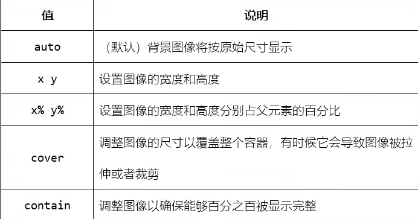

# 概述

## 语法规则

CSS 规则集（rule-set）由选择器和声明块组成：


## 嵌入方式

- 内联样式：HTML 标签内使用 style 属性。

  ```css
  style="键1:值1; 键2:值2;"
  ```

- 内部样式表：使用 \<style> 标签。
  
- 外部样式表：使用 \<link> 标签。

> 优先级：style → \<style> → \<link>

## 注释

/**/

## 单位

- px：像素，最常用。
- vm：视口宽度，1vm 占 视窗的 1% 。
- em：1em=16px 。
- %：占父标签的尺寸。
- cm

# 选择器

## 基本选择器

### 通用选择器

优先级最低。

```css
*{
    xxx
}
```

### 元素选择器

```css
p{
    xxx
}
```

### 类选择器

```css
/*匹配所有class*/
//<h1 class="demo">xxx</h1>
//<p class="demo">yyy</p>
.demo{
    xxx
}
/*仅针对某元素*/
//<h1 class="demo">xxx</h1>
//<p class="demo">yyy</p>
p.demo{
    xxx
}
/*扩展应用*/
//<h1 class="center">xxx</h1>
//<p class="center">yyy</p>
//<p class="center large">zzz</p> 
//此例中h1不享受CSS，p-yyy享受一个，p-zzz享受两个
p.center{
  xxx
}
p.large{
  xxx
}
```

### id选择器

```css
//<span id="demo">xxx</span>
#demo{
    xxx
}
```

> class 与 id 的区别：一个 id 属性值只能匹配一个标签，而 class 可匹配多个。

## 复合选择器

### 交集选择器

`元素选择器.类选择器` or `元素选择器#id选择器`，如 "span#xxx"（\<span id="xxx">）。

### 并集选择器

又叫分组/群组选择器。

```css
任意选择器1, 任意选择器2, 任意选择器3[...]{
    xxx
}
```

### 后代选择器

又叫包含选择器。

```css
任意选择器1 任意选择器2 任意选择器3[...]{
    xxx
}
```

为任意选择器 1 的后代中的任意选择器 2 的后代中的任意选择器 3 添加 CSS 。

### 子元素选择器

类似后代选择器，区别为“子”与“后代”。

```css
任意选择器1 > 任意选择器2 > 任意选择器3[...]{
    xxx
}
```

### 相邻兄弟选择器

```css
基本选择器1 + 基本选择器2{
    xxx
}
```

两个选择器互为相邻兄弟，在标签树中选择器 2 在选择器 1 右边，对选择器 2 添加 CSS 。

### 通用兄弟选择器

```css
基本选择器1 ~ 基本选择器2{
    xxx
}
```

两个选择器只要是兄弟即可，对选择器 2 添加 CSS 元素。

## 伪选择器

> 注意：不约束范围则默认为全局。

### 伪元素选择器

- ::first-line：匹配块级元素如 div、p 的第一行，不受网页框大小影响，通过如 p::first-line 约束范围。

- ::first-letter：匹配块级元素的第一个字符，通过如 p::first-line 约束范围。

- ::before、::after：

  ```css
  a::before{
        content: "xxx";
  }
  //在<a>标签包围的内容前插入xxx，若插入图片则为“content=路径”
  //::after同
  ```

  

- ::selection：对用户使用点按鼠标左键拖动等方式选中的内容使用 CSS 。

### 伪类选择器

- 动态伪类选择器：常用于链接，约束方式同上，编写时需按顺序。

  以 \<a> 为例，

  - :link：链接未被访问时。

  - :visited：链接被访问过时。

  - :hover：鼠标悬停在链接上时。

  - :active：鼠标点击链接并未松开时。

  - :focus：

    ```html
    <style type="text/css">
        input#boy:focus{
            background-color: cyan;
        }
        input#girl:focus{
            background-color: pink;
        }
    </style>
    <form>
        <input type="text" name="name" id="boy" placeholder="男">
        <br/><br/>
        <input type="text" name="name" id="girl" placeholder="女">
    </form>
    ```
    
    
    
    注：input 可省，但 CSS 语法注重在选择器前写上对应标签。

- UI 伪类选择器：（UI 指交互内容，如表单）

  - :enabled、:diabled：匹配表单对应 enabled 和 disabled 部分。

  - :checked：匹配选择框。

  - :required、:optional

  - :default：对表单元素的默认值添加 CSS ，可用于以下元素：

    - \<button>
    - \<input type="checkbox">
    - \<input type="radio">
    - \<option>

    ```html
    <style type="text/css">
        option:default{
            background-color: red;
        }
    </style>
    <form>
        <select>
            <option>选项1</option>
            <option>选项2</option>
            <option selected>默认选项</option>
        </select>
    </form>
    ```

    

  - :valid、:invalid：用于会自动检测输入是否合法的表单元素。

  - :in-range、:out-of-range：匹配 max、min 属性。

  - :read-only、:read-write：匹配 readonly 及默认的 readwrite 属性。

- 结构伪类选择器：

  - :root：无需进行约束，匹配 HTML 文档的根标签 \<body> 。

  - :empty：匹配空元素如 \<p>\</p> ，注意需要码上宽高把空元素撑开才会显示 CSS 效果。

  - p:first-child：该 \<p> 标签为其父元素的第一个孩子。

  - p:last-child：该 \<p> 标签为其父元素的最后一个孩子。

  - span:only-child：该 \<span> 标签为其父元素的唯一孩子。

  - span:only-of-type：该 \<span> 标签可能不是其父元素的唯一孩子，但其父元素的孩子一定只能有一个\<span> 。

  - span:first-of-type、span:last-of-type：该 \<span> 标签为其父元素的所有子 \<span> 标签中的第一个或最后一个。

  - p:nth-child(n)：该 \<p> 标签是 \<body> 的第 n 个孩子。

  - p:nth-last-child(n)：该 \<p> 标签是 \<body> 的倒数第 n 个孩子。

  - p:nth-of-type(n)：该 \<p> 标签为 \<body> 的所有子 \<p> 标签的第 n 个。

  - p:nth-last-of-type(n)：该 \<p> 标签为 \<body> 的所有子 \<p> 标签的倒数第 n 个。

  - :target：为使用了页内跳转的元素添加 CSS 。

  - :lang(xx)：为设置为 xx 语言的元素添加 CSS 。

  - :not(xx)：匹配除 xx 以外的标签。

## 属性选择器

如 `[class="xxx"]` ，匹配所有包含 class="xxx" 的元素。如果想要匹配所有以 "xxx" 开头的 class ，则改为 `[class^="xxx"]` ；想要匹配所有以 "xxx" 结尾的 class ，则把 ^ 改为 $ ；想要模糊匹配，即匹配所有内含 "xxx" 字眼的 class ，则把 ^ 改为 * ；想要匹配所有含 "xxx" 字串的 class ，则把 ^ 改为 ~ 。进一步的，想要筛选特定的标签，则在 [ 前加上所需要的标签即可。

对于 \<p class="wood-fire"> ，`[class*="woo"]` 可匹配到，`[class~="woo"]` 则不能，因为 "woo" 不是字串，"wood" 才是。

# 属性

## 颜色

### 值

```css
rgb(red, green, blue)
#rrggbb
red /*用名字*/
hsl(hue, saturation, lightness)
/*
色相（hue）：色轮上从 0 到 360 的度数。0 是红色，120 是绿色，240 是蓝色。
饱和度（saturation）：一个百分比值，0％ 表示灰色阴影，100％ 是全色。
亮度（lightness）：也是百分比，0％ 是黑色，50％ 是既不明也不暗，100％是白色。
*/
rgba(255, 99, 71, 0.5) 
hsla(9, 100%, 64%, 0.5)
/*
透明度为50%，默认1.0，即完全不透明
使用默认1.0时，写作rgb()或hsl()即可
*/
```

### background-color

背景颜色，针对盒子模型中 border 以内的部分。

### color

文本颜色。

### border-color

边框颜色，可以设置一、二、三、四个值，同 border-width（后面会讲）。

### outline-color

轮廓颜色。

## 背景

### opacity

透明度，默认 1.0 ，即不透明。为一个元素的背景添加透明度时，其所有子元素都继承相同的透明度。

### background-image

1. 图片背景：

   ```css
   background-image:url(xxx)[,url(xxx),..
   ```

   - 先设置的覆盖后设置的。
   - 默认情况下，图像会重复，以覆盖整个元素。
   - 背景图片会覆盖背景颜色。

2. 渐变色背景

   ```css
   background-image: linear-gradient(direction, color1, color2, ...);
   ```

   - direction 指定渐变方向：
     - to bottom - 默认，从上到下
     - to top
     - to left
     - to right
     - to top left/right
     - to bottom left/right
   - 从 color1 渐变到 color2 。
   - direction 可改成 angle ，即使用自定义渐变角度开启渐变，而不是默认的 45°。
     - 0deg 等于向上（to top）
     - 90deg 等于向右（to right）
     - 180deg 等于向下（to bottom）
     - ……

### background-repeat

默认情况下，background-image 属性在水平和垂直方向上都重复图像。而某些图像只适合水平或垂直方向上重复，否则它们看起来会很奇怪，此时可使用 background-repeat 属性。


### background-position

背景图片的框距，如 "10px 50px" 表示距水平 10 像素，垂直 50 像素。


### background-attachment

背景图像随页面的滚动方式，属性值：scroll、fixed 。

### 简写

```css
body {
  background-color: #ffffff;
  background-image: url("tree.png");
  background-repeat: no-repeat;
  background-position: right top;
}
```

->

```css
body {
  background: #ffffff url("tree.png") no-repeat right top;
}
```

在使用简写属性时，属性值的顺序为：

1. background-color
2. background-image
3. background-repeat
4. background-attachment
5. background-position

属性值之一缺失不要紧，只要按照此顺序设置其他值即可。

### background-clip

规定背景的绘制区域。

| 值          | 描述                   |
| :---------- | :--------------------- |
| border-box  | 背景被裁剪到边框盒。   |
| padding-box | 背景被裁剪到内边距框。 |
| content-box | 背景被裁剪到内容框。   |

### background-origin

定位背景图像的相对位置。

| 值          | 描述                           |
| :---------- | :----------------------------- |
| padding-box | 背景图像相对于内边距框来定位。 |
| border-box  | 背景图像相对于边框盒来定位。   |
| content-box | 背景图像相对于内容框来定位。   |

### background-size

背景图像的大小。



## 边框

### border-style

边框样式。


### border-width

边框宽度，一般用单位 px ，也可以使用三个预定义值之一：thin(1px)、medium(3px) 、 thick(5px) 。

border-width 属性可以设置一（上下左右）、二（上下、左右）、三（上、左右、下）、四（上、右、下、左）个值。

### border-top-style、border-bottom-style、border-left-style、border-right-style

边框的上、下、左、右部分的类型。统一写法：

1. `border-style:"上 右 下 左"` 
2. `border-style:"上下 左右"` 
3. `border-style:"上 左右 下"`

> border-width、border-color也有类似用法

### 简写

仅适用于三个属性：

- border-width
- border-style（必需）
- border-color

还可以只为一个边指定所有单个边框属性：

```css
border-left: 6px solid red;
```

### border-radius

&emsp;&emsp;向元素添加圆角边框，一般用单位 px ，指定 1/4 圆的水平半径和垂直半径的长度。

### border-top-left-radius

设置边框左上角为圆角，其他三个类推，可以有一或二个值。

## 盒子模型

### 概述

块级元素才有的，只有对块级元素设置才会生效。默认情况下，margin、border、padding 都为 0 。


### 外边距

键：

- margin-top
- margin-right
- margin-bottom
- margin-left

值：

- auto：（默认），按浏览器的想法设置外边距。
- 10px、10cm
- 10%：按占父元素的百分比设置外边距。
- inherit：从父元素继承外边距。

简写：`margin:上 右 下 左` ，还可以只设置三、二、一个值。

### 内边距

类似 margin 。

### 内容

1. height  和 width 属性用于设置高度和宽度，值与 margin 相同。
2. max-width、min-width、max-height、min-height：最小最大尺寸，值：px/cm、%、none（默认，无限制） 。页面框缩放时，元素是可以同步改变大小的，但此属性可规定最大/最小限度。当浏览器窗口小于元素的尺寸时，浏览器会将滚动条添加到页面。但注意，max-width  属性的值将覆盖 width 。

### box-sizing

盒子尺寸，有 margin-box、padding-box、border-box、content-box（默认） 四个值，分别对应盒子模型的四个部分。使用了该属性后，该标签设置的 width 和 height 将使用于 box-sizing 属性值对应的盒子部分。如：

```css
.div1 {
  width: 300px;
  height: 100px;
  border: 1px solid blue;
  box-sizing: border-box;
}
```

### box-shadow

设置盒子的阴影。


## 轮廓

### 概述

轮廓是在元素边框之外绘制的，并且可能与其他内容重叠。同样，轮廓也不是元素尺寸的一部分；元素的总宽度和高度不受轮廓线宽度的影响。

### outline-style

轮廓样式，值同 border-style 。

### outline-width

轮廓宽度，值同 border-width 。

### 简写

仅适用于三个属性：

- outline-width
- outline-style（必需）
- outline-color

### outline-offset

在轮廓与边框之间添加空间，单位 px ，该空间是透明的。

## 文本

### text-align

水平对齐方式，三个值：left、center、right 。如果文本方向是从左到右，则默认为左对齐；如果文本方向是从右到左，则默认是右对齐。

如果属性设置为 "justify" ，将拉伸每一行，以使每一行具有相等的宽度，并且左右边距是直的（类似报纸）。

### vertical-align

垂直对齐方式，三个值：top、middle、bottom（默认）。

### text-decoration

文本装饰，四个值：overline(上划线)、line-throuth(中划线)、underline(下划线)、none(无划线，通常用于去掉链接的下划线) 。

### text-transform

大小写转换，三个值：uppercase(全部大写)、lowercase(全部小写)、capitalize(每个单词首字母大写) 。

### text-indent

指定文本第一行的缩进，单位 px 。

### letter-spacing

指定文本中非空白字符间的间距，可用于每个单词的字母的间距或每个汉字的间距。

### word-spacing

指定每个单词之间的间距，对汉字没有效果。

### line-height

指定行间距。

### white-space

值 nowrap ，禁止文本换行。

### text-shadow

为文本添加阴影。

```css
text-shadow:水平阴影(px) 垂直阴影(px)[ 阴影模糊效果(px)][ 阴影颜色]
```

### text-overflow

规定当文本溢出包含元素时发生的事情，即如文本太多了，包围它的边框不够大时。

| 值       | 描述                                 |
| :------- | :----------------------------------- |
| clip     | 修剪文本。                           |
| ellipsis | 显示省略符号来代表被修剪的文本。     |
| string   | 使用给定的字符串来代表被修剪的文本。 |

## 字体

### font-family

规定文本的字体。font-family 属性应包含多个字体名称作为“后备”系统，以确保浏览器/操作系统之间的最大兼容性。请以您需要的字体开始，并以通用系列结束，字体名称应以逗号分隔。

如果字体名称不止一个单词，则必须用引号引起来，例如："Times New Roman"。

```css
font-family: "Times New Roman", Times, serif;
/*这里您需要的字体是Times New Roman，Times是“后备”系统，serif是当前两个都不兼容时，由浏览器自己往里选它兼容的
```


### font-style

指定字体是否斜体。

- normal - 文字正常显示，默认
- italic - 文本以斜体显示

### font-weight

指定字体的粗细。

- normal - 文字正常显示，默认
- lighter - 细体
- bold - 粗体

### font-variant

指定是否以 small-caps 字体（小型大写字母）显示文本。在 small-caps 字体中，所有小写字母都将转换为大写字母。但是，转换后的大写字母的字体大小小于文本中原始大写字母的字体大小。

- normal
- small-caps


### font-size

字体大小。

## 列表

### list-style-type

列表项标记类型。

- circle：空心圆
- square：实心正方形
- upper-roman：大写罗马数字
- lower-alpha：小写英文字母

### list-style-image

设置列表项标记为图案。

```css
list-style-image: url('sqpurple.gif');
```

### list-style-position

列表项标记的位置：


### list-style-type

`list-style-type:none` ，设置为不使用列表项标记。注意，列表还拥有默认的外边距和内边距，要删除此内容，请在 \<ul> 或 \<ol> 的 CSS 添加 `margin:0` 和 `padding:0` 。

### 简写

仅适用三个：

- list-style-type（如果指定了 list-style-image，那么在由于某种原因而无法显示图像时，会显示这个属性的值）
- list-style-position
- list-style-image

## 表格

### border-spancing

设置相邻单元格的边框间的距离（仅用于双边框表格）。

| 值            | 描述                                                         |
| :------------ | :----------------------------------------------------------- |
| length length | 如果定义一个 length 参数，那么定义的是水平和垂直间距。如果定义两个 length 参数，那么第一个设置水平间距，而第二个设置垂直间距。 |
| inherit       | 从父元素继承 border-spacing 属性的值。                       |

### caption-side

设置表格标题的位置。

| 值      | 描述                                 |
| :------ | :----------------------------------- |
| top     | 默认值，把表格标题定位在表格之上。   |
| bottom  | 把表格标题定位在表格之下。           |
| inherit | 从父元素继承 caption-side 属性的值。 |

### empty-cells

设置空白单元格的边框是否可见（仅用于双边框表格）。

| 值      | 描述                                |
| :------ | :---------------------------------- |
| hide    | 不在空单元格周围绘制边框。          |
| show    | 在空单元格周围绘制边框，默认。      |
| inherit | 从父元素继承 empty-cells 属性的值。 |

### 宽高

width、height

### 单边框

HTML 中的表格是双边框的，因为 \<th>、\<td> 都有自己的边框。如果只想要一个边框，只需为 \<table> 标签添加 `border-collapse: collapse;` 。

### 合并边框

如果只需要有个框框，不需要行列单元的分隔，仅为 \<table> 添加 border 属性即可。

### 表格内边距

如需控制边框和内容之间的间距，请在 \<td> 和 \<th> 元素上使用 padding 属性。

### 水平分隔线


```css
th, td {
  border-bottom: 1px solid #ddd;
}
```

### 可悬停表格

鼠标悬停到某行上会有如下效果：


```css
tr:hover {
    background-color: #f5f5f5;
}
```

### 条状表格


&emsp;&emsp;为了实现斑马纹表格效果，请使用 nth-child()  选择器，并为所有偶数/奇数表行添加 background-color：

```css
tr:nth-child(even) {
    background-color: #f2f2f2;
}
```

### 响应式表格

如果屏幕太小而无法显示全部内容，则响应式表格会显示水平滚动条。在 \<table> 元素周围添加带有 `overflow-x:auto` 的容器元素（例如\<div>），以实现响应式效果：

```css
<div style="overflow-x:auto;">

<table>
... table content ...
</table>

</div>
```

## display

规定是否/如何显示元素，每个 HTML 元素都有一个默认的 display 值，具体取决于它的元素类型，但可以修改：

- block：对行内元素使用，可将其晋升为块级元素。

- inline：对块级元素使用，可将其降级为行内元素。

- inline-block：行内块，对块级、行内均可，抹掉了块级元素霸道的独占一行、上下间隔的特点而已。

- none：将元素抹掉，相当于没写这个元素。

## visibility

指定元素是否可见。

- visible：默认，元素可见。

- hidden：元素占据空间，但不可见，即隐身。

## 定位

### position

规定应用于元素的定位方法的类型。

- static：默认，静态定位的元素不受 top、bottom、left 和 right（简称trbl）属性的影响，不会以任何特殊方式定位，它始终根据页面的正常流进行定位。
- fixed：相对于视口定位，这意味着即使滚动页面，它也始终位于同一位置。
- absolute：相对于最近的使用了 position 定位的祖先元素（除开 static）进行定位，如果使用该方式定位的元素没有祖先，它将相对于 \<body> 定位。注意，这与相对视口定位（fixed）相反，即随着页面滚动，它也会滚动。
- relative：相对正常位置定位。一般不需要改变定位，但需要使用 z-index、tblr 时使用。
- [sticky](https://www.w3school.com.cn/css/css_positioning.asp)

### top、bottom、left、right

用于元素定位，只有设置了 position 属性才生效。

### z-index

当多个元素的定位重叠时，指定元素的重叠顺序，其值通常为 -1、0、1、2……大的元素始终位于具有小的元素之前。

仅对使用了 position 的元素生效。

## clip

裁剪图像。

- rect (*top*, *right*, *bottom*, *left*)
- auto - 默认，不裁剪
- inherit - 从父元素继承

## 溢出

### overflow

指定在元素的内容太大而无法放入指定区域时是剪裁内容还是添加滚动条，仅适用于指定了高度的块元素。

- visible - 默认，溢出不剪裁，内容在元素框外渲染
- hidden - 溢出被剪裁，其余内容将不可见
- scroll - 溢出被剪裁，同时添加滚动条以查看其余内容
- auto - 与 scroll 类似，但仅在必要时添加滚动条

### overflow-x、overflow-y

规定是仅水平还是垂直地更改内容的溢出。

## float

浮动，一般用于让图像浮动到容器中指定方位。

- left - 元素浮动到其容器的左侧
- right - 元素浮动在其容器的右侧
- none - 元素不会浮动，默认
- inherit - 元素继承其父级的 float 值

## 2D转换

### translate(a, b)

从其当前位置移动元素，如 `translate(50px, 100px)` 指向右移动 50 个像素、并向下移动 100 个像素。

### rotate(x)

根据给定的角度顺时针或逆时针旋转元素，如 `rotate(20deg)` 指顺时针旋转 20 度。

### scale(a, b)

增加或减少元素的大小（根据给定的宽度和高度参数），如 `scale(2, 3)` 指增大为其原始宽度的两倍和其原始高度的三倍。

### scaleX(x)

增加或减少元素的宽度。

### scaleY(y)

类似 scaleX() 。

### skew(x, y)

使元素沿 X 和 Y 轴倾斜给定角度，如 `skew(20deg, 10deg)` 指沿 X 轴倾斜 20 度、同时沿 Y 轴倾斜 10 度。

### skewX(x)、skewY(y)

### matrix(scaleX(),skewY(),skewX(),scaleY(),translateX(),translateY())

## 3D转换

### rotateX(x)

使元素绕其 X 轴旋转给定角度。

### rotateY(y)

### rotateZ(z)

## 多列

### column-count

规定元素应被划分的列数。

### column-gap

规定列之间的间隔。

### column-rule-style

规定列之间的规则样式，即列于列之间的分割线的样式，值同 border-style 。

### column-rule-width

规定列之间的规则宽度。

### column-rule-color

规定列之间的规则的颜色。

### column-rule

简写，仅适用三个属性：

- width
- style
- color

### column-span

规定元素应跨越多少列。

### column-width

为列指定建议的最佳宽度。

## 弹性布局

> 比较抽象的地方你可以去[这里](https://www.ruanyifeng.com/blog/2015/07/flex-grammar.html)找灵感。

### 前提

使用该布局的块 \<div> 设置 `display: flex;` ，即定义 flex 容器。

### flex-direction

定义容器要在哪个方向上堆叠 flex 项目。

- column：垂直，从上到下
- column-reverse：垂直，从下到上
- row：水平，从左到右
- row-reverse

### flex-wrap

规定是否应该对 flex 项目换行（根据视口大小自适应换行）。

- warp
- nowrap - 默认
- wrap-reverse - 以相反方式换行

### flex-flow

简写，仅适用于两个属性：

- direction
- wrap

### justify-content

用于对齐 flex 项目。

- center：中心对齐

- flex-start：在容器的开头对齐（默认）

- flex-end

- space-around：

  

- space-between：

  

## 网格布局

### 概述

1. Flex 布局是轴线布局，只能指定"项目"针对轴线的位置，可以看作是一维布局。Grid 布局则是将容器划分成"行"和"列"，产生单元格，然后指定"项目"所在的单元格，可以看作是二维布局。

2. 容器和项目：采用网格布局的区域，称为"容器"（container）。容器内部采用网格定位的子元素，称为"项目"（item）。

   ```html
   <div>
     <div><p>1</p></div>
     <div><p>2</p></div>
     <div><p>3</p></div>
   </div>
   ```

   上面代码中，最外层的 \<div> 元素就是容器，内层的三个 \<div> 元素就是项目。

   注意：项目只能是容器的顶层子元素，不包含项目的子元素，比如上面代码的 \<p> 元素就不是项目。Grid 布局只对项目生效。

### 前提

容器 \<div> 设置 `display: grid;` ，即定义 grid 容器。默认情况下，容器元素都是块级元素，但也可以设成行内元素：`display: inline-grid;` 。

### grid-template-columns、grid-template-rows

网格布局的“几行几列”不是显式指定的，而是通过这两个属性隐式指定，分别定义每一列的列宽、行高。

```css
grid-template-columns: 100px 100px 100px;
grid-template-rows: 100px 100px 100px;
```

上面代码指定了一个三行三列的网格，列宽和行高都是100px。

有时候，重复写同样的值非常麻烦，尤其网格很多时。这时，可以使用`repeat()`函数简化重复的值。

```css
grid-template-columns: repeat(3, 100px);
grid-template-rows: repeat(3, 100px);

grid-template-columns: repeat(2, 100px 20px 80px);
/*定义了6列，第一列和第四列的宽度为100px，第二列和第五列为20px，第三列和第六列为80px*/
```

`grid-template-columns` 属性和 `grid-template-rows` 属性里面，还可以使用方括号指定每一根网格线的名字，方便以后的引用。

```css
grid-template-columns: [c1] 100px [c2] 100px [c3] 100px [c4];
grid-template-rows: [r1] 100px [r2] 100px [r3] 100px [r4];
```

### grid-row-gap、grid-column-gap

分别设置行间距、列间距，简写：`grid-gap: <grid-row-gap> <grid-column-gap>;` 。如果`grid-gap`省略了第二个值，浏览器认为第二个值等于第一个值。

### grid-template-areas

给网格布局指定区域。

```css
grid-template-columns: 100px 100px 100px;
grid-template-rows: 100px 100px 100px;
grid-template-areas: 'a b c'
                     'd e f'
                     'g h i';
/*多个单元格合并成一个区域*/
grid-template-areas: 'a a a'
                     'b b b'
                     'c c c';
/*如果某些区域不需要利用，则使用"点"（.）表示*/
grid-template-areas: 'a . c'
                     'd . f'
                     'g . i';
```

注意，区域的命名会影响到网格线。每个区域的起始网格线，会自动命名为 `区域名-start` ，终止网格线自动命名为 `区域名-end` 。

比如，区域名为 `header` ，则起始位置的水平网格线和垂直网格线叫做 `header-start` ，终止位置的水平网格线和垂直网格线叫做 `header-end` 。

### grid-auto-flow

划分网格以后，容器的子元素会按照顺序，自动放置在每一个网格。默认的放置顺序是"先行后列"，即先填满第一行，再开始放入第二行，对应属性值为默认值 `row` 。也可以将它设成 `column` ，变成"先列后行"。

但有时会发生这种情况：


这是因为 3 号项目默认跟着 2 号项目，所以会排在 2 号项目后面。

现在修改设置，设为 `row dense` ，表示"先行后列"，并且尽可能紧密填满，尽量不出现空格。


 `column dense` 类似。

### justify-items、align-items、place-items

`justify-items` 属性设置单元格内容的水平位置（左中右），`align-items` 属性设置单元格内容的垂直位置（上中下）。这两个属性的写法完全相同，都可以取下面这些值：

- start：对齐单元格的起始边缘。
- end：对齐单元格的结束边缘。
- center：单元格内部居中。
- stretch：拉伸，占满单元格的整个宽度（默认值）。

`place-items` 属性是 `align-items` 属性和 `justify-items` 属性的合并简写形式：`place-items: <align-items> <justify-items>;` ，如果省略第二个值，则浏览器认为与第一个值相等。

### justify-content、align-content、place-content

`justify-content` 属性是整个内容区域在容器里面的水平位置（左中右），`align-content` 属性是整个内容区域的垂直位置（上中下）。这两个属性的写法完全相同，都可以取下面这些值：

- start：对齐单元格的起始边缘。

- end：对齐单元格的结束边缘。

- center：单元格内部居中。

- stretch：拉伸，占满单元格的整个宽度（默认值）。

- space-around：每个项目两侧的间隔相等。所以，项目之间的间隔比项目与容器边框的间隔大一倍。

  

- space-between：项目与项目的间隔相等，项目与容器边框之间没有间隔。

  

- space-evenly：项目与项目的间隔相等，项目与容器边框之间也是同样长度的间隔。

  

`place-content` 属性是 `align-content` 属性和 `justify-content` 属性的合并简写形式：`place-content: <align-content> <justify-content>` ，如省略第二个值，浏览器会认为第二个值等于第一个值。

### grid-column-start、grid-column-end、grid-row-start、grid-row-end

项目的位置是可以指定的，具体方法就是指定项目的四个边框，分别定位在哪根网格线。

- `grid-column-start` 属性：左边框所在的垂直网格线
- `grid-column-end `属性：右边框所在的垂直网格线
- `grid-row-start` 属性：上边框所在的水平网格线
- `grid-row-end` 属性：下边框所在的水平网格线

属性值可以是网格线编号、网格线名称。

```css
.item-1 {
  grid-column-start: 2;
  grid-column-end: 4;
}
```

上面代码指定，1号项目的左边框是第二根垂直网格线，右边框是第四根垂直网格线。其他没指定的统统由浏览器自动布局。

这四个属性的值还可以使用 `span` 关键字，表示"跨越"，即左右边框（上下边框）之间跨越多少个网格。

```css
.item-1 {
  grid-column-start: span 2;
}
```

### grid-column、grid-row

`grid-column` 属性是 `grid-column-start` 和 `grid-column-end` 的合并简写形式，`grid-row `属性是`grid-row-start` 属性和 `grid-row-end` 的合并简写形式。

```css
grid-column: <start-line> / <end-line>;
grid-row: <start-line> / <end-line>;
```

斜杠以及后面的部分可以省略，默认跨越一个网格。

### grid-area

指定项目放在哪一个区域。

还可用作 `grid-row-start`、`grid-column-start`、`grid-row-end`、`grid-column-end `的合并简写形式，直接指定项目的位置。

```css
grid-area: <row-start> / <column-start> / <row-end> / <column-end>;
```

# 操作

## 过渡

[https://www.w3school.com.cn/css/css3_transitions.asp](https://www.w3school.com.cn/css/css3_transitions.asp)

## 工具提示

[https://www.w3school.com.cn/css/css_tooltip.asp](https://www.w3school.com.cn/css/css_tooltip.asp)

## 图像

[https://www.w3school.com.cn/css/css3_images.asp](https://www.w3school.com.cn/css/css3_images.asp)

## 边框标题


```html
<div id="upload">
    <span class="title">上传</span>
    <form action="./upload.php" method="POST" enctype="multipart/form-data">
        <input type="file" name="file"/>
        <br/>
        <input type="submit" name="submit" value="上传"/>
    </form>
</div>
```

```css
#upload{
	border-style: solid;
	border-radius:10px;
	padding: 20px 30px 20px;
}
.title{
	display: block;
	background-color: white; /*去掉重叠的线条*/
	width: 50px;
	text-align: center;
	position: relative;
	top: -30px;
}
```

## 居中

```css
width: 300px;
height: 300px;
position: absolute;
top:50%;
left: 50%;
margin-left: -150px; /*width的一半*/
margin-top: -150px; /*height的一半*/
```

