# 概述

完整的 HTML 页面：

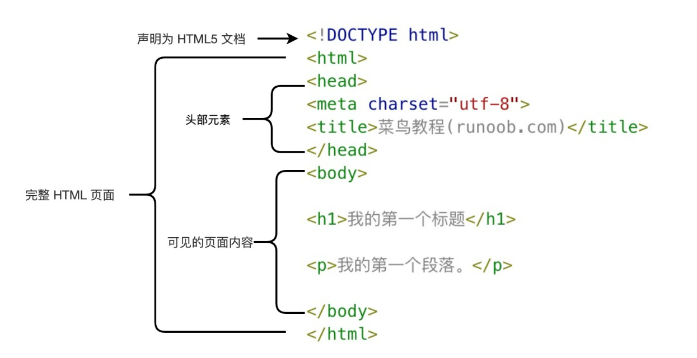

\<!DOCTYPE html> 不区分大小写。

\<html> 元素是 HTML 页面的根元素。

\<head> 元素包含文档的元数据。

站点起始页，请命名为 index 或 default 。

语义化：很多标签的效果是一样的，但是为了使人、浏览器、爬虫、机器等都能良好地理解开发者的初衷，就应当使用最恰当的标签，即语义化。

再多的空格和换行符都将保留为一个空格。

理解块级元素和行内元素。

推崇文本与样式分离的写法。

很多情况下不同浏览器有自己的想法，所以最好是将代码在所有主流浏览器测试后再发布。

# 格式化

## \<strong>、\<b>

粗体，但 \<strong> 有“重点”的语义。

## \<em>、\<i>

斜体，但 \<em> 有“强调”的语义。

## \<del>、\<s>

删除线，\<s> 有”此内容是错误的”的语义，\<del> 有“此内容是我要删除的”的语义。

## \<ins>

下划线。

## \<u>

英语中拼写错误内容或汉语中的专有名词，效果为下划线，被包裹内容中的空格不会消失。

## \<mark>

标记，效果为黄色高光。

## \<sup>、\<sub>

上标、下标。

## \<small>

文本变小。

# 基础标签

## 链接

```html
<a href="url">xxx</a>
```

### target属性

设置目标窗口。

- _blank：新窗口

- _self：同一框架或窗口（默认）

- _parent：父窗口，一般用于有框架的页面

- _top：浏览器的整个窗口，忽略任何框架

- 框架名：此时你应当在对应 \<iframe> 标签里使用 name 属性并设定其值为该框架名

### id属性

创建一个 HTML 文档书签。书签不会以任何特殊方式显示，即在 HTML 页面中是不显示的，所以对于读者来说是隐藏的。

在 HTML 文档中插入 ID：

```html
<a id="tips">有用的提示部分</a>
```

在 HTML 文档中创建一个链接到“有用的提示部分”：

```html
<a href="#tips">访问有用的提示部分</a>
```

或者，从另一个页面创建一个链接到“有用的提示部分”：

```html
<a href="https://www.runoob.com/html/html-links.html#tips">访问有用的提示部分</a>
```

### 注意

\<a> 标签可包裹 \ 标签，以图片做为触点。

请始终将正斜杠添加到子文件夹。假如这样书写链接：`href="https://www.runoob.com/html"` ，就会向服务器产生两次 HTTP 请求。这是因为服务器会添加正斜杠到这个地址，然后创建一个新的请求，就像这样：`href="https://www.runoob.com/html/"` 。

## 头部

### \<title>

标题，也就是你这个页面的名字。

- 展示在浏览器搜索框；

- 做为书签收藏时该页面对应的名字；

- 搜索引擎索引关键字；

- 搜索结果标题展示。

### \<base>

指定使用相对路径时的基准路径。

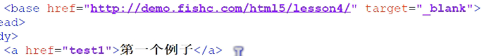

一劳永逸！

### \<link>

定义文档与外部资源之间的关系，常用于链接 CSS 和  JS。

```html
<link rel="stylesheet" type="text/css" href="url"> 
```

rel：指明链接文件与该页面的关系

### \<style>

CSS 。

```html
<style type="text/css">
xxx
</style>
```

### \<script>

JS 。

### \<noscript>

在浏览器不支持 JS 或禁用 JS 时显示的替代内容。

可包含普通 HTML 页面的 body 元素中能够找到的所有元素。

跟在 \</script> 后面。

### \<meta>

元数据。

HTML5 之前，meta 标签只有两个主要属性，分别是 name 属性和 http-equiv 属性。 HTML5 新添加 charset。

#### name

name 属性主要用于描述网页，对应属性值是 content 以便于搜索引擎机器人查找、分类。

```html
<meta name="参数" content="参数值" />
```

**1.keywords**

说明：为搜索引擎提供的关键字列表。

语法：

```html
<meta name="keywords" content="程序员,程序猿,攻城狮"/>
```

**2.description**

说明：用来告诉搜索引擎你的网站主要内容。

语法：

```html
<meta name="description" content="meta标签是HTML中的一个重要标签。"/>
```

**3.author**

说明：标注网页的作者。

语法：

```html
<meta name="author" content="TG,TG@qq.com"/>
```

**4.copyright**

说明：标注版权。

语法：

```html
<meta name="copyright" content="本网站版权归TG所有"/>
```

**5.generator**

说明：说明网站采用什么编辑器制作。

语法：

```html
<meta name="generator" content="你所用的编辑器"/>
```

**6.viewport**

H5 新增。

说明：能优化移动浏览器的显示（屏幕的缩放）。

语法：

```html
<meta name="viewport" content="width=device-width,initial-scale=1.0,maximum-scale=1.0, user-scalable=no"/>
```

参数值：

- width：viewport 的宽度为 device-width 或 pixel_value。width 如果直接设置 pixel_value 数值，大部分的安卓手机不支持，但是 ios 支持。

- height：viewport 的高度，范围从 223 到 10000。  

- user-scalable：yes 或 no，是否允许缩放。

- initial-scale：数值，初始化比例，范围从 >0 到 10。   

- minimum-scale：数值，允许缩放的最小比例。

- maximum-scale：数值，允许缩放的最大比例。

**7.format-detection**

H5 新增。

说明：忽略电话号码和邮箱。

语法：

```html
//忽略页面中的数字识别为电话号码
<meta name="format-detection" content="telephone=no">

//忽略页面中的邮箱格式识别为邮箱
<meta name="format-detection" content="email=no"/>

//也可以写成
<meta name="format-detection" content="telphone=no, email=no"/>  
```

#### http-equiv

http-equiv 类似 于HTTP 的头部协议，它回应给浏览器一些有用的信息，以帮助正确和精确地显示网页内容。与之对应的属性值为 content，content 中的内容其实就是各个参数的变量值。

```html
<meta http-equiv="参数"  content="参数值"/>
```

**1.Expires（期限）**

说明：指定网页在缓存中的过期时间，一旦网页过期，必须到服务器上重新传输。

语法：

```html
<meta http-equiv="Expires" content="Wed, 26 Feb 1997 08:21:57 GMT"/>
```

注意：必须使用 GMT 的时间格式。

**2.Pragma（cache 模式）**

说明：禁止浏览器从本地计算机的缓存中访问页面内容。

语法：

```html
<meta http-equiv="Pragma" content="no-cache"/>
```

注意：网页不保存在缓存中，每次访问都刷新页面。这样设定，访问者将无法脱机浏览。

**3.Refresh（刷新）**

说明：自动刷新并指向新页面。

语法：

```html
<meta http-equiv="Refresh" content="5;url=http://www.baidu.com/"/>
```


其中的 5 表示 5 秒后自动刷新并调整到 URL 新页面。

**4.Window-Target（显示窗口的设定）**

说明：强制页面在当前窗口以独立页面显示

语法：

```html
<meta http-equiv="Window-Target" content="_top"/>
```

可以用来防止别人在框架里调用你的页面。

**5.Content-Type（显示字符集的设定）**

说明：设定页面使用的字符集

```html
<meta http-equiv="Content-Type" content="text/html;charset=utf-8"/>
```

在 HTML5 中，我们一般都是：\<meta charset="utf-8"/>

**6.Content-Language（显示语言的设定）**

说明：显示语言

语法：

```html
<meta http-equiv="Content-Language" content="zh-cn"/>
```

**7.X-UA-Compatible（浏览器使用设定）**

```html
//优先使用 IE 最新版本和 Chrome
<meta http-equiv="X-UA-Compatible" content="IE=edge,chrome=1" />

//使用IE6
<meta http-equiv="X-UA-Compatible" content="IE=6" >
```

## 图片

### \

```html

//可添加border属性设置边框
```

### favicon

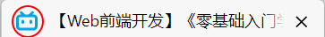

favorite icon，.ico 格式的图片文件，即在页面标签栏看到小图片。

链接方式：

```html
<link rel="icon" type="image/x-icon" href="url">
//"x-icon"可根据实际情况更改，如png
```

## 表格

```html
<table border="xxx">
    <tr>
        <th>Header 1</th>
        <th>Header 2</th>
    </tr>
    <tr>
        <td>row 1, cell 1</td>
        <td>row 1, cell 2</td>
    </tr>
    <tr>
        <td>row 2, cell 1</td>
        <td>row 2, cell 2</td>
    </tr>
</table>
```

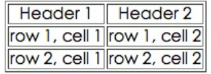

### 可省标签

\<caption>：表名，默认顶部居中显示。

\<th>：表头，以粗体显示。

### 属性

**普适：**

- width、height

**位于 \<table> 里：**

- border：边框。

- text-align：对齐方式。

  - center：居中对齐。

  - left：左对齐。

  - right：右对齐。

- cellpadding：单元格内容与单元格边框的间距。

- cellspacing：单元格间的间距，默认值为 2 。

**位于 \<td>、\<th> 里：**

- rowspan：单元格跨行。

- colspan：单元格跨列。

## 列表

### 无序列表

```html
<ul>
<li>Coffee</li>
<li>Milk</li>
</ul>
```

type 属性：

- disc：实心圆点，默认。
- circle：空心圆点。
- square：实心方块。

### 有序列表

```html
<ol>
<li>Coffee</li>
<li>Milk</li>
</ol>
```

常见属性：

- reversed：倒序，但不倒内容。

- type：属性值有 1、A、a、I、i 。

- start：定义起始编号。

## 区块

### \<div>

块级标签，没有语义，单纯起文档分块作用。

### \<span>

行内标签，没有语义，通常用于配合 CSS。

```html
<p>Hello <span>World</span>!</p>
```

然后为 `<span> 标签添加 CSS 元素。

## 表单

```html
<form>
xxx
</form>
```

### \<form>子标签

\<label>：用户点击其内的文本时，鼠标将自动聚焦到文本对应的框。

- 使用方法 1：

  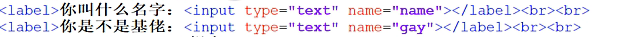

- 使用方法 2：

  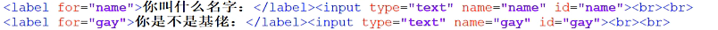

\<feildset>：表单分块，其包裹的内容将以一个框囊括。

\<legend>：搭配 \<feildset> 标签使用，为其划分的框添加框名。

\<select>：下拉选项框。

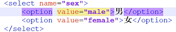

​					选项分块：

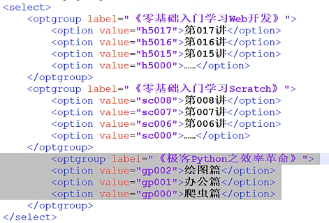

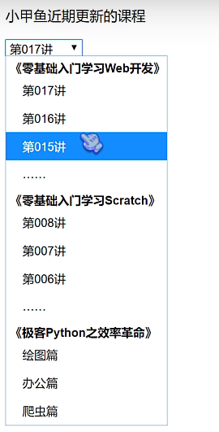

​					若想实现多选，在 \<select> 标签中加入 multiple 属性即可。

\<input>

\<textarea>：\<input> 的文本框仅限于单行输入，当希望输入多行如一首诗歌时，改 \<input> 为 \<textarea> 即可，其他的同 \<input> 。

> 可使用属性 rows（高）和 cols（宽）改变文本框大小。

### 提交

**可使用 \<input> 或 \<button>。**

**\<button> 中 type 属性的值：**

- submit：提交表单。

- reset：清空当前表单所填写的所有内容，用于用户在填写时使用。

**\<input> 方式改写 \<button>：**

```html
<button type="submit">提交</button>
<input type="submit" value="提交">

<button type="reset">重写</button>
<input type="reset" value="重写">
```

### \<form>属性

name：表单名称。

method：提交方式，默认为 GET。

action：服务端处理脚本。

onsubmit：指定表单提交前的 JS 函数，需要设置为 `return xxx();` 且 `xxx()` 返回 true/false 才会起到根据条件是否提交表单的作用。

enctype：设置 MIME 类型，默认为 application/x-www-formurlencoded。需要上传文件时，请设置为multipart/form-data 。

autocomplete：自动填充，默认为 on，值为 off 则取消自动填充。\<form> 子标签下添加的 autocomplete 属性将单独作用，不受 \<form> 标签内的 autocomplete 影响。

novalidate：取消验证，即禁用该表单提交时所有 JS 验证函数。无属性值。

### \<form>子标签通用属性

formnovalidate：取消验证，即禁用该标签的 JS 验证函数。无属性值。

formaction：覆盖 \<form> 里所指定的提交方式。

### \<input>属性

type：输入类型。

name：前后端交互的变量名。

value：默认值，用户无需填写，页面将自动填写value值。填写内容可修改，但提交时仍为默认值。

autofocus：自动聚焦。

disabled：“废掉”，表单提交时不会将其对应的框提交。

readonly：只读，用户无法修改，表单提交时依旧会将其提交。默认为 readwrite。

placeholder：输入文本框内的提示信息。

required：必填，默认为 optional（可选）。

size：输入框长度。

maxlength：输入文本长度。

### \<input>type属性值

text：文本输入。

password：密码，使用 "*" 号覆盖。

hidden：隐藏框，不展示给用户，但会随其他数据一起提交。

submit：提交按钮。

reset：重置按钮。

button：普通按钮。

```html
<input type="button" value="按钮显示文本" onclick="JS函数名" name="按钮名"/>
```

radio：单选。

checkbox：多选。

time：时间，如 13:45，24 小时制。

date：年月日，如 2024-11-08。

month：年月，如 2024-11。

week：年周，如 2024-W45。

color：颜色，请使用如 "#ff0000" 指定其 value 值。

file：注意 method 和 enctype。enctype 默认为 application/x-www-form-urlencode，需改为 multipart/form-data。

- 注意防止任意文件上传（虽然前端搞这种东西没什么用）：

  ```html
  accept="image/*"
  ```

- 指定文件大小：

  ```html
  <input type="hidden" name="MAX_FILE_SIZE" value="1024">
  ```

- 允许同时上传多个文件：\<input> 中添加 multiple 属性即可。

number：数字，搭配属性 max、min、step。

range：滚动条，搭配属性 max、min、step。

tel、emil、url：搭配属性 pattern="正则表达式"、title="错误提示信息" 可进行输入限制。

## 框架

\<iframe>：内联框架，即在网页中嵌入其他网页。

```html
<iframe src="url" width="宽" height="高">浏览器不支持iframe时的替代文本</iframe>
```

设置框架边框，使用 frameborder 属性：值 0（默认）为不显示，值 1 为显示。

存在安全隐患，当内联网页被 hack 后，主网页也一样不安全了。

可使用 sandbox 属性增加安全等级，相关属性值：

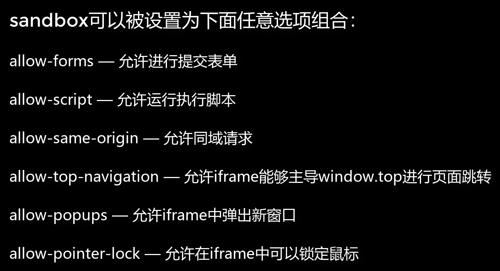

## 代码

### \<pre>、\<code>

\<code> 标签是最符合语义化的，用以显示源代码的标签，\<pre> 也有相同功能，但并不是最合适的选择。

\<code> 的缺陷在于它将忽略源代码中的缩进、换行等，使源代码展现出来的效果不佳，而 \<pre> 标签优点在于它会将源代码原封不动地展现，所以一般搭配使用：

```html
<pre>
    <code>
    </code>
</pre>
```

\<pre> 标签内依旧不能使用预保留字符，需替换为字符实体。

### 行内元素

\<var>：定义程序的变量。

\<kbd>：定义用户的输入。

\<samp>：定义用户的输出。

## 引用

### \<q>

行内元素，行内引用，浏览器将自动在引用内容两侧加上双引号。

### \<blockquote>

块级元素，大块引用，不会在两侧加双引号，但会在引用块两侧加页边距，也就是说引用内容会比普通段落整体缩进。

可添加属性 `cite="链接"` ，说明引用来源。

## 网页布局

语义化方式布局：

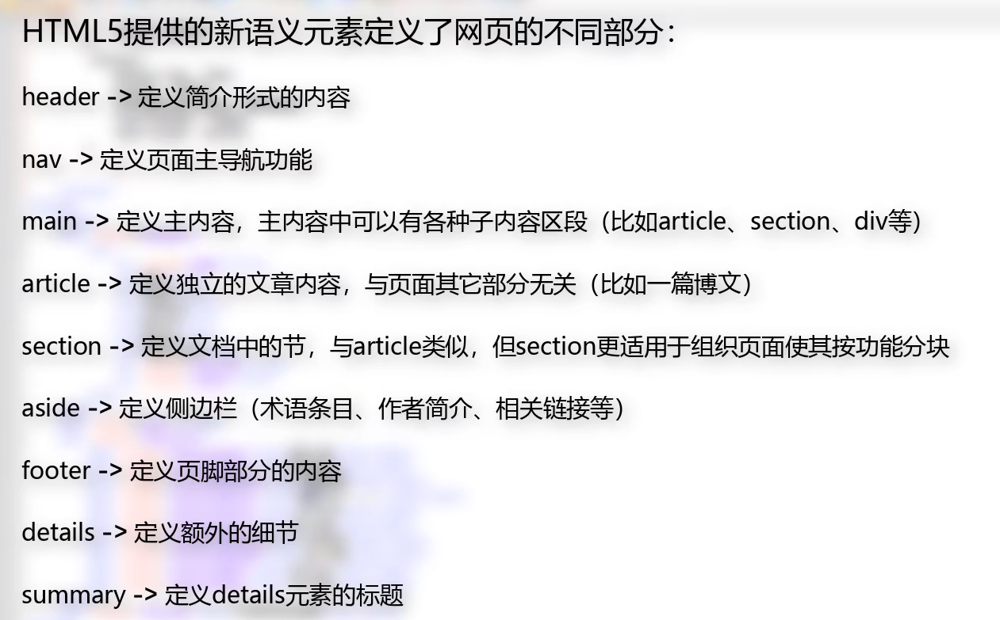

其实就跟 \<div> 一个样，只是有一定的语义而已。

并非所有的“块”都有意义，有时仅仅是设计者想要设置这么一个“块”。这些分块标签搭配属性 class="xxx"，"xxx" 对应 CSS，就可以将该块填入 CSS。

## 视频

### \<video>

网页嵌入视频。

```html
<video src="url" width="宽" height="高">视频加载失败时的替换文本</video>
```

此时视频只会显示一帧的静态画面，也没有三角形的播放控件，解决方法：

- 添加 controls 属性，此时便会出现播放控件。

- 添加 autoplay 属性，此时视频会自动播放。

### 属性

preload：视频预加载，默认为 auto，另一值为 none，即关闭预加载，还有一值为 meta，即加载视频的元数据如视频宽高、视频总长、第一帧画面等。若同时使用了 autoplay，则该属性无效。

> 预加载：页面展现出来的同时视频也加载完毕，此时用户点击“播放”时就不会转圈圈显示“正在加载”。
>
> 该功能有缺点，首先当视频较大时，势必会减缓页面的加载时间，影响用户体验；其次，加载要流量。所有如果不是什么必须要用户看的或用户必定会点击的视频，请取消预加载功能。

poster：视频封面，控制视频第一帧的画面，将其属性值填入封面链接即可。

loop：循环播放，默认为 false。

muted：静音播放。

## 音频

```html
<audio flag1 [flag2...]>
  <source src="horse.ogg" type="audio/ogg">
  <source src="horse.mp3" type="audio/mpeg">
  浏览器不支持播放音频时的文本
</audio>
```

默认播放第一个。

### flag

| 属性     | 值                   | 描述                                                         |
| :------- | :------------------- | :----------------------------------------------------------- |
| autoplay | autoplay             | 如果出现该属性，则音频在就绪后马上播放。                     |
| controls | controls             | 如果出现该属性，则向用户显示音频控件，并默认为停止播放状态。 |
| loop     | loop                 | 如果出现该属性，则每当音频结束时重新开始播放。               |
| muted    | muted                | 如果出现该属性，则音频输出为静音。                           |
| preload  | auto、metadata、none | 规定当网页加载时，音频是否默认被加载以及如何被加载。         |

如果只有一个值的属性，则不需要写出属性值，如：`<audio controls>` 。

### 音频类型

| Format | MIME-type  |
| :----- | :--------- |
| MP3    | audio/mpeg |
| Ogg    | audio/ogg  |
| Wav    | audio/wav  |

# 其他标签

## \<br/>

换行。

## \<hr>

水平线。

## \<cite>

行内元素，作品标题，使用后标题将以斜体展示。

## \<abbr>

行内元素，定义简称或缩写。

```html
<p>xxx<abbr title="全称">简称</abbr>xxx</p>
```

效果：

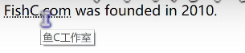

## \<address>

块级元素，定义作者相关信息，使用后其包裹的内容都将以斜体展示。

## \<ruby>、\<rp>、\<rt>

行内元素，为汉字注音。\<rp> 为当浏览器不支持 \<ruby> 元素时显示的内容。

```html
<ruby>魑<rp>(</rp><rt>chi</rt><rp>)</rp></ruby>
```

正常效果：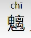

浏览器不支持时：魑(chi)

## \<bdo>

行内元素，规定数据的展示方向，用属性 dir 规定。默认为 ltr（left to right），还有一值为 rtl（从右到左）。

## \<details>、\<summary>

```html
<details>
	<summary>Web开发是社么？</summary>
    <p>
        bala bala bala……
    </p>
</details>
```

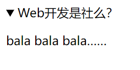

描述内容是默认关闭的，需点击三角形部分才会展开。

## \<marquee>

设置滚动字幕，默认为从右到左循环滚动。

属性说明：

- direction：滚动方向。
  
  - up：从下到上。
  
  - down：从上到下。
  
  - left：从右到左（默认）。
  
  - right：从左到右。

- behavior：滚动行为。
  
  - scroll：循环滚动（默认）。
  
  - slide：滚动一次。
  
  - alternate：往复滚动，即先滚设置的方向，到边后镜像方向滚回来，再重复……

- scrollamount：滚动速度，默认为 6 。

- scrolldelay：滚动延迟，默认为 100ms 。

## \<progress>

进度条。

```html
<progress max="1" value="0.4"></progress>
```

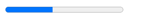

