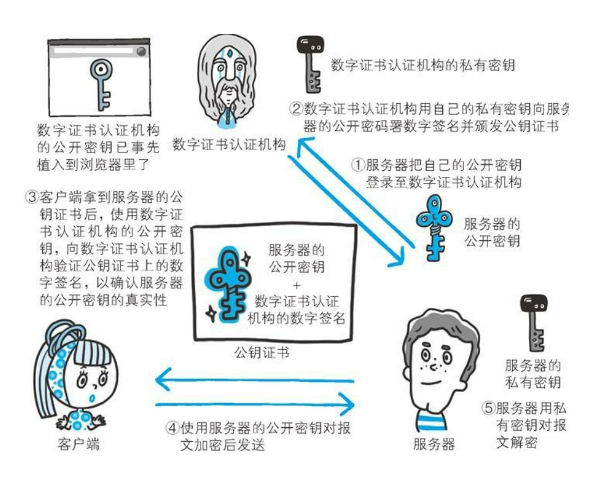
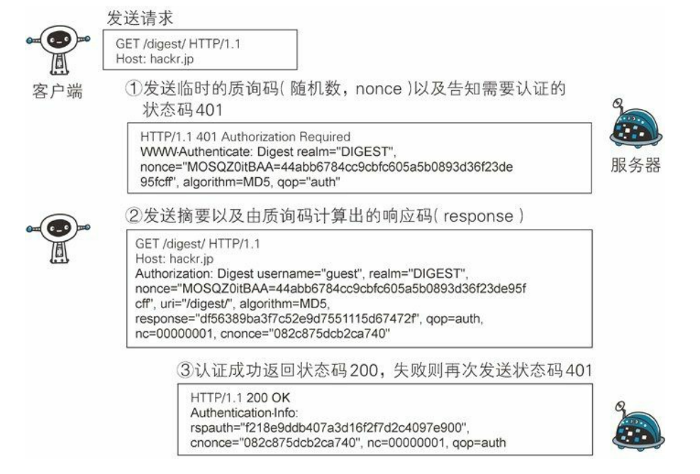

# 了解Web及网络基础

1. **HTTP**：超文本传输协议。

2. **Web**：WWW（World Wide Web，万维网）的简称，由三项构建技术组成，分别为 HTML、HTTP、URL

3. **TCP/IP 协议族**：

   - 通常使用的网络（包括互联网）是在 TCP/IP 协议族的基础上运作的。

   

   - TCP/IP 协议族按层次分别分为以下 4 层：应用层、传输层、网络层和数据链路层。

     - 应用层：应用层决定了向用户提供应用服务时通信的活动。TCP/IP 协议族内预存了各类通用的应用服务。比如，FTP（File Transfer Protocol，文件传输协议）和 DNS（Domain Name System，域名系统）服务就是其中两类。HTTP 协议也处于该层。
     - 传输层：传输层对上层应用层提供处于网络连接中的两台计算机之间的数据传输。在传输层有两个性质不同的协议：TCP（Transmission Control Protocol，传输控制协议）和 UDP（User Data Protocol，用户数据报协议）。
     - 网络层：又名网络互连层。网络层用来处理在网络上流动的数据包。数据包是网络传输的最小数据单位。该层规定了通过怎样的路径（所谓的传输路线）到达对方计算机，并把数据包传送给对方。与对方计算机之间通过多台计算机或网络设备进行传输时，网络层所起的作用就是在众多的选项内选择一条传输路线。
     - 链路层：又名数据链路层，网络接口层。用来处理连接网络的硬件部分。包括控制操作系统、硬件的设备驱动、NIC（Network Interface Card，网络适配器，即网卡），及光纤等物理可见部分（还包括连接器等一切传输媒介）。硬件上的范畴均在链路层的作用范围之内。

   - TCP/IP 通信传输流：

     

     我们用 HTTP 举例来说明，首先作为发送端的客户端在应用层（HTTP 协议）发出一个想看某个 Web 页面的 HTTP 请求。

     接着，为了传输方便，在传输层（TCP 协议）把从应用层处收到的数据（HTTP 请求报文）进行分割，并在各个报文上打上标记序号及端口号后转发给网络层。

     在网络层（IP 协议），增加作为通信目的地的 MAC 地址后转发给链路层。这样一来，发往网络的通信请求就准备齐全了。

     接收端的服务器在链路层接收到数据，按序往上层发送，一直到应用层。当传输到应用层，才能算真正接收到由客户端发送过来的 HTTP请求。

     这种把数据信息包装起来的做法称为封装。

     

4. **IP 协议**：

   - Internet Protocol，网际协议。IP 协议的作用是把各种数据包传送给对方。而要保证确实传送到对方
     那里，则需要满足各类条件。其中两个重要的条件是 IP 地址和 MAC 地址（Media Access Control Address）。IP 地址指明了节点被分配到的地址，MAC 地址是指网卡所属的固定地址。IP 地址可以和 MAC 地址进行配对。IP 地址可变换，但 MAC 地址基本上不会更改。
   - IP 间的通信依赖 MAC 地址。在网络上，通信的双方在同一局域网（LAN）内的情况是很少的，通常是经过多台计算机和网络设备中转才能连接到对方。而在进行中转时，会利用下一站中转设备的 MAC 地址来搜索下一个中转目标。这时，会采用 ARP 协议（Address Resolution Protocol）。ARP 是一种用以解析地址的协议，根据通信方的 IP 地址就可以反查出对应的 MAC 地址。
   - 没有人能够全面掌握互联网中的传输状况。在到达通信目标前的中转过程中，那些计算机和路由器等网络设备只能获悉很粗略的传输路线。这种机制称为路由选择，有点像快递公司的送货过程。

5. **TCP 协议**：

   - 按层次分，TCP 位于传输层，提供可靠的字节流服务。所谓的字节流服务是指，为了方便传输，将大块数据分割成以报文段为单位的数据包进行管理。

   - 为了准确无误地将数据送达目标处，TCP 协议采用了三次握手策略。用 TCP 协议把数据包送出去后，TCP 不会对传送后的情况置之不理，它一定会向对方确认是否成功送达。握手过程中使用了 TCP 的标志——SYN（synchronize） 和 ACK（acknowledgement）。发送端首先发送一个带 SYN 标志的数据包给对方。接收端收到后，回传一个带有 SYN/ACK 标志的数据包以示传达确认信息。最后，发送端再回传一个带 ACK 标志的数据包，代表“握手”结束。若在握手过程中某个阶段莫名中断，TCP 协议会再次以相同的顺序发送相同的数据包。

     

6. **DNS 服务**：DNS（Domain Name System）服务是和 HTTP 协议一样位于应用层的协议。它提供域名到 IP 地址之间的解析服务。计算机既可以被赋予 IP 地址，也可以被赋予主机名和域名。比如 www.baidu.com 。用户通常使用主机名或域名来访问对方的计算机，而不是直接通过 IP 地址访问。因为与 IP 地址的一组纯数字相比，用字母配合数字的表示形式来指定计算机名更符合人类的记忆习惯。但要让计算机去理解名称，相对而言就变得困难了。因为计算机更擅长处理一长串数字。为了解决上述的问题，DNS 服务应运而生。DNS 协议提供通过域名查找 IP 地址，或逆向从 IP 地址反查域名的服务。

7. **URI**：Uniform Resource Identifier，统一资源标识符。

   - URL 与 URI：URL 即网页地址，比如 http://hackr.jp/ 。URI 用字符串标识某一互联网资源，而 URL 表示资源的地点（互联网上所处的位置），可见 URL 是 URI 的子集。

   - 绝对 URI 的格式：

     

     使用 http: 或 https: 等协议方案名获取访问资源时要指定协议类型，不区分字母大小写，最后附一个冒号。也可使用 data: 或 javascript: 这类指定数据或脚本程序的方案名。

     字段选讲：

     - 登录信息（认证）：指定用户名和密码作为从服务器端获取资源时必要的登录信息（身份认证）。此项是可选项。
     - 服务器地址：使用绝对 URI 必须指定待访问的服务器地址。地址可以是类似 www.hackr.jp 这种 DNS 可解析的名称，或是 192.168.1.1 这类 IPv4 地址名，还可以是 [0:0:0:0:0:0:0:1] 这样用方括号括起来的 IPv6 地址名。
     - 服务器端口号：指定服务器连接的网络端口号。此项是可选项，若用户省略则自动使用默认端口号。
     - 片段标识符：使用片段标识符通常可标记出已获取资源中的子资源（文档内的某个位置）。该项也为可选项。

# 简单的HTTP协议

1. **报文的构成**：

   - 请求报文是由请求方法、请求 URI 、协议版本、可选的请求首部字段和内容实体构成的。

   

   - 响应报文基本上由协议版本、状态码、用以解释状态码的原因短语、可选的响应首部字段以及实体主

     体构成。

     

2. **HTTP 请求方法**：

   - GET：如果请求的资源是文本，那就保持原样返回；如果是像 CGI（Common Gateway Interface，通用网关接口）那样的程序，则返回经过执行后的输出结果。

   - POST：功能与 GET 很相似，但 POST 的主要目的并不是获取响应的主体内容，而是传输实体的主体。

   - PUT：PUT 方法用来传输文件。就像 FTP 协议的文件上传一样，要求在请求报文的主体中包含文件内容，然后保存到请求 URI 指定的位置。但是，鉴于 HTTP/1.1 的 PUT 方法自身不带验证机制，任何人都可以上传文件 , 存在安全性问题，因此一般的 Web 网站不使用该方法。若配合 Web 应用程序的验证机制，或架构设计采用 REST（REpresentational State Transfer，表征状态转移）标准的同类 Web 网站，就可能会开放使用 PUT 方法。

   - HEAD：获得报文首部。HEAD 方法和 GET 方法一样，只是不返回报文主体部分。用于确认 URI 的有效性及资源更新的日期时间等。

   - DELETE：DELETE 方法用来删除文件，是与 PUT 相反的方法。DELETE 方法按请求 URI 删除指定的资源。但是，HTTP/1.1 的 DELETE 方法本身和 PUT 方法一样不带验证机制，所以一般的 Web 网站也不使用 DELETE 方法。当配合 Web 应用程序的验证机制，或遵守 REST 标准时还是有可能会开放使用的。

   - OPTIONS：OPTIONS 方法用来查询针对请求 URI 指定的资源支持的方法。

     > 如何使用 OPTIONS 方法：
     >
     > 正常访问一个页面，抓包，将 HTTP 方法改为 OPTIONS 即可。如果服务端允许使用该方法，将会返回含 Allow: POST,OPTIONS,HEAD,GET 这样的包。

   - TRACE：追踪路径。TRACE 方法是让 Web 服务器端将之前的请求通信环回给客户端的方法。发送请求时，在 Max-Forwards 首部字段中填入数值，每经过一个服务器端就将该数字减 1，当数值刚好减到 0 时，就停止继续传输，最后接收到请求的服务器端则返回状态码 200 OK 的响应。客户端通过 TRACE 方法可以查询发送出去的请求是怎样被加工修改/篡改的。这是因为，请求想要连接到源目标服务器可能会通过代理中转，TRACE 方法就是用来确认连接过程中发生的一系列操作。但是，TRACE 方法本来就不怎么常用，再加上它容易引发 XST（Cross-Site Tracing，跨站追踪）攻击，通常就更不会用到了。

   - CONNECT：CONNECT 方法要求在与代理服务器通信时建立隧道，实现用隧道协议进行 TCP 通信。主要使用 SSL（Secure Sockets Layer，安全套接层）和 TLS（Transport Layer Security，传输层安全）协议把通信内容加密后经网络隧道传输。

     > 如何使用 CONNECT 方法：
     >
     > 格式：
     >
     > CONNECT 代理服务器名:端口号 HTTP版本
     >
     > 示例：
     >
     > CONNECT proxy.hackr.jp:8080 HTTP/1.1
     >
     > Host: proxy.hackr.jp

3. **持久连接**：

   - HTTP 协议的初始版本中，每进行一次 HTTP 通信就要断开一次 TCP 连接。以当年的通信情况来说，因为都是些容量很小的文本传输，所以即使这样也没有多大问题。可随着 HTTP 的普及，文档中包含大量图片的情况多了起来。比如，使用浏览器浏览一个包含多张图片的 HTML 页面时，在发送请求访问 HTML页面资源的同时，也会请求该 HTML页面里包含的其他资源。因此，每次的请求都会造成无谓的 TCP 连接建立和断开，增加通信量的开销。

     为解决上述 TCP 连接的问题，HTTP/1.1 和一部分的 HTTP/1.0 想出了持久连接（HTTP Persistent Connections，也称为 HTTP keep-alive 或 HTTP connection reuse）的方法。持久连接的特点是，只要任意一端没有明确提出断开连接，则保持 TCP 连接状态。在 HTTP/1.1 中，所有的连接默认都是持久连接，但在 HTTP/1.0 内并未标准化。

   - 管线化：持久连接使得多数请求以管线化方式发送成为可能。从前发送请求后需等待并收到响应，才能发送下一个请求。管线化技术出现后，不用等待响应亦可直接发送下一个请求。这样就能够做到同时并行发送多个请求，而不需要一个接一个地等待响应了。这在请求包含多种媒体的页面时发挥了很大作用。

# HTTP报文内的HTTP信息

1. **HTTP 报文**：用于 HTTP 协议交互的信息被称为 HTTP 报文。HTTP 报文本身是由多行（用 CR+LF 作换行符）数据构成的字符串文本。HTTP 报文大致可分为报文首部和报文主体两块。两者由最初出现的空行（CR+LF）来划分。通常，并不一定要有报文主体。

   

   

   > 请求行：请求报文的第一行，如 GET / HTTP/1.1
   >
   > 状态行：响应报文的第一行，如 HTTP/1.1 200 OK
   >
   > 其他：可能包含 RFC 里未定义的首部（Cookie 等）

2. **报文和实体**：报文（message）是 HTTP 通信中的基本单位，由 8 位组字节流组成，通过 HTTP 通信传输。实体（entity）作为请求或响应的有效载荷数据（补充项）被传输，其内容由实体首部和实体主体组成。HTTP 报文的主体用于传输请求或响应的实体主体。通常，报文主体等于实体主体。只有当传输中进行编码操作时，实体主体的内容发生变化，才导致它和报文主体产生差异。

3. **编码**：

   - 内容编码：用于压缩传输内容。内容编码指明应用在实体内容上的编码格式，并保持实体信息原样压缩。实体由服务端进行压缩编码，由客户端接收并负责解码。常用的内容编码有以下几种：
     - gzip（GNU zip）
     - compress（UNIX 系统的标准压缩）
     - deflate（zlib）
     - identity（不进行编码）
   - 分块传输编码：在 HTTP 通信过程中，请求的编码实体资源尚未全部传输完成之前，浏览器无法显示请求页面。在传输大容量数据时，通过把数据分割成多块，能够让浏览器逐步显示页面。这种把实体主体分块的功能称为分块传输编码。分块传输编码会将实体主体分成多个部分（块）。每一块都会用十六进制来标记块的大小，而实体主体的最后一块会使用“0(CR+LF)”来标记。使用分块传输编码的实体主体会由接收的客户端负责解码，恢复到编码前的实体主体。

4. **多部分对象集合**：发送邮件时，我们可以在邮件里写入文字并添加多份附件。这是因为采用了 MIME（Multipurpose Internet Mail Extensions，多用途因特网邮件扩展）机制，它允许邮件处理文本、图片、视频等多个不同类型的数据。而在 MIME 扩展中会使用一种称为多部分对象集合（Multipart）的方法，来容纳多份不同类型的数据。

   相应地，HTTP 协议中也采纳了多部分对象集合，发送的一份报文主体内可含有多类型实体。通常是在图片或文本文件等上传时使用。多部分对象集合包含的对象如下：

   - multipart/form-data：在 Web 表单文件上传时使用。

     ```http
     xxx
     Content-Type: multipart/form-data; boundary=AaB03x
     
     --AaB03x
     Content-Disposition: form-data; name="field1"
     
     Joe Blow
     --AaB03x
     Content-Disposition: form-data; name="pics"; filename="file1.txt"
     Content-Type: text/plain
     
     ...（file1.txt的数据）...
     --AaB03x--
     ```

   - multipart/byteranges：状态码 206 响应报文包含了多个范围的内容时使用。

     ```http
     HTTP/1.1 206 Partial Content
     Date: Fri, 13 Jul 2012 02:45:26 GMT
     Last-Modified: Fri, 31 Aug 2007 02:02:20 GMT
     Content-Type: multipart/byteranges; boundary=THIS_STRING_SEPARATES
     
     --THIS_STRING_SEPARATES
     Content-Type: application/pdf
     Content-Range: bytes 500-999/8000
     
     ...（范围指定的数据）...
     --THIS_STRING_SEPARATES
     Content-Type: application/pdf
     Content-Range: bytes 7000-7999/8000
     
     ...（范围指定的数据）...
     --THIS_STRING_SEPARATES--
     ```

5. **范围请求**：以前，用户不能使用现在这种高速的带宽访问互联网，当时，下载一个尺寸稍大的图片或文件就已经很吃力了。如果下载过程中遇到网络中断的情况，那就必须重头开始。为了解决上述问题，需要一种可恢复的机制。所谓恢复是指能从之前下载中断处恢复下载。要实现该功能需要指定下载的实体范围。像这样，指定范围发送的请求叫做范围请求。

   请求：

   

   响应：

   

   执行范围请求时，会用到首部字段 Range 来指定资源的 byte 范围。byte 范围的指定形式如下：

   > **5001~10000** 字节：
   >
   > Range: bytes=5001-10000
   >
   > 从 **5001** 字节之后全部的：
   >
   > Range: bytes=5001-
   >
   > 从一开始到 **3000** 字节和 **5000~7000** 字节的多重范围：
   >
   > Range: bytes=-3000, 5000-7000

   针对范围请求，响应会返回状态码为 206 Partial Content 的响应报文。另外，对于多重范围的范围请求，响应会在首部字段 Content-Type 标明 multipart/byteranges 后返回响应报文。如果服务器端无法响应范围请求，则会返回状态码 200 OK 和完整的实体内容。

6. **内容协商**：同一个 Web 网站有可能存在着多份相同内容的页面。比如英语版和中文版的 Web 页面，它们内容上虽相同，但使用的语言却不同。当浏览器的默认语言为英语或中文，访问相同 URI 的 Web 页面时，则会显示对应的英语版或中文版的 Web 页面。这样的机制称为内容协商。包含在请求报文中的某些首部字段（如下）就是判断的基准：

   - Accept
   - Accept-Charset
   - Accept-Encoding
   - Accept-Language
   - Content-Language

# 返回结果的HTTP状态码

## 2XX 成功

- **200 OK**
- **204 No Content**：该状态码代表服务器接收的请求已成功处理，但在返回的响应报文中不含实体的主体部分。另外，也不允许返回任何实体的主体。比如，当从浏览器发出请求处理后，返回 204 响应，那么浏览器显示的页面不发生更新。一般在只需要从客户端往服务器发送信息，而对客户端不需要发送新信息内容的情况下使用。
- **206 Partical Content**：该状态码表示客户端进行了范围请求，而服务器成功执行了这部分的 GET 请求。响应报文中包含由 Content-Range 指定范围的实体内容。

## 3XX 重定向

- **301 Move Permanently**：永久性重定向。该状态码表示请求的资源已被分配了新的 URI，以后应使用资源现在所指的 URI 。也就是说，如果已经把资源对应的 URI 保存为书签了，这时应该按 Location 首部字段提示的 URI 重新保存。

- **302 Found**：临时性重定向。该状态码表示请求的资源已被分配了新的 URI，希望用户（本次）能使用新的 URI 访问。和 301 Moved Permanently 状态码相似，但 302 状态码代表的资源不是被永久移动，只是临时性质的。换句话说，已移动的资源对应的 URI 将来还有可能发生改变。比如，用户把 URI 保存成书签，但不会像 301 状态码出现时那样去更新书签，而是仍旧保留返回 302 状态码的页面对应的 URI。

- **303 See Other**：该状态码表示由于请求对应的资源存在着另一个 URI，应使用 GET 方法定向获取请求的资源。303 状态码和 302 Found 状态码有着相同的功能，但 303 状态码明确表示客户端应当采用 GET 方法获取资源，这点与 302 状态码有区别。比如，当使用 POST 方法访问 CGI 程序，其执行后的处理结果是希望客户端能以 GET 方法重定向到另一个 URI 上去时，返回 303 状态码。虽然 302 Found 状态码也可以实现相同的功能，但这里使用 303 状态码是最理想的。

  > 当 301、302、303 响应状态码返回时，几乎所有的浏览器都会把 POST 改成 GET，并删除请求报文内的主体，之后请求会自动再次发送。
  >
  > 301、302 标准是禁止将 POST 方法改变成 GET 方法的，但实际使用时大家都会这么做。

- **304 Not Modified**：该状态码表示客户端发送附带条件的请求时，服务器端允许请求访问资源，但未满足条件的情况。304 状态码返回时，不包含任何响应的主体部分。304 虽然被划分在 3XX 类别中，但是和重定向没有关系。

  > 附带条件的请求是指采用 GET 方法的请求报文中包含 If-Match，If-Modified-Since，If-None-Match，If-Range，If-Unmodified-Since 中任一首部。

- **307 Temporary Redirect**：临时重定向。该状态码与 302 Found 有着相同的含义。尽管 302 标准禁止 POST 变换成 GET，但实际使用时大家并不遵守。307 会遵照浏览器标准，不会从 POST 变成 GET。但是，对于处理响应时的行为，每种浏览器有可能出现不同的情况。

## 4XX 客户端错误

- **400 Bad Request**：该状态码表示请求报文中存在语法错误。当错误发生时，需修改请求的内容后再次发送请求。另外，浏览器会像 200 OK 一样对待该状态码。服务端此时状态为：“我无法理解这个请求，是不是错了？”。
- **401 Unauthorized**：该状态码表示发送的请求需要有通过 HTTP 认证（BASIC 认证、DIGEST 认证）的认证信息。若之前已进行过 1 次请求，则表示用 户认证失败。返回含有 401 的响应必须包含一个适用于被请求资源的 WWW-Authenticate 首部用以质询用户信息。当浏览器初次接收到 401 响应，会弹出认证用的对话窗口。
- **403 Forbidden**：该状态码表明对请求资源的访问被服务器拒绝了。服务器端没有必要给出拒绝的详细理由，但如果想作说明的话，可以在实体的主体部分对原因进行描述，这样就能让用户看到了。未获得文件系统的访问授权，访问权限出现某些问题（从未授权的发送源 IP 地址试图访问）等情况都可能是发生 403 的原因。
- **404 Not Found**：该状态码表明服务器上无法找到请求的资源。除此之外，也可以在服务器端拒绝请求且不想说明理由时使用。

## 5XX 服务器错误

- **500 Internal Server Error**：该状态码表明服务器端在执行请求时发生了错误。也有可能是 Web 应用存在的 bug 或某些临时的故障。
- **503 Service Unavailable**：该状态码表明服务器暂时处于超负载或正在进行停机维护，现在无法处理请求。如果事先得知解除以上状况需要的时间，最好写入 Retry-After 首部字段再返回给客户端。

# 与HTTP协作的Web服务器

1. **用单台主机实现多个域名**：HTTP/1.1 规范允许一台 HTTP 服务器搭建多个 Web 站点，在物理层面只有一台服务器，但使用了虚拟主机的功能，则可以假想已具有多台服务器。在相同的 IP 地址下，由于虚拟主机可以寄存多个域名的 Web 网站，但经过 DNS 解析后，都只会是一个 IP 地址，因此在发送 HTTP 请求时，必须在 Host 首部内完整指定主机名或域名的 URI，否则服务器将无法理解客户端请求的具体是什么。

2. **代理**：基本介绍略。分类：

   - 缓存代理：代理转发响应时，缓存代理会预先将资源的副本（缓存）保存在代理服务器上。当代理再次接收到对相同资源的请求时，就可以不从源服务器那里获取资源，而是将之前缓存的资源作为响应返回。
   - 透明代理：转发请求或响应时，不对报文做任何加工的代理类型被称为透明代理。反之，对报文内容进行加工的代理被称为非透明代理。

   > 补充：反向代理和正向代理
   >
   > 反向代理和正向代理都是网络代理的一种形式，它们之间的区别在于它们所处的位置和代理的方向。
   >
   > 正向代理是在客户端和服务器之间的代理服务器，代理的方向是客户端向服务器，也就是客户端请求先经过代理服务器，再由代理服务器转发请求到服务器，服务器返回响应也先经过代理服务器再由代理服务器转发给客户端。正向代理常见的应用场景是突破网络访问限制，如通过代理服务器访问被屏蔽的网站。
   >
   > 反向代理是在服务器端的代理服务器，代理的方向是服务器向客户端，也就是客户端请求先到达代理服务器，再由代理服务器根据请求内容转发到相应的服务器上处理，服务器返回响应也先经过代理服务器再由代理服务器返回给客户端。反向代理常见的应用场景是负载均衡和安全性，如通过反向代理实现多台服务器的负载均衡和隐藏真实服务器的 IP 地址等。

3. **网关**：网关是转发其他服务器通信数据的服务器，接收从客户端发送来的请求时，它就像自己拥有资源的源服务器一样对请求进行处理。有时客户端可能都不会察觉，自己的通信目标是一个网关。利用网关能提高通信的安全性，因为可以在客户端与网关之间的通信线路上加密以确保连接的安全。网关的工作机制和代理十分相似，而网关能使通信线路上的服务器提供非 HTTP 协议服务。

   

   比如，网关可以连接数据库，使用 SQL 语句查询数据。另外，在 Web 购物网站上进行信用卡结算时，网关可以和信用卡结算系统联动。

4. **隧道**：隧道是在相隔甚远的客户端和服务器两者之间进行中转，并保持双方通信连接的应用程序。隧道可按要求建立起一条与其他服务器的通信线路，届时使用 SSL 等加密手段进行通信。隧道的目的是确保客户端能与服务器进行安全的通信。隧道本身不会去解析 HTTP 请求。也就是说，请求保持原样中转给之后的服务器。隧道会在通信双方断开连接时结束。隧道本身是透明的，客户端不用在意隧道的存在。

5. **缓存**：缓存是指代理服务器或客户端本地磁盘内保存的资源副本。利用缓存可减少对源服务器的访问，因此也就节省了通信流量和通信时间。缓存服务器是代理服务器的一种，并归类在缓存代理类型中。

   缓存存在有效期限，若判断缓存失效，缓存服务器将会再次从源服务器上获取“新”资源。

   缓存不仅可以存在于缓存服务器内，还可以存在客户端浏览器中。浏览器缓存如果有效，就不必再向服务器请求相同的资源了，可以直接从本地磁盘内读取。另外，和缓存服务器相同的一点是，当判定缓存过期后，会向源服务器确认资源的有效性。若判断浏览器缓存失效，浏览器会再次请求新资源。

# HTTP首部

## 概述

1. 首部字段结构：

   ```http
   字段名: value[, value1, value2...]
   ```

2. 首部字段类型：

   - 通用首部字段

     | 首部字段名        | 说明                       |
     | ----------------- | -------------------------- |
     | Cache-Control     | 控制缓存的行为             |
     | Connection        | 逐跳首部、连接的管理       |
     | Date              | 创建报文的日期时间         |
     | Pragma            | 报文指令                   |
     | Trailer           | 报文末端的首部一览         |
     | Transfer-Encoding | 指定报文主体的传输编码方式 |
     | Upgrade           | 升级为其他协议             |
     | Via               | 代理服务器的相关信息       |
     | Warning           | 错误通知                   |

   - 请求首部字段

     | 首部字段名          | 说明                                          |
     | ------------------- | --------------------------------------------- |
     | Accept              | 用户代理可处理的媒体类型                      |
     | Accept-Charset      | 优先的字符集                                  |
     | Accept-Encoding     | 优先的内容编码                                |
     | Accept-Language     | 优先的语言（自然语言）                        |
     | Authorization       | Web 认证信息                                  |
     | Expect              | 期待服务器的特定行为                          |
     | From                | 用户的电子邮箱地址                            |
     | Host                | 请求资源所在服务器                            |
     | If-Match            | 比较实体标记（ETag）                          |
     | If-Modified-Since   | 比较资源的更新时间                            |
     | If-None-Match       | 比较实体标记（与 If-Match 相反）              |
     | If-Range            | 资源未更新时发送实体 Byte 的范围请求          |
     | If-Unmodified-Since | 比较资源的更新时间（与If-Modified-Since相反） |
     | Max-Forwards        | 最大传输逐跳数                                |
     | Proxy-Authorization | 代理服务器要求客户端的认证信息                |
     | Range               | 实体的字节范围请求                            |
     | Referer             | 对请求中 URI 的原始获取方                     |
     | TE                  | 传输编码的优先级                              |
     | User-Agent          | HTTP 客户端程序的信息                         |

   - 响应首部字段

     | 首部字段名         | 说明                         |
     | ------------------ | ---------------------------- |
     | Accept-Ranges      | 是否接受字节范围请求         |
     | Age                | 推算资源创建经过时间         |
     | ETag               | 资源的匹配信息               |
     | Location           | 令客户端重定向至指定 URI     |
     | Proxy-Authenticate | 代理服务器对客户端的认证信息 |
     | Retry-After        | 对再次发起请求的时机要求     |
     | Server             | HTTP 服务器的安装信息        |
     | Vary               | 代理服务器缓存的管理信息     |
     | WWW-Authenticate   | 服务器对客户端的认证信息     |

   - 实体首部字段

     | 首部字段名       | 说明                         |
     | ---------------- | ---------------------------- |
     | Allow            | 资源可支持的 HTTP 方法       |
     | Content-Encoding | 实体主体适用的编码方式       |
     | Content-Language | 实体主体的自然语言           |
     | Content-Length   | 实体主体的大小（单位：字节） |
     | Content-Location | 替代对应资源的 URI           |
     | Content-MD5      | 实体主体的报文摘要           |
     | Content-Range    | 实体主体的位置范围           |
     | Content-Type     | 实体主体的媒体类型           |
     | Expires          | 实体主体过期的日期时间       |
     | Last-Modified    | 资源的最后修改日期时间       |

   - 非 HTTP/1.1 首部字段

## 通用首部字段：[85]()

## 请求首部字段：[99]()

## 响应首部字段：[115]()

## 实体首部字段：[122]()

## 其他首部字段

- Set-Cookie：响应首部字段。

  

  - expires 属性：Cookie 的 expires 属性指定浏览器可发送 Cookie 的有效期。当省略 expires 属性时，其有效期仅限于维持浏览器会话（Session）时间段内。这通常限于浏览器应用程序被关闭之前。另外，一旦 Cookie 从服务器端发送至客户端，服务器端就不存在可以显式删除 Cookie 的方法。但可通过覆盖已过期的 Cookie，实现对客户端 Cookie 的实质性删除操作。
  - path 属性：Cookie 的 path 属性可用于限制指定 Cookie 的发送范围的文件目录。
  - domain 属性：通过 Cookie 的 domain 属性指定的域名可做到与结尾匹配一致。比如，当指定 example.com 后，除 example.com 以外，www.example.com 或 www2.example.com 等都可以发送 Cookie 。因此，除了针对具体指定的多个域名发送 Cookie 之 外，不指定 domain 属性显得更安全。

- Cookie

- X-Frame-Options：响应首部，用于控制网站内容在其他 Web 网站的 Frame 标签内的显示问题。字段值：

  - DENY ：拒绝
  - SAMEORIGIN ：仅同源域名下的页面匹配时许可。比如，当指定 http://hackr.jp/sample.html 页面为 SAMEORIGIN 时，那么 hackr.jp 上所有页面的 frame 都被允许可加载该页面，而 example.com 等其他域名的页面就不行了。
  
- X-XSS-Protection：响应首部，针对 XSS 攻击的一种对策，用于控制浏览器 XSS 防护机制的开关。字段值：

  - 0 ：将 XSS 过滤设置成无效状态
  - 1 ：将 XSS 过滤设置成有效状态

- DNT：请求首部，其中 DNT 是 Do Not Track 的简称，意为拒绝个人信息被收集，是表示拒绝被精准广告追踪的一种方法。字段值：

  - 0 ：同意被追踪
  - 1 ：拒绝被追踪
  
- X-Forwarded-For：请求首部，用来表示 HTTP 请求端的真实/原始 IP 。当客户端直接连接到服务器时，客户端的 IP 地址将被发送到服务器（并且通常会写入服务器访问日志）。但是，如果客户端连接经过任何正向或反向代理，服务器只能看到最终代理的 IP 地址，这通常没什么用处。因此，为了向服务器提供更有用的客户端 IP 地址，就有了 X-Forwarded-For 请求标头。

  格式：

  ```http
  X-Forwarded-For: <client-ip>, <proxy1-ip>, <proxy2-ip>[, ...]
  ```

  有的程序是通过获取 XFF 头的值，从而判断是不是同一个客户端在访问，如“同一个用户只允许投票一次”。实际上 XFF 是很不安全的，容易被篡改，从而欺骗服务端。
  
- X-Real-IP：请求首部，也用来表示 HTTP 请求端的真实/原始 IP 。

  > X-Real-IP 与 X-Forwarded-For 的区别：
  >
  > X-Real-IP 和 X-Forwarded-For 都用于在代理服务器或负载均衡服务器中传递客户端的真实 IP 地址给后端服务器。它们的主要区别在于用途和实现方式：
  >
  > 1. X-Real-IP:
  >    - X-Real-IP 是一个自定义的 HTTP 头部字段，不属于 HTTP 协议的正式标准。
  >    - 一般由代理服务器或负载均衡服务器将客户端的真实 IP 地址添加到请求中的该头部字段中，并将请求转发给后端服务器。
  >    - 后端服务器可以从 X-Real-IP 头部中获取客户端的真实 IP 地址。
  > 2. X-Forwarded-For:
  >    - X-Forwarded-For 也是一个自定义的 HTTP 头部字段，不属于 HTTP 协议的正式标准。
  >    - 在一个请求通过多个代理服务器或负载均衡服务器时，每个代理服务器都会将其来源 IP 地址附加到 X-Forwarded-For 头部字段中，然后将请求转发给下一个代理服务器。
  >    - 后端服务器可以通过解析 X-Forwarded-For 头部字段获取整个请求经过的代理服务器链的 IP 地址信息，以及最终客户端的真实 IP 地址。
  >
  > 区别总结：
  >
  > - X-Real-IP 只包含客户端的最终真实 IP 地址，而 X-Forwarded-For 包含了整个请求的代理服务器链上的 IP 地址信息，包括最终客户端的真实 IP 地址在内。
  > - X-Real-IP 是由单个代理服务器设置并传递给后端服务器，而 X-Forwarded-For 是由多个代理服务器依次添加并传递给后端服务器。
  
- Client-IP：XFF 和 X-Real-IP 的替代。

## 请求报文模板

注意，如果多个字段写在同一行，那么需要用分号 **;** 分割。

```http
GET xxx HTTP/1.1
Host: 
User-Agent: 
Accept: 
Accept-Language: 
Accept-Encoding: 
DNT: 
Referer:
X-Forwarded-For:
Cookie: 
Connection: 
Upgrade-Insecure-Requests:
Content-Type: #POST传参再加
Content-Length: #POST传参再加
Cache-Control:
```

# 确保Web安全的HTTPS

1. **加密处理**：

   - 通信的加密：HTTP 协议中没有加密机制，但可以通过和 SSL（Secure Socket Layer，安全套接层）或
     TLS（Transport Layer Security，安全层传输协议）的组合使用，加密 HTTP 的通信内容。用 SSL 建立安全通信线路之后，就可以在这条线路上进行 HTTP 通信了。与 SSL 组合使用的 HTTP 被称为 HTTPS（HTTP Secure，超文本传输安全协议）或 HTTP over SSL 。
   - 内容的加密：通信本身不加密，而对报文主体进行加密。由于该方式不同于 SSL 或 TLS 将整个通信线路加密处理，所以内容仍有被篡改的风险。

2. **验证通信方的身份**：HTTP 协议中的请求和响应不会对通信方进行确认，任何人都可发起请求、不论是谁发送过来的请求都会返回响应，但也仅限于发送端的 IP 地址和端口号没有被 Web 服务器设定限制访问的前提下。同时，即使是无意义的请求也会照单全收，无法阻止 DDos 攻击。

   虽然使用 HTTP 协议无法确定通信方，但如果使用 SSL 则可以。SSL 不仅提供加密处理，而且还使用了一种被称为证书的手段，可用于确定通信方。证书由值得信任的第三方机构颁发，用以证明服务器和客户端是实际存在的。另外，伪造证书从技术角度来说是异常困难的一件事。所以只要能够确认通信方（服务器或客户端）持有的证书，即可判断通信方的真实意图。另外，客户端持有证书即可完成个人身份的确认，也可用于对 Web 网站的认证环节。

3. **证明报文完整性**：虽然有使用 HTTP 协议确定报文完整性的方法，但事实上并不便捷、可靠。其中常用的是 MD5 和 SHA-1 等散列值校验的方法，以及用来确认文件的数字签名方法。

   提供文件下载服务的 Web 网站也会提供相应的以 PGP（Pretty Good Privacy，完美隐私）创建的数字签名及 MD5 算法生成的散列值。PGP 是用来证明创建文件的数字签名，MD5 是由单向函数生成的散列值。不论使用哪一种方法，都需要操纵客户端的用户本人亲自检查验证下载的文件是否就是原来服务器上的文件。浏览器无法自动帮用户检查。可惜的是，用这些方法也依然无法百分百保证确认结果正确。因为 PGP 和 MD5 本身被改写的话，用户是没有办法意识到的。

   为了有效防止这些弊端，有必要使用 HTTPS 。SSL 提供认证和加密处理及摘要功能。仅靠 HTTP 确保完整性是非常困难的，因此需要通过和其他协议组合使用来实现这个目标。

4. **HTTP + 加密 + 认证 + 完整性保护 = HTTPS**：

   - HTTPS 并非是应用层的一种新协议，只是 HTTP 通信接口部分用 SSL 协议和 TLS 协议代替而已（TSL 是以 SSL 为原型开发的协议，有时会统一称该协议为 SSL）。通常，HTTP 直接和 TCP 通信。当使用 SSL 时，则演变成先和 SSL 通信，再由 SSL 和 TCP 通信了。

   - 公开密钥加密技术：SSL 采用一种叫做公开密钥加密的加密处理方式。加密和解密同用一个密钥的方式称为共享密钥加密，也被叫做对称密钥加密。但如果通信被监听那么密钥就可会落入攻击者之手，同时也就失去了加密的意义。另外还得设法安全地保管接收到的密钥。

     公开密钥加密方式很好地解决了共享密钥加密的困难。公开密钥加密使用一对非对称的密钥。一把叫做私有密钥，另一把叫做公开密钥。顾名思义，私有密钥不能让其他任何人知道，而公开密钥则可以随意发布，任何人都可以获得。使用公开密钥加密方式，发送密文的一方使用对方的公开密钥进行加密处理，对方收到被加密的信息后，再使用自己的私有密钥进行解密。利用这种方式，不需要发送用来解密的私有密钥，也不必担心密钥被攻击者窃听而盗走。另外，要想根据密文和公开密钥，恢复到信息原文是异常困难的，就目前的技术来看不太现实。

     HTTPS 采用共享密钥加密和公开密钥加密两者并用的混合加密机制。若密钥不能够实现安全交换，那么有可能会考虑仅使用公开密钥加密来通信。但是公开密钥加密与共享密钥加密相比，其处理速度要慢。所以在交换密钥环节使用公开密钥加密方式，之后的建立通信交换报文阶段则使用共享密钥加密方式。

   - 公钥证书：证明公开密钥正确性的证书。如何证明收到的公开密钥就是原本预想的那台服务器发行的公开密钥，可以使用由数字证书认证机构（CA，Certificate Authority）和其相关机关颁发的公开密钥证书。

     首先，服务器的运营人员向数字证书认证机构提出公开密钥证书的申请。数字证书认证机构在判明提出申请者的身份之后，会对已申请的公开密钥做数字签名，然后分配这个已签名的公开密钥，并将该公开密钥放入公钥证书后绑定在一起。

     服务器会将这份由数字证书认证机构颁发的公钥证书发送给客户端，以进行公开密钥加密方式通信。公钥证书也可叫做数字证书或直接称为证书。接到证书的客户端可使用数字证书认证机构的公开密钥，对那张证书上的数字签名进行验证。此处认证机关的公开密钥必须安全地转交给客户端。使用通信方式时，如何安全转交是一件很困难的事，因此，多数浏览器开发商发布版本时，会事先在内部植入常用认证机关的公开密钥。

     

   - 客户端证书：HTTPS 中还可以使用客户端证书。以客户端证书进行客户端认证，证明服务器正在通信的对方始终是预料之内的客户端，其作用跟服务器证书如出一辙。由于不是每个客户端用户都愿意去安装客户端证书，且还不是免费的，所以现状是，安全性极高的认证机构可颁发客户端证书，但仅用于特殊用途的业务。例如，银行的网上银行就采用了客户端证书。在登录网银时不仅要求用户确认输入 ID 和密码，还会要求用户的客户端证书，以确认用户是否从特定的终端访问网银。客户端证书存在的另一个问题点是，客户端证书毕竟只能用来证明客户端实际存在，而不能用来证明用户本人的真实有效性。也就是说，只要获得了安装有客户端证书的计算机的使用权限，也就意味着同时拥有了客户端证书的使用权限。

   - 自签名证书：由自认证机构颁发的证书。如果使用 OpenSSL 这套开源程序，每个人都可以构建一套属于自己的认证机构，从而自己给自己颁发服务器证书。但该服务器证书在互联网上不可作为证书使用，似乎没什么帮助。独立构建的认证机构叫做自认证机构，由自认证机构颁发的“无用”证书也被戏称为自签名证书。浏览器访问该服务器时，会显示“无法确认连接安全性”或“该网站的安全证书存在问题”等警告消息。自认证机构能够产生的作用顶多也就是自己对外宣称“我是某某”的这种程度。

5. **HTTPS 通信步骤**：

   - 步骤 1： 客户端通过发送 Client Hello 报文开始 SSL 通信。报文中包含客户端支持的 SSL 的指定版本、加密组件列表（所使用的加密算法及密钥长度等）。

   - 步骤 2： 服务器可进行 SSL 通信时，会以 Server Hello 报文作为应答。和客户端一样，在报文中包含 SSL 版本以及加密组件。服务器的加密组件内容是从接收到的客户端加密组件内筛选出来的。

   - 步骤 3： 之后服务器发送 Certificate 报文。报文中包含公开密钥证书。

   - 步骤 4： 最后服务器发送 Server Hello Done 报文通知客户端，最初阶段的 SSL 握手协商部分结束。

   - 步骤 5： SSL 第一次握手结束之后，客户端以 Client Key Exchange 报文作为回应。报文中包含通信加密中使用的一种被称为 Pre-master secret 的随机密码串。该报文已用步骤 3 中的公开密钥进行加密。

   - 步骤 6： 接着客户端继续发送 Change Cipher Spec 报文。该报文会提示服务器，在此报文之后的通信会采用 Pre-master secret 密钥加密。

   - 步骤 7： 客户端发送 Finished 报文。该报文包含连接至今全部报文的整体校验值。这次握手协商是否能够成功，要以服务器是否能够正确解密该报文作为判定标准。

   - 步骤 8： 服务器同样发送 Change Cipher Spec 报文。

   - 步骤 9： 服务器同样发送 Finished 报文。

   - 步骤 10： 服务器和客户端的 Finished 报文交换完毕之后，SSL 连接就算建立完成。当然，通信会受 SSL 的保护。从此处开始进行应用层协议的通信，即发送 HTTP 请求。

   - 步骤 11： 应用层协议通信，即发送 HTTP 响应。

   - 步骤 12： 最后由客户端断开连接。断开连接时，发送 close_notify 报文。这步之后再发送 TCP FIN 报文来关闭与 TCP 的通信。

     > 在以上流程中，应用层发送数据时会附加一种叫做 MAC（Message Authentication Code）的报文摘要。MAC 能够查知报文是否遭到篡改，从而保护报文的完整性。


# 确认访问用户身份的认证

## BASIC认证

BASIC 认证（基本认证）是从 HTTP/1.0 就定义的认证方式，是 Web 服务器与客户端之间进行的认证方式。但由于不够便捷灵活且不太安全，所以不常用。


> 步骤 **1**： 当请求的资源需要 BASIC 认证时，服务器会随状态码 401 Authorization Required，返回带 WWW-Authenticate 首部字段的响应。该字段内包含认证的方式（BASIC） 及 Request-URI 安全域字符串（realm）。
>
> 步骤 **2**： 接收到状态码 401 的客户端为了通过 BASIC 认证，需要将用户 ID 及密码发送给服务器。发送的字符串内容是由用户 ID 和密码构成，两者中间以冒号连接后，再经过 Base64 编码处理。
>
> 假设用户 ID 为 guest，密码是 guest，连接起来就会形成 guest:guest 这样的字符串。然后经过 Base64 编码，最后的结果即是 Z3Vlc3Q6Z3Vlc3Q= 。把这串字符串写入首部字段 Authorization 后，发送请求。当用户代理为浏览器时，用户仅需输入用户 ID 和密码即可，浏览器会自动完成到 Base64 编码的转换工作。
>
> 步骤 **3**： 接收到包含首部字段 Authorization 请求的服务器，会对认证信息的正确性进行验证。如验证通过，则返回一条包含 Request-URI 资源的响应。

## DIGEST 认证

摘要认证，从 HTTP/1.1 起有，同样使用质询 / 响应的方式。所谓质询响应方式是指，一开始一方会先发送认证要求给另一方，接着使用从另一方那接收到的质询码计算生成响应码。最后将响应码返回给对方进行认证的方式。因为发送给对方的只是响应摘要及由质询码产生的计算结果，所以比起 BASIC 认证，密码泄露的可能性就降低了。

DIGEST 认证提供了高于 BASIC 认证的安全等级，但是和 HTTPS 的客户端认证相比仍旧很弱。DIGEST 认证提供防止密码被窃听的保护机制，但并不存在防止用户伪装的保护机制。DIGEST 认证和 BASIC 认证一样，使用上不那么便捷灵活，且仍达不到多数 Web 网站对高度安全等级的追求标准。因此它的适用范围也有所受限。



> 步骤 **1**： 请求需认证的资源时，服务器会随着状态码 401 Authorization Required，返回带 WWW-Authenticate 首部字段的响应。该字段内包含质问响应方式认证所需的临时质询码（随机数，nonce）。首部字段 WWW-Authenticate 内必须包含 realm 和 nonce 这两个字段的信息。客户端就是依靠向服务器回送这两个值进行认证的。nonce 是一种每次随返回的 401 响应生成的任意随机字符串。该字符串通常推荐由 Base64 编码的十六进制数的组成形式，但实际内容依赖服务器的具体实现。
>
> 步骤 **2**： 接收到 401 状态码的客户端，返回的响应中包含 DIGEST 认证必须的首部字段 Authorization 信息。首部字段 Authorization 内必须包含 username、realm、nonce、uri 和 response 的字段信息。其中，realm 和 nonce 就是之前从服务器接收到的响应中的字段。username 是 realm 限定范围内可进行认证的用户名。uri（digest-uri）即 Request-URI 的值，但考虑到经代理转发后 Request-URI 的值可能被修改，因此事先会复制一份副本保存在 uri 内。response 也可叫做 Request-Digest，存放经过 MD5 运算后的密码字符串，形成响应码。
>
> 步骤 **3**： 接收到包含首部字段 Authorization 请求的服务器，会确认认证信息的正确性。认证通过后则返回包含 Request-URI 资源的响应。并且这时会在首部字段 Authentication-Info 写入一些认证成功的相关信息。

## SSL客户端认证

SSL 客户端认证是借由 HTTPS 的客户端证书完成认证的方式。在多数情况下，SSL 客户端认证不会仅依靠证书完成认证，一般会和基于表单认证组合形成一种双因素认证来使用。

> 步骤 **1**： 接收到需要认证资源的请求，服务器会发送 Certificate Request 报文，要求客户端提供客户端证书。
>
> 步骤 **2**： 用户选择将发送的客户端证书后，客户端会把客户端证书信息以 Client Certificate 报文方式发送给服务器。
>
> 步骤 **3**： 服务器验证客户端证书，验证通过后方可领取证书内客户端的公开密钥，然后开始 HTTPS 加密通信。

## FormBase认证

基于表单认证（目前的认证方式多半是这个）。基于表单的认证方法并不是在 HTTP 协议中定义的。客户端会向服务器上的 Web 应用程序发送登录信息，按登录信息的验证结果认证。不同 Web 应用程序提供的用户界面及认证方式也各不相同，如：


基于表单认证的标准规范尚未有定论，一般会使用 Cookie 来管理 Session（会话）。鉴于 HTTP 是无状态协议，之前已认证成功的用户状态无法通过协议层面保存下来，即无法实现状态管理，因此即使当该用户下一次继续访问，也无法区分他与其他的用户。于是我们会使用 Cookie 来管理 Session，以弥补 HTTP 协议中不存在的状态管理功能。

> 步骤 **1**： 客户端把用户 ID 和密码等登录信息放入报文的实体部分，通常是以 POST 方法把请求发送给服务器。而这时，会使用 HTTPS 通信来进行 HTML 表单画面的显示和用户输入数据的发送。
>
> 步骤 **2**： 服务器会发放用以识别用户的 Session ID 。通过验证从客户端发送过来的登录信息进行身份认证，然后把用户的认证状态与 Session ID 绑定后记录在服务器端。向客户端返回响应时，会在首部字段 Set-Cookie 内写入 Session ID（如 PHPSESSID=028a8c…）。然而，如果 Session ID 被第三方盗走，对方就可以伪装成你的身份进行恶意操作了。因此必须防止 Session ID 被盗，或被猜出。为了做到这点，Session ID 应使用难以推测的字符串，且服务器端也需要进行有效期的管理，保证其安全性。
>
> 步骤 **3**： 客户端接收到从服务器端发来的 Session ID 后，会将其作为 Cookie 保存在本地。下次向服务器发送请求时，浏览器会自动发送 Cookie，所以 Session ID 也随之发送到服务器。服务器端可通过验证接收到的 Session ID 识别用户和其认证状态。

另外，不仅基于表单认证的登录信息及认证过程都无标准化的方法，服务器端应如何保存用户提交的密码等登录信息等也没有标准化。通常，一种安全的保存方法是，先利用给密码加盐的方式增加额外信息，再使用散列函数计算出散列值后保存。

>  “盐”其实就是由服务器随机生成的一个字符串，但是要保证长度足够长，并且是真正随机生成的。然后把它和密码字符串相连接（前后都可以）生成散列值。当两个用户使用了同一个密码时，由于随机生成的 salt 值不同，对应的散列值也将是不同的。这样一来，很大程度上减少了密码特征，攻击者也就很难利用自己手中的密码特征库进行破解。
