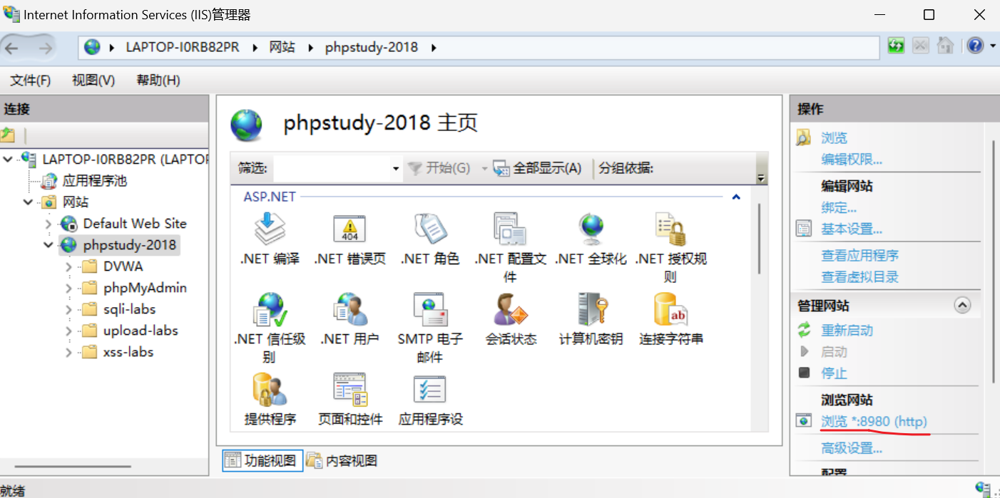

# VScode+phpStudy搭建PHP开发环境

1. VScode 中 `文件->首选项->设置->扩展->PHP->在settings.json中编辑` ，填入 `"php.validate.executablePath"` 内容为如 `D:\\phpStudy\\PHPTutorial\\php\\php-7.2.1-nts\\php.exe` 。
2. 在环境变量 Path 中添加对应 PHP 版本文件夹如 `D:\phpStudy\PHPTutorial\php\php-7.2.1-nts` ，DOS 窗口输入 php -v 查看版本，验证是否成功。
3. 安装 PHP Debug 扩展，重启即可。

# IDEA跑MyBatis

## 配置Maven

IDEA 自带有 Maven，但一般不用它的，自己下载并部署，参考 [CSDN](https://blog.csdn.net/fl6881688/article/details/121353872?ops_request_misc=%257B%2522request%255Fid%2522%253A%2522167715549616800211563642%2522%252C%2522scm%2522%253A%252220140713.130102334..%2522%257D&request_id=167715549616800211563642&biz_id=0&utm_medium=distribute.pc_search_result.none-task-blog-2~all~top_positive~default-2-121353872-null-null.142^v73^control_1,201^v4^add_ask,239^v2^insert_chatgpt&utm_term=idea%E9%85%8D%E7%BD%AEmaven&spm=1018.2226.3001.4187)。说明：

1. 第一步“安装本地Maven”，去官网不知道下哪个的话，可以参考其他教程。
2. “配置settings.xml”文件中，镜像部分，自己去阿里云、腾讯云官网找，不要它给的。
3. 配置完镜像，余下内容就不用看了。

## 构建MyBatis工程

1. File->New->Project->New Project，Build system 选择 Maven。
2. File->Settings 或 Ctrl+Alt+S ，设置 Maven，参考上面的 CSDN 教程。
3. 设置打包方式 `<packaging>war</packaging>` 。

> resources目录说明：
> 放在这个目录中的一般是资源文件、配置文件，放在该目录下等同于放到了类的根目录下。

​	<mark>以上是如何使用 Maven 搭建项目骨架</mark>。

5. 引入 mybatis、mysql 依赖，直接去 [maven 官网](https://mvnrepository.com/)搜，版本都是自己选的。

   复制粘贴后 xml 标签爆红说明本地没有下载依赖，全部粘贴完后点击右上角刷新即可。

6. 编写 mybatis 核心配置文件 mybatis-config.xml ，主要用于连接数据库。

   ```xml
   <dataSource type="POOLED">
     <property name="driver" value="${driver}"/>
     <property name="url" value="${url}"/>
     <property name="username" value="${username}"/>
     <property name="password" value="${password}"/>
   </dataSource>
   ```

7. 编写配置文件 XxxMapper.xml 。

8. 在 mybatis-config.xml 中指定 XxxMapper.xml 的路径。默认是从根目录里查找，即 resources 文件夹下查找，如果你放在这里，只需 `<mapper resource="XxxMapper.xml"/>` 。

9. 编写 Java 程序，核心代码。


# IDEA跑SpringBoot

1. 使用 Maven 构建项目骨架。

2. 编辑 pom.xml：

   ```xml
   <?xml version="1.0" encoding="UTF-8"?>
   <project xmlns="http://maven.apache.org/POM/4.0.0" xmlns:xsi="http://www.w3.org/2001/XMLSchema-instance"
            xsi:schemaLocation="http://maven.apache.org/POM/4.0.0 https://maven.apache.org/xsd/maven-4.0.0.xsd">
       <modelVersion>4.0.0</modelVersion>
   
       <groupId>com.example</groupId>
       <artifactId>myproject</artifactId>
       <version>0.0.1-SNAPSHOT</version>
   
       <properties>
           <maven.compiler.source>11</maven.compiler.source>
           <maven.compiler.target>11</maven.compiler.target>
           <project.build.sourceEncoding>UTF-8</project.build.sourceEncoding>
       </properties>
   
       <parent>
           <groupId>org.springframework.boot</groupId>
           <artifactId>spring-boot-starter-parent</artifactId>
           <version>2.1.8.RELEASE</version>
       </parent>
   
       <dependencies>
           <dependency>
               <groupId>org.springframework.boot</groupId>
               <artifactId>spring-boot-starter-web</artifactId>
           </dependency>
           <dependency>
               <groupId>org.springframework</groupId>
               <artifactId>spring-web</artifactId>
               <version>5.2.8.RELEASE</version>
           </dependency>
       </dependencies>
   
   </project>
   ```

3. 创建 HelloController.java：

   ```java
   import org.springframework.web.bind.annotation.RequestMapping;
   import org.springframework.web.bind.annotation.RestController;
   
   @RestController
   public class HelloController {
       @RequestMapping("/hello")
       public String hello(){
           return "Hello Spring Boot!";
       }
   }
   ```

4. 创建 HelloApplication.java：

   ```java
   import org.springframework.boot.SpringApplication;
   import org.springframework.boot.autoconfigure.SpringBootApplication;
   
   @SpringBootApplication
   public class HelloApplication {
       public static void main(String[] args) {
           SpringApplication.run(HelloApplication.class, args);
       }
   }
   ```

5. 运行项目，如果没有报错，访问 `localhost:8080/hello` 即可。如果有报错，极大可能是引入的依赖版本之间不兼容。

   注意协议用 HTTP 不是 HTTPS ，不然访问会失败。如果 `localhost:8080/hello` 浏览器自动用 HTTPS ，则改为 `127.0.0.1:8080/hello` 。

# IDEA跑Spring

1. 使用 Maven 构建项目骨架。

2. 在 pom.xml 中引入 Spring 相关依赖，分别为：

   - spring-core
   - spring-beans
   - spring-context
   - spring-expression
   - spring-aop
   - commons-logging
   - java-annotation

   具体配置去 Maven 官网搜。

3. 在 resources 文件夹下新建 applicationContext.xml ，具体配置参考 [CSDN](https://blog.csdn.net/xiaojiejie_baby/article/details/105733413) 。

4. 编写 POJO 类。

# IDEA破解

https://www.exception.site/essay/how-to-free-use-idea-202021-by-resigter-code

# Tomcat安装

[链接1](https://blog.csdn.net/weixin_47700137/article/details/116055222?ops_request_misc=%257B%2522request%255Fid%2522%253A%2522168072954516800186559539%2522%252C%2522scm%2522%253A%252220140713.130102334..%2522%257D&request_id=168072954516800186559539&biz_id=0&utm_medium=distribute.pc_search_result.none-task-blog-2~all~top_positive~default-1-116055222-null-null.142^v81^insert_down1,201^v4^add_ask,239^v2^insert_chatgpt&utm_term=tomcat%E5%AE%89%E8%A3%85%E5%8F%8A%E9%85%8D%E7%BD%AE%E6%95%99%E7%A8%8B&spm=1018.2226.3001.4187)

[链接2](https://blog.csdn.net/weixin_44259720/article/details/115321173)

[链接3](https://blog.csdn.net/qq_33216840/article/details/86508377)

# IDEA跑SpringMVC

> 话说在前面，这对于任何需要配置的地方都是适用的：
>
> 版本这种东西，不要选太高的、新出的，选择稳定的、长期维护的、大家都用的就好。如 JDK8、Tomcat8，以及 5.x 版本的依赖，否则，很多时候都会由于版本太高或太低而报错。
>

1. 使用 Maven 构建项目骨架。

2. 添加 web 框架：右键点击项目，选择 Add Framework Support，勾选 Web Application(4.0)，点击 OK 。

3. 在 pom.xml 中引入依赖：

   - spring-context
   - spring-webmvc
   - javax.servlet-api
   - jsp-api

4. 编写 web.xml 文件。

5. resources 目录下创建 SpringMVC 核心配置文件。注意，你需要通过以下方式创建：

   

   不过经常会出现没有 XML Configuration File 那个选项，试着重新打开项目。还是没有的话，在后续的 Project Structure 里添加了 Spring 后应该就可以了，最终是需要这个文件有一个 Spring 的图标标注的：

   

   总之，想办法都要搞成这个样子。

6. 编写 spring-mvc.xml 文件。

   ```xml
   <?xml version="1.0" encoding="UTF-8"?>
   <beans xmlns="http://www.springframework.org/schema/beans"
          xmlns:xsi="http://www.w3.org/2001/XMLSchema-instance"
          xmlns:context="http://www.springframework.org/schema/context"
          xsi:schemaLocation="http://www.springframework.org/schema/beans
          http://www.springframework.org/schema/beans/spring-beans.xsd
          http://www.springframework.org/schema/context
          https://www.springframework.org/schema/context/spring-context.xsd">
   
       xxx
   
   </beans>
   ```

7. 编写 Java Class 文件。

8. 新建、编写 WEB-INF 目录下文件。

9. File->Project Structure，添加东西：

   - 

     

   - 

     

   - 

     lib 目录需要自己新建，里面的依赖也要自己加进去，不会操作可以参考后面的教程。

10. 配置 Tomcat：Run->Edit Configurations，后续步骤参考后面的教程。

    注意，有一个地方要改一下：Application context 。

    

11. 运行项目，它会自动弹出浏览器窗口。如果是正常界面那说明成功了，如果是 404 ，根据以往经验，如果确认那一大堆文件的编写都没有问题，那就是 Project Structure 和 Tomcat 配置这两个地方的问题。把之前配的都删了，重新再走一遍流程应该就好。如果还是不行，反正就是这两块地方的问题，反复配就好。
12. 参考案例：[CSDN](https://blog.csdn.net/LiuNengJing/article/details/125888494) 。

# 部署分离版若依

1. 确保安装了 nodejs、redis 环境。

2. 进入前端文件夹，执行命令：

   ```bash
   # 安装依赖
   npm install
   
   # 强烈建议不要用直接使用 cnpm 安装，会有各种诡异的 bug，可以通过重新指定 registry 来解决 npm 安装速度慢的问题。
   npm install --registry=https://registry.npmmirror.com
   
   # 本地开发 启动项目
   npm run dev
   ```

   此时会报“系统 500 接口错误”，然后没有验证码出现，不管它。

3. 创建 ry-vue 数据库，导入后端文件夹下 sql 目录里的两个 .sql 文件。

4. IDEA 直接打开后端项目，编辑 ruoyi-admin 模块 `resources` 目录下的 `application-druid.yml` ：

   ```bash
   # 主库数据源
               master:
                   url: 数据库地址
                   username: 数据库账号
                   password: 数据库密码
   ```

5. 进入前端文件夹，执行命令 `npm run dev` ；进入 redis 安装目录，运行 redis-server.exe ；IDEA 运行 ruoyi-admin 模块下的 RuoYiApplication.java 即可。

# Vue安装及开发环境搭建

## 安装

[好细的Vue安装与配置](https://blog.csdn.net/m0_57545353/article/details/124366678?ops_request_misc=%257B%2522request%255Fid%2522%253A%2522168471878016800222833915%2522%252C%2522scm%2522%253A%252220140713.130102334..%2522%257D&request_id=168471878016800222833915&biz_id=0&utm_medium=distribute.pc_search_result.none-task-blog-2~all~top_positive~default-1-124366678-null-null.142^v87^control_2,239^v2^insert_chatgpt&utm_term=vue%E5%AE%89%E8%A3%85%E5%8F%8A%E7%8E%AF%E5%A2%83%E9%85%8D%E7%BD%AE&spm=1018.2226.3001.4187)

https://blog.csdn.net/zhangkai__/article/details/125549603

按以上教程，在 myvue/ 目录下执行 `vue ui` 是没反应的，参考：[vue ui没反应](https://blog.csdn.net/qq_43571415/article/details/103781460) 。

以上教程中介绍了 vue 项目的命令行创建方式，这里介绍使用 vue create 和 vue ui 创建：[菜鸟教程](https://www.runoob.com/vue3/vue3-create-project.html) 。

如果你是按 CSDN 教程创建的 vue 项目，启动时需要在该目录下执行 `npm run dev` ，并且访问 `localhost:8080/#/` ；

如果是用 vue ui 创建的项目，启动时需要在该目录下执行 `vue ui` 。

实际上用得更多的创建方式是使用 vue-cli ： `vue create project-name` ，后续步骤根据提示来即可。如果在编写项目时使用了 axios ，则再次启动前，需先执行 `npm install axios` 安装 axios ，然后再执行 `npm run serve` 启动项目。

## VSCode搭建Vue

https://blog.csdn.net/qq_36148847/article/details/115178731

# 虚拟机共享主机VPN

https://blog.csdn.net/qq_44881113/article/details/115773082

说明：

1. 第二步省略
2. socks5 后面的 ip 地址填 Clash 鼠标悬浮到“允许局域网”时弹出的第一个“本地连接*1”的那个 ip 。
3. proxychains4 改为 proxychains 一样的。

玩机技巧：

1. 终端输入 `firefox` 、`google-chrome` 即可打开对应浏览器，前提是有安装该浏览器。
2. 终端输入 `firefox baidu.com` 即可打开 firefox 并访问百度主页。`proxychains firefox google.com` 表示打开 firefox 并以共享主机 VPN 方式访问 google.com 。

# Linux下搭建phpStudy

1. `wget -O install.sh https://notdocker.xp.cn/install.sh && sudo bash install.sh`
2. 访问给出的内网地址，输入账密即可。

# 搭建SSM+JSP环境

1. 使用 Maven 构建 ssm 项目骨架。

2. 引入依赖：

   ```xml
   	<dependencies>
           <!--Spring核心容器-->
           <dependency>
               <groupId>org.springframework</groupId>
               <artifactId>spring-context</artifactId>
               <version>5.2.8.RELEASE</version>
           </dependency>
           <!--Spring事务管理-->
           <dependency>
               <groupId>org.springframework</groupId>
               <artifactId>spring-tx</artifactId>
               <version>5.2.8.RELEASE</version>
           </dependency>
           <!--Spring JDBC-->
           <dependency>
               <groupId>org.springframework</groupId>
               <artifactId>spring-jdbc</artifactId>
               <version>5.2.8.RELEASE</version>
           </dependency>
           <!--Spring MVC核心-->
           <dependency>
               <groupId>org.springframework</groupId>
               <artifactId>spring-webmvc</artifactId>
               <version>5.2.8.RELEASE</version>
           </dependency>
           <!--MyBatis核心-->
           <dependency>
               <groupId>org.mybatis</groupId>
               <artifactId>mybatis</artifactId>
               <version>3.5.2</version>
           </dependency>
           <!--MyBatis分页插件-->
           <dependency>
               <groupId>com.github.pagehelper</groupId>
               <artifactId>pagehelper</artifactId>
               <version>5.1.10</version>
           </dependency>
           <!--MyBatis整合Spring-->
           <dependency>
               <groupId>org.mybatis</groupId>
               <artifactId>mybatis-spring</artifactId>
               <version>2.0.1</version>
           </dependency>
           <!--MySQL驱动-->
           <dependency>
               <groupId>mysql</groupId>
               <artifactId>mysql-connector-java</artifactId>
               <version>8.0.16</version>
           </dependency>
           <!--Druid数据源-->
           <dependency>
               <groupId>com.alibaba</groupId>
               <artifactId>druid</artifactId>
               <version>1.1.20</version>
           </dependency>
           <!--Servlet API-->
           <dependency>
               <groupId>javax.servlet</groupId>
               <artifactId>javax.servlet-api</artifactId>
               <version>3.1.0</version>
               <scope>provided</scope>
           </dependency>
           <!--JSP API-->
           <dependency>
               <groupId>javax.servlet.jsp</groupId>
               <artifactId>jsp-api</artifactId>
               <version>2.2</version>
               <scope>provided</scope>
           </dependency>
           <!--JSTL标签库-->
           <dependency>
               <groupId>jstl</groupId>
               <artifactId>jstl</artifactId>
               <version>1.2</version>
           </dependency>
           <dependency>
               <groupId>taglibs</groupId>
               <artifactId>standard</artifactId>
               <version>1.1.2</version>
           </dependency>
           <!--JSON-->
           <dependency>
               <groupId>com.fasterxml.jackson.core</groupId>
               <artifactId>jackson-core</artifactId>
               <version>2.9.2</version>
           </dependency>
           <dependency>
               <groupId>com.fasterxml.jackson.core</groupId>
               <artifactId>jackson-databind</artifactId>
               <version>2.9.2</version>
           </dependency>
           <dependency>
               <groupId>com.fasterxml.jackson.core</groupId>
               <artifactId>jackson-annotations</artifactId>
               <version>2.9.0</version>
           </dependency>
       </dependencies>
   ```

3. 添加 web 框架：右键点击项目，选择 Add Framework Support，勾选 Web Application(4.0)，点击 OK 。

4. 配置 Tomcat，参考前面的教程。

5. File->Project Structure->Artifacts 添加东西，参考前面的教程。

# PHPStudy+IIS搭建PHP运行环境

IIS（Internet Information Services），Windows 自带的 web 中间件。

教程：https://www.cnblogs.com/Can-daydayup/p/15340302.html 。

配置好后，在 开始->Windows工具 中打开这个：


进入，查看 PHPStudy 对应端口：



访问时需要写明端口，如 `127.0.0.1:8980/test.php` 。

# Burpsuite抓HTTPS

官方教程：https://portswigger.net/burp/documentation/desktop/external-browser-config/certificate/ca-cert-firefox

官方的不行再试试这个：https://blog.csdn.net/zyw_anquan/article/details/47904495

