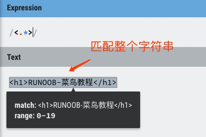
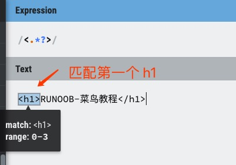
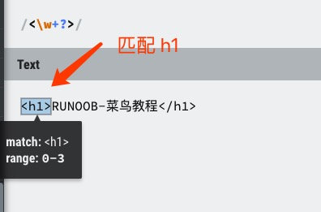
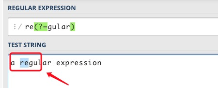
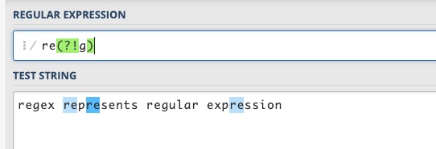
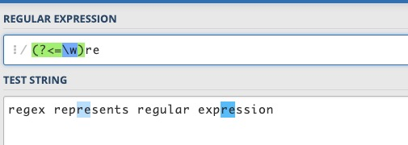
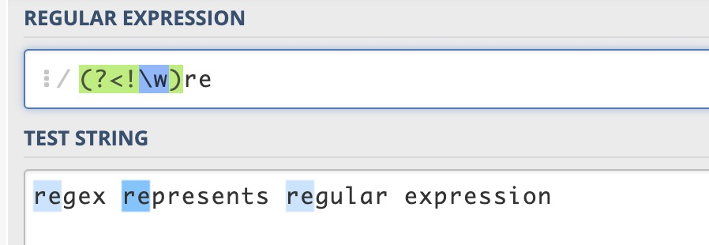
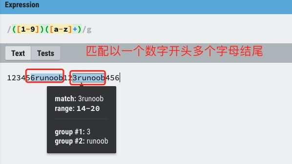
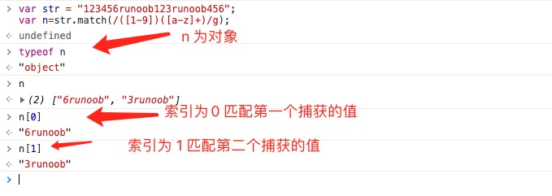

# 概述

正则表达式（Regular Expression）是一种文本模式，包括普通字符（例如 a 到 z 之间的字母）和特殊字符（称为“元字符”），可以用来描述和匹配字符串的特定模式。

正则表达式是一种用于模式匹配和搜索文本的工具。

正则表达式提供了一种灵活且强大的方式来查找、替换、验证和提取文本数据。

正则表达式可以应用于各种编程语言和文本处理工具中，如 JavaScript、Python、Java 等。

正则表达式的模式可以包括以下内容：

- 字面值字符：例如字母、数字、空格等，可以直接匹配它们自身。
- 特殊字符：例如点号 `.` 、星号 `*` 、加号 `+ ` 、问号 `?` 等，它们具有特殊的含义和功能。
- 字符类：用方括号 `[ ]` 包围的字符集合，用于匹配方括号内的任意**一个**字符。
- 元字符：例如 `\d`、`\w`、`\s` 等，用于匹配特定类型的字符，如数字、字母、空白字符等。
- 量词：例如 `{n}`、`{n,}`、`{n,m}` 等，用于指定匹配的次数或范围。
- 边界符号：例如 `^`、`$`、`\b`、`\B` 等，用于匹配字符串的开头、结尾或单词边界位置。

正则表达式的字符和特性：

1. 字符匹配
   - 普通字符：普通字符按照字面意义进行匹配，例如匹配字母 "a" 将匹配到文本中的 "a" 字符。
   - 元字符：元字符具有特殊的含义，例如 `\d` 匹配任意数字字符，`\w` 匹配任意字母数字字符，`.` 匹配任意字符（除了换行符）等。

2. 量词
   - `*`：匹配前面的模式零次或多次。
   - `+`：匹配前面的模式一次或多次。
   - `?`：匹配前面的模式零次或一次。
   - `{n}`：匹配前面的模式恰好 n 次。
   - `{n,}`：匹配前面的模式至少 n 次。
   - `{n,m}`：匹配前面的模式至少 n 次且不超过 m 次。

3. 字符类
   - `[ ]`：匹配括号内的任意一个字符。例如，`[abc]` 匹配字符 "a"、"b" 或 "c"。
   - `[^ ]`：匹配除了括号内的字符以外的任意一个字符。例如，`[^abc]` 匹配除了字符 "a"、"b" 或 "c" 以外的任意一个字符。

4. 边界匹配
   - `^`：匹配字符串的开头。
   - `$`：匹配字符串的结尾。
   - `\b`：匹配单词边界。
   - `\B`：匹配非单词边界。

5. 分组和捕获
   - `( )`：用于分组和捕获子表达式。
   - `(?: )`：用于分组但不捕获子表达式。

6. 特殊字符
   - `\`：转义字符，用于匹配特殊字符本身。
   - `.`：匹配任意字符（除了换行符）。
   - `|`：用于指定多个模式的选择。

匹配特殊字符时需转义：

| 特殊字符 | 描述                                                         |
| :------- | :----------------------------------------------------------- |
| $        | 匹配输入字符串的结尾位置。                                   |
| ( )      | 标记一个子表达式的开始和结束位置。                           |
| *        | 匹配前面的子表达式零次或多次。                               |
| +        | 匹配前面的子表达式一次或多次。                               |
| .        | 匹配除换行符 \n 之外的任何单字符。                           |
| [        | 标记一个中括号表达式的开始。                                 |
| ?        | 匹配前面的子表达式零次或一次，或指明一个非贪婪限定符。       |
| \        | 将下一个字符标记为或特殊字符、或原义字符、或向后引用、或八进制转义符。 |
| ^        | 匹配输入字符串的开始位置，除非在方括号表达式中使用，当该符号在方括号表达式中使用时，表示不接受该方括号表达式中的字符集合。 |
| {        | 标记限定符表达式的开始。                                     |
| \|       | 指明两项之间的一个选择。                                     |

# 修饰符

标记也称为修饰符，正则表达式的标记用于指定额外的匹配策略。

标记不写在正则表达式里，标记位于表达式之外，格式如下：

```javascript
/pattern/flags
```

## g

全局匹配，返回字符串中所有的匹配项。如果不加 ，那么只会返回第一次出现。

## i

不区分大小写，即匹配项的任意大小写组合都算。

## m

多行（\n 为一行结束）匹配，不加的话，只匹配第一行。

## s

默认情况下的 "." 匹配除换行符 \n 之外的任何字符，加上 s 后，"." 也会匹配换行符  \n 。

## x

忽略掉正则表达式中的空白字符，如 `^a b c d$` 也可匹配 "abcd" 。

# 元字符

## 定位符

### ^

匹配字符串的开始位置，遇 \n 结束。如 `^once` 将匹配 "once upon a time"  ，不匹配 "There once was a man from NewYork" 。

### $

匹配字符串的结束位置。如 `bucket$` 将匹配 "Who kept all of this cash in a bucket" ，不匹配 "bucket" ，`^bucket$` 才会匹配 "bucket" 。

> 若要匹配一行文本开始处的文本，请在正则表达式的开始使用 ^ 字符。
>
> 若要匹配一行文本的结束处的文本，请在正则表达式的结束处使用 $ 字符。

### \b

匹配一个单词边界，即 `\b` 所在位置不能为字母。例如，`er\b` 可以匹配 "never" 中的 er，但不能匹配 "verb" 中的 er 。

> 单词边界是单词和空格之间的位置，非单词边界是任何其他位置。

### \B

与 `\b` 相反。

## 限定符

### +

匹配前面子串一次或多次，如 `zo+` 能匹配 zo、zoo…… ，等价于 `{1,}` 。

### ?

匹配前面的子串零次或一次，如 `do(es)?` 将匹配 do、does，等价于 `{0,1}` 。

### *

匹配前面的子串零次或多次，如 `zo*` 能匹配 z、zoo……，等价于 `{0,}` 。

> 还有 `{n}` 、`{n,}` 和 `{n, m}` 三种，不多述。

### 贪婪

\* 和 + 限定符都是贪婪的，因为它们会尽可能多的匹配文字，只有在它们的后面加上一个 ? 就可以实现非贪婪或最小匹配。

例如，你可能搜索 HTML 文档，以查找在 h1 标签内的内容。HTML 代码如下：

```html
<h1>RUNOOB-菜鸟教程</h1>
```

贪婪：下面的表达式匹配从开始小于符号 < 到关闭 h1 标记的大于符号 > 之间的所有内容。

```
/<.*>/
```



非贪婪：如果您只需要匹配开始的 h1 标签，下面的非贪婪表达式只匹配 `<h1>` 。

```
/<.*?>/
```



也可以使用以下正则表达式来匹配 h1 标签，表达式则是：

```
/<\w+?>/
```



通过在 *、+ 限定符之后放置 ? ，该表达式从"贪婪"表达式转换为"非贪婪"表达式或者最小匹配。

## 普通字符

### .

匹配除换行符（\n、\r）之外的任何单个字符，如 `^.5$` 将匹配一个含两个字符且以 5 结尾的字符串。如要匹配包括 \n 在内的任何一个字符，请使用像 `(.|\n)` 的模式。

### \d

匹配一个数字字符，等价于 `[0-9]` 。

### \D

与 `\d` 相反。

### \w

匹配字母、数字、下划线，等价于 `[A-Za-z0-9_]` 。

### \W

与 `\w` 相反。

## 非打印字符

### \s

匹配任何空白字符，等价于 `[\f\n\r\t\v]` 。

### \S

匹配任何非空白字符，等价于 `[^\f\n\r\t\v]` 。

> `[\s\S]` 匹配所有。

## 其它

| 字符   | 描述                                                         |
| ------ | ------------------------------------------------------------ |
| x\|y   | 匹配 x 或 y。                                                |
| [xyz]  | 字符集合。匹配所包含的任意一个字符。                         |
| [^xyz] | 负值字符集合。匹配未包含的任意一个字符。                     |
| [a-z]  | 字符范围。匹配指定范围内的任意一个字符。                     |
| [^a-z] | 负值字符范围。匹配任何不在指定范围内的任意一个字符。         |
| \cx    | 匹配由 x 指明的控制字符。例如， \cM 匹配一个 Control-M 或回车符。x 的值必须为 A-Z 或 a-z 之一。否则，将 c 视为一个原义的 'c' 字符。 |
| \f     | 匹配一个换页符。等价于 \x0c 和 \cL。                         |
| \n     | 匹配一个换行符。等价于 \x0a 和 \cJ。                         |
| \r     | 匹配一个回车符。等价于 \x0d 和 \cM。                         |
| \t     | 匹配一个制表符。等价于 \x09 和 \cI。                         |
| \v     | 匹配一个垂直制表符。等价于 \x0b 和 \cK。                     |
| \xn    | 匹配 n，其中 n 为十六进制转义值。十六进制转义值必须为确定的两个数字长。例如，'\x41' 匹配 "A"。'\x041' 则等价于 '\x04' & "1"。正则表达式中可以使用 ASCII 编码。 |
| \num   | 匹配 num，其中 num 是一个正整数。对所获取的匹配的引用。例如，'(.)\1' 匹配两个连续的相同字符。 |
| \n     | 标识一个八进制转义值或一个向后引用。如果 \n 之前至少 n 个获取的子表达式，则 n 为向后引用。否则，如果 n 为八进制数字 (0-7)，则 n 为一个八进制转义值。 |
| \nm    | 标识一个八进制转义值或一个向后引用。如果 \nm 之前至少有 nm 个获得子表达式，则 nm 为向后引用。如果 \nm 之前至少有 n 个获取，则 n 为一个后跟文字 m 的向后引用。如果前面的条件都不满足，若 n 和 m 均为八进制数字 (0-7)，则 \nm 将匹配八进制转义值 nm。 |
| \nml   | 如果 n 为八进制数字 (0-3)，且 m 和 l 均为八进制数字 (0-7)，则匹配八进制转义值 nml。 |
| \un    | 匹配 n，其中 n 是一个用四个十六进制数字表示的 Unicode 字符。 |

# 零宽断言

## 概述

事实上就是匹配符合规定 `前面/后面 必须 是/不是 xxx` 的子串。

零宽断言，简称断言。正则表达式中的零宽断言是一种特殊的结构，它在匹配的时候不会消耗字符，只是对匹配位置进行条件判断。

正则表达式的先行断言（lookahead）和后行断言（lookbehind）一共有 4 种形式：

- **(?=pattern)** 零宽正向先行断言（zero-width positive lookahead assertion）
- **(?!pattern)** 零宽负向先行断言（zero-width negative lookahead assertion）
- **(?<=pattern)** 零宽正向后行断言（zero-width positive lookbehind assertion）
- **(?<!pattern)** 零宽负向后行断言（zero-width negative lookbehind assertion）

先行断言也叫后缀/后瞻断言，后行断言也叫前缀断言。

这里面的 pattern 是一个正则表达式。

如同 ^ 代表开头，$ 代表结尾，\b 代表单词边界一样，先行断言和后行断言也有类似的作用，它们只匹配某些位置。在匹配过程中，不占用字符，所以被称为"零宽"。

所谓位置，是指字符串中（每行）第一个字符的左边、最后一个字符的右边以及相邻字符的中间（假设文字方向是头左尾右）。

概念说明：

- 零宽（Zero-width）： 只匹配位置，意味着断言在匹配时不会"消耗"字符串，它只是对位置进行条件判断。
- 先行（Lookahead）： 表示断言发生在匹配位置之前。
- 后行（Lookbehind）： 表示断言发生在匹配位置之后。
- 正向（Positive）： 匹配括号中的表达式，即断言所作的条件判断是肯定的。即当条件成立时，匹配才成功。
- 负向（Negative）： 不匹配括号中的表达式，即断言所作的条件判断是否定的。即当条件不成立时，匹配才成功。

## (?=pattern) 正向先行断言

代表字符串中的一个位置，紧接该位置之后的字符序列能够匹配 pattern 。

例如对 "a regular expression" 这个字符串，要想匹配 regular 中的 re，但不能匹配 expression 中的 re，可以用 `re(?=gular)` ，该表达式限定了 re 右边的位置，这个位置之后是 gular，但并不消耗 gular 这些字符。



将表达式改为 `re(?=gular).` ，将会匹配 reg，元字符 . 匹配了 g ，括号这一砣匹配了 e 和 g 之间的位置。


## (?!pattern) 负向先行断言

代表字符串中的一个位置，紧接该位置之后的字符序列不能匹配 pattern 。

例如对 "regex represents regular expression" 这个字符串，要想匹配除 regex 和 regular 之外的 re，可以用 `re(?!g)` ，该表达式限定了 re 右边的位置，这个位置后面不是字符 g 。

负向和正向的区别，就在于该位置之后的字符能否匹配括号中的表达式。



## (?<=pattern) 正向后行断言

代表字符串中的一个位置，紧接该位置之前的字符序列能够匹配 pattern 。

例如对 regex represents regular expression 这个字符串，有 4 个单词，要想匹配单词内部的 re，但不匹配单词开头的 re，可以用 `(?<=\w)re` ，单词内部的 re，在 re 前面应该是一个单词字符。

之所以叫后行断言，是因为正则表达式引擎在匹配字符串和表达式时，是从前向后逐个扫描字符串中的字符，并判断是否与表达式符合/当在表达式中遇到该断言时，正则表达式引擎需要往字符串前端检测已扫描过的字符，相对于扫描方向是向后的。



## (?<!pattern) 负向后行断言

代表字符串中的一个位置，紧接该位置之前的字符序列不能匹配 pattern 。

例如对 "regex represents regular expression" 这个字符串，要想匹配单词开头的 re，可以用 `(?<!\w)re` 。单词开头的 re ，在本例中，也就是指不在单词内部的 re ，即 re 前面不是单词字符。当然也可以用 `\bre` 来匹配。



## 总结

对于这 4 个断言的理解，可以从两个方面入手：

- **关于先行和后行：**正则表达式引擎在执行字符串和表达式匹配时，会从头到尾（从前到后）连续扫描字符串中的字符。设想有一个扫描指针指向字符边界处并随匹配过程移动。先行断言，是当扫描指针位于某处时，引擎会尝试匹配指针还未扫过的字符，先于指针到达该字符，故称为先行。后行断言，引擎会尝试匹配指针已扫过的字符，后于指针到达该字符，故称为后行。
- **关于正向和负向：**正向就表示匹配括号中的表达式，负向表示不匹配。

对这 4 个断言形式的记忆：

- **先行和后行：**后行断言 (?<=pattern) 、(?<!pattern) 中，有个小于号，同时也是箭头。对于自左至右的文本方向，这个箭头是指向后的，这也比较符合我们的习惯。把小于号去掉，就是先行断言。
- **正向和负向：**所以有 ! 号的形式表示不匹配、负向；将 ! 号换成 = 号，就表示匹配、正向。

上述 4 种断言，括号里的 pattern 本身是一个正则表达式。但对 2 种后行断言有所限制，在 Python 中，这个表达式必须是定长的，即不能使用 * 、+ 、? 等元字符，如 `(?<=abc)` 没有问题，但 `(?<=a*bc)` 是不被支持的。特别是当表达式中含有|连接的分支时，各个分支的长度必须相同。

之所以不支持变长表达式，是因为当引擎检查后行断言时，无法确定要回溯多少步。Java 支持 ? 、{m} 、{n,m} 等符号，但同样不支持 * 、+ 字符。Javascript 干脆不支持后行断言。

先行断言和后行断言某种程度上就好比使用 if 语句对匹配的字符前后做判断验证。

简记：

- **exp1(?=exp2)**：查找 exp2 前面的 exp1 。
- **(?<=exp2)exp1**：查找 exp2 后面的 exp1 。
- **exp1(?!exp2)**：查找后面不是 exp2 的 exp1 。
- **(?<!=exp2)exp1**：查找前面不是 exp2 的 exp1 。

# 运算符优先级

相同级从左到右，不同级先高后低。

| 运算符                     | 描述                                                         |
| :------------------------- | :----------------------------------------------------------- |
| \                          | 转义符                                                       |
| (), (?:), (?=), []         | 圆括号和方括号                                               |
| *, +, ?, {n}, {n,}, {n,m}  | 限定符                                                       |
| ^, $, 任何元字符，任何字符 | 定位点和序列                                                 |
| \|                         | 替换。"或"操作具有高于替换运算符的优先级，使得 "m\|food" 匹配 "m" 或 "food" 。若要匹配 "mood "或 "food" ，请使用括号创建子表达式，从而产生 "(m\|f)ood" 。 |

# 分组和捕获

## 概述

在正则表达式中，**圆括号 ( )** 的主要功能是：

**分组**：将某些部分视为一个整体，或逻辑组合 `|` 。

**捕获**：自动捕获匹配的内容并保存到一个内部缓存中，称为捕获组。

**()** 表示捕获分组，**()** 会把每个分组里的匹配的值保存起来，多个匹配值可以通过数字 n 来查看（n 是一个数字，表示第 n 个捕获组的内容）。





捕获的副作用：如果你只是想分组，但并不需要捕获匹配内容，使用普通的圆括号会浪费资源，并且可能导致意外的捕获和不必要的缓存。

使用非捕获分组 `(?:...)` 可以这个问题。`(?:...)` 只分组而不捕获内容，它不影响捕获组编号，也不会保存到缓存中。适用于你只需要分组的功能，但不需要捕获的时候。

```python
import re

# 捕获分组
pattern1 = r"(ab)+"
string = "ababab"
match = re.match(pattern1, string)
print(match.group(0))  # 输出 'ababab'
print(match.group(1))  # 输出 'ab'

# 非捕获分组
pattern2 = r"(?:ab)+"
match = re.match(pattern2, string)
print(match.group(0))  # 输出 'ababab'
# print(match.group(1))  # 抛出错误，因为没有捕获分组
```

## 反向引用

对一个正则表达式模式或部分模式的两边添加圆括号，将导致相关匹配存储到一个临时缓冲区中，所捕获的每个子匹配都按照在正则表达式模式中从左到右出现的顺序存储。缓冲区编号从 1 开始，最多可存储 99 个捕获的子表达式。每个缓冲区都可以使用 \n 访问，其中 n 为一个标识特定缓冲区的一位或两位十进制数。

可以使用非捕获元字符 `?:` 、`?=` 或 `?!` 来重写捕获，忽略对相关匹配的保存。

反向引用的最简单的、最有用的应用之一，是提供查找文本中两个相同的相邻单词的匹配项的能力。以下面的句子为例：

```
Is is the cost of of gasoline going up up?
```

下面的正则表达式使用单个子表达式来实现查找每个单词的重复出现：

```javascript
var str = "Is is the cost of of gasoline going up up";
var patt1 = /\b([a-z]+) \1\b/igm;
document.write(str.match(patt1));

//输出：
Is is,of of,up up
```

捕获的表达式，正如 `[a-z]+` 指定的，包括一个或多个字母。正则表达式的第二部分是对以前捕获的子匹配项的引用，即单词的第二个匹配项正好由括号表达式匹配。`\1` 指定第一个子匹配项。

单词边界元字符确保只检测整个单词，诸如 "is issued" 或 "this is" 之类的词组将不能正确地被此表达式识别。

反向引用还可以将通用资源指示符（URI）分解为其组件。

假定您想将下面的 URI 分解为协议、域地址、路径：

```
https://www.runoob.com:80/html/html-tutorial.html
```

下面的正则表达式提供该功能：

```javascript
var str = "https://www.runoob.com:80/html/html-tutorial.html";
var patt1 = /(\w+):\/\/([^/:]+)(:\d*)?([^# ]*)/;
arr = str.match(patt1);
for (var i = 0; i < arr.length ; i++) {
    document.write(arr[i]);
	document.write("<br>");
}

//输出：
https://www.runoob.com:80/html/html-tutorial.html
https
www.runoob.com
:80
/html/html-tutorial.html
```


# 匹配规则

- `once` 将与任何包含 "once" 字串的字符串匹配。

- `/xxx/` 匹配字符串 xxx 。如果不使用修饰符，一般整个正则 pattern 的前后不需要加 `/` 包裹。

- 不用小括号限定范围，一律只作用于前一个字符。

- 字符簇

  - 如 `[a-z]` 这样用中括号括起来的一堆字符叫字符簇，一个字符簇只匹配一个字符。

  - 如果要匹配由一个小写字母和一位数字组成的字符串，如 "z2"、"t6" 或 "g7"，则需要 `^[a-z][0-9]$` 。

  - 字符簇里的 ^ 表示“非”，即如 `[^0-9]` 表示匹配一个非数字字符。

  - PHP 正则表达式内置的一些通用字符簇：

    | 字符簇       | 描述                                |
    | :----------- | :---------------------------------- |
    | [[:alpha:]]  | 任何字母                            |
    | [[:digit:]]  | 任何数字                            |
    | [[:alnum:]]  | 任何字母和数字                      |
    | [[:space:]]  | 任何空白字符（\n、\r、\t）          |
    | [[:upper:]]  | 任何大写字母                        |
    | [[:lower:]]  | 任何小写字母                        |
    | [[:punct:]]  | 任何标点符号                        |
    | [[:xdigit:]] | 任何16进制的数字，相当于[0-9a-fA-F] |

